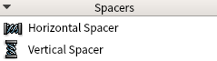

# 笔记

## 将ui文件转换为py文件

使用qt designer设计出自己想要的样子, 在转换为py文件, 然后调用这个文件就行了.

主要使用的工具是`pyuic5`命令

    pyuic5 firstWindow.ui -o firstWindow.py

[pyuic5官网](https://www.riverbankcomputing.com/static/Docs/PyQt5/designer.html)

由创建的ui文件编译而来的py文件, 叫做界面文件, 然后一般还会在创建一个py文件调用这个界面文件, 该py文件就叫做逻辑文件.

之后所有的逻辑都在这个逻辑文件中写, 实现了显示与业务逻辑的分离.

## 布局管理入门

Widget Box(工具箱), 其中包含很多控件, 如果需要只需要进行拖拽放在自己想要的位置即可.

一般进行布局有两种方式
+ 通过布局惯管理器进行布局
+ 通过容器控件进行布局

### 布局管理器进行布局

vertical layout 垂直布局: 控件默认按照从上到下的顺序进行纵向添加.  
horizontal layout 水平布局: 控件默认按照从左到右的顺序进行横向添加.  
grid layout 栅格布局: 将窗口控件放入一个网格之中, 然后将他们合理地划分为若干行row和column, 并把其中的每个窗口控件放置在合适的单元中(cell)中.  
form layouts 表单布局: 控件以两列的形式布局在列表中, 其中左列包含标准, 右列包含输入的控件.  

*注意:* 使用布局管理器布局的控件位置是相对的, 控件可以随着窗口的大小而动态调整自己的大小.

### 使用容器控件进行布局

容器控件是指能够容纳子控件的控件. 使用容器控件目的就是将容器控件中的控件归为一类, 以有别于其他控件. 当然容器控件也可以对其子控件进行布局, 只不过没有布局管理器常用.

用容器的话就没那么容易对齐对象了, 但是可以选中容器->右键呼出菜单->选择布局->选择布局形式. 这样从QFrame与主控件之间有一个QHBoxLayout. 可以知道容器进行控件布局本质上还是调用布局管理器进行.

## 辅助布局的控件

在spacers中

在display widgets中

spacer 将生成水平方向或垂直方向的空行或列, 类似字符间插入空格. line 将生成可见的水平或垂直的分割线.

    # 向水平布局中添加水平方向的spacer
    spacerItem = QtWidgets.QSpacerItem(40, 20, QtWidgets.QSizePolicy.Expanding, QtWidgets.QSizePolicy.Minimum)
    self.horizontalLayout.addItem(spacerItem)

    # 向水平布局中添加垂直方向的Vline
    self.line = QtWidgets.QFrame(self.horizontalLayoutWidget)
    self.line.setFrameShape(QtWidgets.QFrame.VLine)
    self.line.setFrameShadow(QtWidgets.QFrame.Sunken)
    self.line.setObjectName("line")
    self.horizontalLayout.addWidget(self.line)

## 控件属性

### 绝对布局

最简单的布局方法就是设置`geometry`(几何)属性. 其在PyQt中主要用来设置控件在窗口中的聚堆坐标与控件自身的大小.

这样设置的大小是没有办法随窗口的大小而动态调整自己大小的.

geometry[(x, y), widget_x × widget_y], 在主窗口的x, y轴(左上角为原点), 控件的宽x高y. 

    self.label = QtWidgets.QLabel(self.centralwidget)
    self.label.setGeometry(QtCore.QRect(20, 40, 150, 20))
    self.label.setObjectName("label")

### 使用布局管理器布局

使用布局管理器可以让控件动态的随着窗口的大小而调整自己的大小.

使用布局管理器后, 控件的geometry属性在Qt Designer中显示就变成了灰色不可用的了. 这说明这些控件的位置与大小已经由布局管理器接管了, 与geometry属性无关了. 查看代码也会发现没有setGeometry(QtCore.QRect(...))这一项了.

horizontal layout 水平布局

    self.horizontalLayoutWidget = QtWidgets.QWidget(self.centralwidget)
    self.horizontalLayoutWidget.setGeometry(QtCore.QRect(40, 20, 360, 60))
    self.horizontalLayoutWidget.setObjectName("horizontalLayoutWidget")
    self.horizontalLayout = QtWidgets.QHBoxLayout(self.horizontalLayoutWidget)
    self.horizontalLayout.setContentsMargins(0, 0, 0, 0)
    self.horizontalLayout.setObjectName("horizontalLayout")
    # 内容的控件
    self.label = QtWidgets.QLabel(self.horizontalLayoutWidget)
    self.label.setObjectName("label")
    self.horizontalLayout.addWidget(self.label)
    self.lineEdit = QtWidgets.QLineEdit(self.horizontalLayoutWidget)
    self.lineEdit.setObjectName("lineEdit")
    self.horizontalLayout.addWidget(self.lineEdit)

vertical layout 垂直布局

    self.verticalLayoutWidget = QtWidgets.QWidget(self.centralwidget)
    self.verticalLayoutWidget.setGeometry(QtCore.QRect(40, 100, 360, 80))
    self.verticalLayoutWidget.setObjectName("verticalLayoutWidget")
    self.verticalLayout = QtWidgets.QVBoxLayout(self.verticalLayoutWidget)
    self.verticalLayout.setContentsMargins(0, 0, 0, 0)
    self.verticalLayout.setObjectName("verticalLayout")
    # 内容的控件
    self.lineEdit = QtWidgets.QLineEdit(self.verticalLayoutWidget)
    self.lineEdit.setObjectName("lineEdit")
    self.verticalLayout.addWidget(self.lineEdit)
    self.pushButton = QtWidgets.QPushButton(self.verticalLayoutWidget)
    self.pushButton.setObjectName("pushButton")
    self.verticalLayout.addWidget(self.pushButton)

grid layout 网格布局

    self.gridLayoutWidget = QtWidgets.QWidget(self.centralwidget)
    self.gridLayoutWidget.setGeometry(QtCore.QRect(40, 240, 320, 120))
    self.gridLayoutWidget.setObjectName("gridLayoutWidget")
    self.gridLayout = QtWidgets.QGridLayout(self.gridLayoutWidget)
    self.gridLayout.setContentsMargins(0, 0, 0, 0)
    self.gridLayout.setObjectName("gridLayout")
    # 内容的控件
    self.pushButton = QtWidgets.QPushButton(self.gridLayoutWidget)
    self.pushButton.setObjectName("pushButton")
    self.gridLayout.addWidget(self.pushButton, 1, 1, 1, 1)
    self.pushButton_1 = QtWidgets.QPushButton(self.gridLayoutWidget)
    self.pushButton_1.setObjectName("pushButton_1")
    self.gridLayout.addWidget(self.pushButton_1, 0, 0, 1, 1)

self.gridLayout.addWidget(窗口控件, 行位置, 列位置 [, 要合并的行数, 要合并的列数])

form layout 表格布局

    self.formLayoutWidget = QtWidgets.QWidget(self.centralwidget)
    self.formLayoutWidget.setGeometry(QtCore.QRect(40, 390, 371, 111))
    self.formLayoutWidget.setObjectName("formLayoutWidget")
    self.formLayout = QtWidgets.QFormLayout(self.formLayoutWidget)
    self.formLayout.setContentsMargins(0, 0, 0, 0)
    self.formLayout.setObjectName("formLayout")
    # 内容的控件
    self.label = QtWidgets.QLabel(self.formLayoutWidget)
    self.label.setObjectName("label")
    self.formLayout.setWidget(0, QtWidgets.QFormLayout.LabelRole, self.label)
    self.label_1 = QtWidgets.QLabel(self.formLayoutWidget)
    self.label_1.setObjectName("label_1")
    self.formLayout.setWidget(1, QtWidgets.QFormLayout.LabelRole, self.label_1)

**note:** PyQt有一个基本原则, 主窗口中的所有窗口控件都有自己的父类.

### 最小尺寸, 最大尺寸属性

`minimumSize`(最小尺寸), `maximumSize`(最大尺寸), 用于控制控件在布局管理器中的最小尺寸和最大尺寸.

选择控件所在的布局管理器或控件本身, 不论怎么压缩和伸展, 该控件的大小都不会超出这个尺寸区间.

    self.pushButton.setMinimunSize(QtCore.QSize(100, 100))
    self.pushButton.setMaximunSize(QtCore.QSize(300, 300))

### 尺寸策略

每个窗口控件都有属于自己的两个尺寸: sizeHint(尺寸提示), minimumSize(最小尺寸)  
sizeHint表示窗口控件的期望尺寸, minimumSize表示窗口控件压缩式能够达到的最小的尺寸.

`sizePolicy`(尺寸策略), 如果窗口控件在布局管理器中的布局不能满足我们的需求, 那么就可以设置该窗口控件的sizePolicy来实现布局的微调. sizePolicy也是每个窗口控件的特有属性, 不同的窗口控件sizePolicy可能不同.

    sizePolicy = QtWidgets.QSizePolicy(QtWidgets.QSizePolicy.Minimum, QtWidgets.QSizePolicy.Fixed)   # 水平策略 minimum, 垂直策略 fixed
    sizePolicy.setHorizontalStretch(0)   # 水平伸展0
    sizePolicy.setVerticalStretch(0)   # 垂直伸展0
    sizePolicy.setHeightForWidth(self.pushButton.sizePolicy().hasHeightForWidth())
    # 应用该策略的pushButton控件
    self.pushButton.setSizePolicy(sizePolicy)
    self.pushButton.setObjectName("pushButton")

**sizePolicy相关的策略**  
Fixed: 窗口控件具有sizeHint所提示的尺寸且尺寸不会再改变.  
Minimum: 窗口控件的sizeHint所提示的尺寸就是它的最小尺寸; 该窗口控件不能被压缩得比这个值小, 但可以变的更大.  
Maximum: 窗口控件的sizeHint所提示的尺寸就是它的最大尺寸; 该窗口控件不能变得比这个值更大, 但可以被压缩到minisizeHint给定的尺寸大小.  
Preferred: 窗口控件的sizeHint所提示的尺寸就是它期望的尺寸; 该窗口控件可以缩小到minisizeHint所提示的尺寸, 也可以变得比sizeHint所提示的尺寸还要大.  
Expanding: 窗口控件可以缩小到minisizeHint所提示的尺寸, 也可以变得比sizeHint所提示的尺寸大, 但它希望能够变得更大.  
MinimumExpanding: 窗口控件的sizeHint所提示的尺寸就是它的最小尺寸; 该窗口控件不能被压缩得比这个值更小, 但它希望能够变得更大.  
Ignored: 无视窗口控件的sizeHint和minisizeHint所提示的尺寸, 按照默认来设置.

**水平伸展**和**垂直伸展**表示会按占比指定的数字, 与同在一个父布局管理器的兄弟窗口控件按该比例大小共享这个布局管理器.

## 其它设置

### 设置伙伴关系

单击"Edit" -> "编辑伙伴" 用鼠标左键按住需要添加伙伴关系的控件, 拉动到其伙伴上, 这就算是设置好了.

    self.label.setBuddy(self.lineEdit)

保存后, 单击"窗体" -> "预览窗体" 进行测试, 这时候按Alt+S快捷键, 会发现光标会快速定位到lineEdit, 这就是伙伴关系.

### 设置tab键次序

单击"Edit" -> "设置Tab键次序", 就可以可视化的设计每次Tab键时光标跳动的顺序.

也可以 鼠标右键, 在弹出的快捷菜单中选择"制表符顺序列表", 进入其窗口进行排序设置.

## 信号和槽关联

信号(signal)和槽(slot)是Qt的核心机制. 在创建事件循环之后, 通过建立信号和槽的连接就可以实现对象之间的通信. 当信号发射(emit)时, 连接的槽函数将会自动执行. 在PyQt5中, 信号和槽通过`QObject.signal.connect()`连接.

所有从QObject类或其子类(如 QWidget)派生的类都能够包含信号和槽. 当对象改变其状态时, 信号就由该对象发射出去. 槽用于接收信号, 但它们是普通的对象成员函数. 多个信号可以与单个槽进行连接, 单个信号也可以与多个槽进行连接. 总之, 信号和槽构建了一种强大的控件编程机制.

**为控件发射的信号指定对应的处理槽函数**
+ 在窗口的UI设计中操作添加信号和槽
+ 通过代码连接信号和槽

### 使用QtDesier的 信号/槽编辑器

直接通过编辑器, 添加对应objectName的控件及其信号事件 -> 对应objectName的控件及其对应槽事件

通过点击 Edit -> 编辑信号/槽, 进行可视化的编辑

    self.pushButton.clicked.connect(Form.close)   # 在使用QObject.signal.connect()连接的槽函数不要加括号(即调用), 而是作为变量传入

## 菜单与工具栏

MainWindow即主窗口, 主要包含菜单栏, 工具栏, 任务栏等. 

### 菜单栏

双击菜单栏上的"在这里输入", 然后输入文字, 最后按回车键即可生成菜单. 对于一级菜单, 可以通过输入"文件(&F)"和"编辑(&E)"来加入菜单的快捷键. **注意:** 要按回车键来确认菜单的输入.

在 "窗体" -> "预览" 可以快速预览所生成的窗口效果.

通过动作编辑器或者在属性编辑器中快捷键(shortcut)上来添加快捷键.

双击需要编辑的动作, 可以对其进行设置, 添加图标, 快捷键等.

### 工具栏

在主窗口上, 鼠标右键, 第一项"添加工具栏", 将会在菜单栏下面生成一个工具栏.

使用动作编辑器, 新建一个动作, 然后将新建的动作拖入到工具栏中. 

#### 状态栏

鼠标右键, 第二项"添加状态栏", 用于显示一些提示信息.

    self.statusBar = QtWidgets.QStatusBar(MainWindow)
    self.statusBar.setObjectName("statusBar")
    MainWindow.setStatusBar(self.statusBar