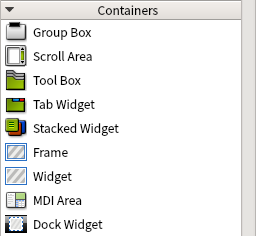

# 笔记

## 将ui文件转换为py文件

使用qt designer设计出自己想要的样子, 在转换为py文件, 然后调用这个文件就行了.

主要使用的工具是`pyuic5`命令

    pyuic5 firstWindow.ui -o firstWindow.py

[pyuic5官网](https://www.riverbankcomputing.com/static/Docs/PyQt5/designer.html)

由创建的ui文件编译而来的py文件, 叫做界面文件, 然后一般还会在创建一个py文件调用这个界面文件, 该py文件就叫做逻辑文件.

之后所有的逻辑都在这个逻辑文件中写, 实现了显示与业务逻辑的分离.

## 布局管理入门

Widget Box(工具箱), 其中包含很多控件, 如果需要只需要进行拖拽放在自己想要的位置即可.

一般进行布局有两种方式
+ 通过布局惯管理器进行布局
+ 通过容器控件进行布局

### 布局管理器进行布局

vertical layout 垂直布局: 控件默认按照从上到下的顺序进行纵向添加.  
horizontal layout 水平布局: 控件默认按照从左到右的顺序进行横向添加.  
grid layout 栅格布局: 将窗口控件放入一个网格之中, 然后将他们合理地划分为若干行row和column, 并把其中的每个窗口控件放置在合适的单元中(cell)中.  
form layouts 表单布局: 控件以两列的形式布局在列表中, 其中左列包含标准, 右列包含输入的控件.  

### 使用容器控件进行布局

容器控件是指能够容纳子控件的控件. 使用容器控件目的就是将容器控件中的控件归为一类, 以有别于其他控件. 当然容器控件也可以对其子控件进行布局, 只不过没有布局管理器常用.

用容器的话就没那么容易对齐对象了, 但是可以选中容器->右键呼出菜单->选择布局->选择布局形式. 这样从QFrame与主控件之间有一个QHBoxLayout. 可以知道容器进行控件布局本质上还是调用布局管理器进行.