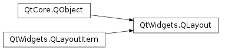
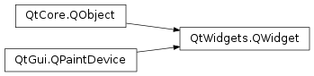
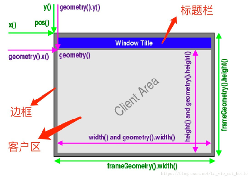

# 笔记

<!-- TOC -->

- [笔记](#笔记)
    - [窗口类型介绍](#窗口类型介绍)
    - [一些常用的窗口控件](#一些常用的窗口控件)
        - [PyQt5.QtWidgets](#pyqt5qtwidgets)
        - [PyQt5.QtCore](#pyqt5qtcore)
        - [PyQt5.QtGui](#pyqt5qtgui)
    - [QWidget](#qwidget)
        - [窗口坐标系统](#窗口坐标系统)
        - [常用的几何机构](#常用的几何机构)
            - [QWidget不包含边框的常用函数](#qwidget不包含边框的常用函数)
            - [QWidget包含边框的常用函数](#qwidget包含边框的常用函数)
    - [QMain Window](#qmain-window)
        - [QMainWindow类中比较重要的方法](#qmainwindow类中比较重要的方法)

<!-- /TOC -->

一些常用的控件, 固定的Qt参数. QtGui, QtCore.

可以被用作主窗口的控件QWidget, QMainWindow. 窗口的排版功能Layout(布局)管理器.

## 窗口类型介绍

在PyQt中把没有嵌入到其他控件中的控件称为窗口, 一般窗口都有边框, 标题. 窗口是指程序的整体界面, 可以包含标题栏, 菜单栏, 工具栏, 关闭按钮, 最小化按钮, 最大化按钮等; 控件是指按钮, 复选框, 文本框, 表格,进度条等这些组成程序的基本元素.

QWidget(基础控件), QMainWindow(主窗口控件), QDialog(对话框控件) 三个类都是用来创建窗口的, 可以直接使用, 也可以继承后再使用.

QWidget 是所有用户界面对象的基类, 是在PyQt中建立界面的主要元素.  
QMainWindow 主窗口可以包含菜单栏, 工具栏, 状态栏, 标题栏等, 是最常见的窗口形式, 也可以说是GUI程序的主窗口.  
QDialog 是对话框窗口的基类. 对话框主要用来执行短期任务, 或者与用户进行互动, 它可以是模态(modal), 也可以非模态(not modal). QDialog窗口没有菜单栏, 工具栏, 状态栏等.

如果是主窗口, 就使用QMainWindow类; 如果会对话框, 就使用QDialog类; 如果不确定, 或者有可能作为顶层窗口, 也有可能嵌入到其他窗口中, 那么就是用QWidget类.

支持XML方式的文字标记表示法.

## 一些常用的窗口控件

### PyQt5.QtWidgets

QApplication.instance() 方法, 这是一个类方法, 返回应用对象的实例, 这样就可以在任何地方使用应用实例了.

PyQt5.QtWidgets.QToolTip 类, 冒泡提示框类, 向支持的控件中设置.

PyQt5.QtWidgets.QDesktopWidget 类, 用于描述系统桌面屏幕. 如: 用QDesktopWidget().screenGeometry()会返回屏幕的QRect

PyQt5.QtWidgets.QLayout 类, 作为垂直布局器, 水平布局器, 表格布局器, 格栅布局器的父类存在.

PyQt5.QtWidgets.QVBoxLayout 类, 垂直布局管理器, PyQt5.QtWidgets.QHBoxLayout 类, 水平布局管理器. 二者都可以使用addWidget向其中添加控件, addLayout向其中添加其他布局管理器, 然后使用父窗口.setLayout(布局对象)设置为窗口的布局(只能设置一个)

PyQt5.QtWidgets.QFormLayout 类, 表格布局管理器. 
  + addRow(可以使str, QWidget对象, Layout)
  + setItem (row, role, item)
  + setLabelAlignment (alignment)
  + setLayout (row, role, layout)
  + setRowWrapPolicy (policy)
  + setVerticalSpacing (spacing)
  + setWidget (row, role, widget)

PyQt5.QtWidgets.QGridLayout 类, 格栅布局管理器. 添加控件的各参数: 行(row), 列(column), 占用行(rowSpan), 占用列数(columnSpan), 对齐方式(alignment)
  + addItem (item, row, column[, rowSpan=1[, columnSpan=1[, alignment=Qt.Alignment()]]])
  + addLayout (arg__1, row, column, rowSpan, columnSpan[, alignment=Qt.Alignment()])
  + addLayout (arg__1, row, column[, alignment=Qt.Alignment()])
  + addWidget (arg__1, row, column, rowSpan, columnSpan[, alignment=Qt.Alignment()])
  + addWidget (arg__1, row, column[, alignment=Qt.Alignment()])
  + cellRect (row, column)

### PyQt5.QtCore

PyQt5.QtCore.Qt 类, 存储Qt的常用设置用的参数值

PyQt5.QtCore.QRect 长方形, PyQt5.QtCore.QSize 大小, PyQt5.QtCore.QPoint 坐标

PyQt5.QtCore.QRegExp 对象, 用于设置正则表达式

### PyQt5.QtGui

PyQt5.QtGui.QIcon 图标对象, 可以向支持图标的对象中设置图标, PyQt5.QtGui.QPixmap 图片对象, 可以向支持图片显示的对象中设置图片. 如果使用相对位置指定图片位置, 那相对位置的起始目录是整个项目的根目录. 支持常见的图片格式与gif动图,  svg矢量图.

PyQt5.QtGui.QPalette 调色板对象, 可以设置支持setPalette的控件的颜色

PyQt5.QtGui.QFont 字体对象, 可以设置字体样式和大小, 用于放入支持setFont的控件中

## QWidget

`PyQt5.QtWidgets.QWidget` 窗口控件, 简称控件, 是在PyQt中建立界面的主要元素. QWidget类是所有用户界面对象的基类或间接基类.

### 窗口坐标系统

PyQt使用统一的坐标系统来定位窗口空间的位置和大.

电脑屏幕和应用窗口都是以左上角为原点(0, 0), 从左向右为x正向, 从上到下为y轴正向. ↓→

原点, x轴, y轴围城的区域叫Client Area(客户区), 在客户区的周围则是标题栏(Window Title)和边框(Frame).

**QWidget的成员函数可以分三类**

坐标 x , y 函数, 宽高 width , height 函数

+ QWidget直接提供的成员函数
    + 获得左上角坐标 QWidget().x(), QWidget().y(); 获得客户区宽高 QWidget().width(), QWidget().height()

+ QWidget的geometry()提供的成员函数
    + 获得客户区左上角坐标 QWidget().geometry().x(), QWidget().geometry().y(); 获得客户区宽高 QWidget().geometry().width(), QWidget().geometry().height()

+ QWidget的frameGeometry()提供的成员函数
    + 获得窗口左上角坐标 QWidget().frameGeometry().x(), QWidget().frameGeometry().y(); 获取包含客户区, 标题栏, 边框在内的整个窗口的宽高 QWidget().frameGeometry().width(), QWidget().frameGeometry().height()

### 常用的几何机构

QWidget有两种常用的几何结构
+ 不包含外边各种边框的几何结构
+ 包含外边各种边框的几何结构

#### QWidget不包含边框的常用函数

一般, 不包含边框的部分是客户区, 这里面就是正常操作的地方, 可以添加子控件. 该部分是一个长方形, 会有大小(width, height参数)和位置(屏幕上的x, y参数). Qt中保存这个长方形使用的是PyQt5.QtCore.QRect类, 这个类也有自己的大小和位置. 要改变派生的QWidget对象中的QRect, 可以使用如下的方法:

更改客户区的面积

    QWidget.resize(width, height)
    QWidget.resize(QSize)   # PyQt5.Qtcore.QSize

获得客户区大小

    QWidget.size() -> QSize

获得客户区的宽度和高度

    QWidget.width() -> int
    QWidget.height() -> int

设置客户区的宽度和高度, fixed(固定的)

    # 高度将固定不可变, 可以改变宽度
    QWidget.setFixedWidth(width: int)

    # 宽度将固定不可变, 可以改变高度
    QWidget.setFixedHeight(height: int)

    # 宽度和高度都固定, 不可以通过鼠标来改变窗口大小
    QWidget.setFixedSize(size: QSize)
    QWidget.setFixedSize(width: int, height: int)

    # 固定宽度和高度更改
    QWidget.setGeometry(x: int, y: int, width: int, height: int)
    QWidget.setGeometry(rect: QRect)

#### QWidget包含边框的常用函数

边框会有大小和位置, 是窗口在屏幕上显示的整个区域. 下边是一些操作整个窗口的函数:

获得窗口的大小和位置

    QWidget.frameGeometry()

设置窗口的位置

    QWidget.move(x: int, y: int)
    QWidget.move(point: QPint)   # PyQt5.QtCore.QPoint

获得窗口左上角的坐标

    QWidget.pos() -> QPoint

## QMain Window

`PyQt5.QtWidgets.QMainWindow` 是一个类, 继承自QWidget类, 拥有所有QWidget的方法和属性.

    QWidget
        |
        +- QMainWindow

如果一个窗口没有父窗口, 其就是顶层窗口, QMainWindow就是一个用于顶层窗口的类. 它可以包含很多界面元素, 如菜单栏, 工具栏, 状态栏, 子窗口等.

QMainWindow提供的布局如下图.

**note:** QMainWindow不能设置布局(使用setLayout()方法), 因为其有自己的布局.

### QMainWindow类中比较重要的方法

addToolBar() : 添加工具栏  
centralWidget() : 返回窗口中心的一个控件, 未设置时返回NULL  
menuBar() : 返回主窗口的菜单栏  
setCentralWidget() : 设置窗口中心的控件  
setStatusBar() : 设置状态栏  
statusBar() : 获得状态栏对象后, 调节状态栏对象的showMessage(message, int timeout=0)方法, 像是状态信息.

**常用方法补充**

QMainWindow.setWindowTitle() : 设置主窗口标题  
QMainWindow.resize() : 重置窗口大小  
QMainWindow.move() : 移动应用窗口的位置  
QMainWindow.geometry() -> QRect : 获取QWidget窗口的大小  
QMainWindow.setGeometry() : 设置QWidget窗口的位置, 大小  
QMainWindow.sender() : 返回信号发送对象  
