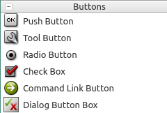
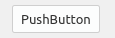
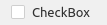
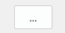
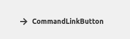
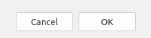

# 笔记

<!-- TOC -->

- [笔记](#笔记)
    - [QAbstractButton](#qabstractbutton)
        - [QAbstractButton提供的状态API](#qabstractbutton提供的状态api)
        - [QAbstractButton提供的信号API](#qabstractbutton提供的信号api)
    - [QPushButton](#qpushbutton)
        - [QPushButton设置快捷键](#qpushbutton设置快捷键)
        - [QPushButton类中常用的方法](#qpushbutton类中常用的方法)
    - [按钮分组QButtonGroup, 分组控件QGroupBox](#按钮分组qbuttongroup-分组控件qgroupbox)
        - [QButtonGroup](#qbuttongroup)
            - [QButtonGroup常见方法](#qbuttongroup常见方法)
            - [QButtonGroup的信号, 可用于统一设置一个函数进行处理事件](#qbuttongroup的信号-可用于统一设置一个函数进行处理事件)
        - [QGroupBox](#qgroupbox)
    - [QRadioButton](#qradiobutton)
        - [QRadioButton常用方法](#qradiobutton常用方法)
    - [QCheckBox](#qcheckbox)
        - [QCheckBox常用方法](#qcheckbox常用方法)
    - [其他按钮样式](#其他按钮样式)
    - [使用lambda向方法传参](#使用lambda向方法传参)

<!-- /TOC -->

使用按钮类控件, QAbstractButton, QPushButton, QToolButton, QRadioButton, QCheckBox

## QAbstractButton

`PyQt5.QtWidgets.QAbstractButton` 类是按钮的抽象类, 所有按钮控件都继承自它.

    QWidget
        |
        +-QAbstractButton

### QAbstractButton提供的状态API

isDown() : 提示按钮是否被按下  
isChecked() : 提示按钮是否已经选中  
isEnable() : 提示按钮是否可以被用户点击  
isCheckAble() : 提示按钮是否为可标记的  
setAutoRepeat() : 设置按钮是否在用户长按时可以自动重复执行  
setShortcut() : 设置快捷键, 接受PyQt5.QtGui.QKeySequence对象  
shortcut() : 返回QKeySequence, 是快捷键键列

### QAbstractButton提供的信号API

Pressed : 当鼠标在按钮上并按下左键时触发  
Released : 当鼠标左键被释放时触发  
Clicked : 当鼠标左键被按下后释放时, 或者快捷键被释放时触发  
Toggled : 当按钮的标记状态发生改变时触发

## QPushButton

`PyQt5.QtWidgets.QPushButton`, 其形方, 可容文与icon.

也是一种命令按钮, 可以单击该按钮执行一些命令, 或者相应一些事件.

### QPushButton设置快捷键

初始化设置文本或setText()的时候使用助记符 & + 单个字母 + 其他字母, 这样就可以使用Alt+该单个字母 作为快捷键了. 与QLabel的一样.

也可已使用setShortcut()自行设置

### QPushButton类中常用的方法

setCheckable() : 设置按钮是否已经被选中, 如果设置为True, 则表示按钮将保持已点击和释放状态  
isChecked() : 按钮是否被选中  
toggle() : 点击按钮样式切换, 在单击时触发toggled  
setIcon() : 设置按钮比上的图标, 接受PyQt5.QtGui.QIcon对象  
setEnabled() : 设置按钮是否可以使用  
setDefault() : 设置按钮是否是默认选中的状态  
setText() : 设置按钮的显示文本  
text() : 返回按钮的显示文本

## 按钮分组QButtonGroup, 分组控件QGroupBox

### QButtonGroup

`PyQt5.QtWidgets.QButtonGroup`, 专用于将按钮进行分组并可进行统一管理

    win = QWidget()

    vbox = QVboxLayout()

    radio_btn_1 = QRadioButton()
    radio_btn_1.setChecked(True)
    radio_btn_1.setText("单选按钮1")
    # radio_btn_1.toggled.connect(lambda:btn_func(radio_btn_1))   # 这里是单独设置事件
    
    radio_btn_2 = QRadioButton()
    radio_btn_2.setText("单选按钮2")
    # radio_btn_2.toggled.connect(lambda:btn_func(radio_btn_2))   # 这里是单独设置事件

    btn_group = QButtonGroup(vbox)   # 初始化的时候顺带就定义了父控件
    # btn_group.setParent()

    btn_group.addButton(radio_btn_1, 1)   # 向buttonGroup中添加按钮, 并为其绑定id 
    btn_group.addButton(radio_btn_2, 2)
    btn_group.buttonClicked.connect(btn_func)   # 这里是使用buttonGroup集体设置事件, 其会向方法中自动传入事件的来源控件

    vbox.addWidget(radio_btn_1)
    vbox.addWidget(radio_btn_2)

    win.setLayout(vbox)

    def btn_func(btn):
        pass

只是单纯的将按钮进行分组, 一个QButtonGroup对象为一组. 并且还可以对在其中的按钮控件设置id, 以便快速识别.

#### QButtonGroup常见方法

addButton(arg__1[, id=-1]) : 添加按钮控件, id用于设置按钮在其中的标示, -1为自动分配, 自动分配的会为负数  
removeButton(arg__1) : 移除组中的按钮控件  
button(id) : 通过id返回对应的按钮  
buttons() : 返回包含所有按钮的列表  
checkedButton() : 返回checked的按钮  
checkedId() : 返回checked的按钮的id, -1表没有  
exclusive() : 返回是否独占  
setExclusive() :　设置是否独占  
id(button) : 返回指定按钮的id  
setId(button, id) : 指定按钮的id

#### QButtonGroup的信号, 可用于统一设置一个函数进行处理事件

buttonClicked : 单击事件  
buttonPressed : 按下  
buttonReleased : 释放  
buttonToggled : 切换

### QGroupBox

`PyQt5.QtWidgets.QGroupBox`, 是用于分组的窗口控件

    win = QWidget()

    vbox_main = QVBoxLayout()   # 用来排列下面水平布局管理器的垂直布局管理器
    hbox_sub = QHBoxLayout()   # 用来排列check box的水平布局管理器
    
    group_box = QGroupBox("Group Box - checkbox 抬头分组标题")   #　初始化QGroupBox
    group_box.setFlat(True)   # 平铺样式
    
    # 复选框1
    check_box_1 = QCheckBox("复选框_1")
    check_box_1.setChecked(True)
    check_box_1.stateChanged.connect(lambda : func_btn(check_box_1))

    # 复选框2
    check_box_2 = QCheckBox("复选框_2")
    check_box_2.toggled.connect(lambda : func_btn(check_box_2))

    # 向水平管理器中添加复选框
    hbox_sub.addWidget(check_box_1)
    hbox_sub.addWidget(check_box_2)

    # 设置Group Box的布局管理器, 顺带check box也被加入了, 这样这些check box就有同一个父窗体控件, 是一组了
    group_box.setLayout(hbox_sub)
    # 向垂直布局管理器添加Group Box
    vbox_main.addWidget(group_box)

    # 主窗口设置布局管理器
    win.setLayout(vbox_main)

    def func_btn(btn):
        pass

通过将QGroupBox设置为按钮控件的父窗口就可以完成一个分组.

## QRadioButton

`PyQt5.QtWidgets.QRadioButton`, 单选按钮类

其是一种开关按钮, 可以切换为on或off, 即checked或unchecked, 主要是提供多选一的选择方式. 当将单选按钮选中(check)状态时, 就会触发toggle事件, 也会切换样式.

单选按钮默认是独占的(Exclusive). 对于继承自同一个父Widget的多个单选按钮, 他们属于同一个按钮组合, 在单选按钮组合里, 一次只能选择一个单选按钮. 定义多个单选按钮的组合, 一般将它们放在不同的`PyQt5.QtWidgets.QGroupBox`或`PyQt5.QtWidgets.QButtonGroup`对象中, 这样也算是继承不同的父窗口了.

QGroupBox是一个窗口控件, QButtonGroup是单纯的将按键们分组, 并且可以统一设置事件.

### QRadioButton常用方法

setCheckable() : 设置按钮是否已经被选中, 可以改变单选按钮的选中状态, 如果设置为True, 则表示单选按钮将保持已点击选中的状态  
isChecked() : 是否单选按钮被选中  
setText() : 设置单选按钮显示的文本  
text() : 返回单选按钮显示的文本  
setIcon() : 设置icon

## QCheckBox

`PyQt5.QtWidgets.QCheckBox`, 带文本标签的复选框, 可以选择多个选项.

QCheckBox(复选框)和QRadioButton(单选框)都是选项按钮, 两者都可以在on(选中)或off(未选中)之间切换. 一组复选框可以多选, 而一组单选框只能选一个.

只要复选框被选中或取消选中, 都会触发stateChanged. 可以使用isChecked()来查询复选框是否被选中.

除了常用的选中和未选中两种状态, 复选框还提供一个半选中状态(PartiallyChecked), 用来表明没有变化.

### QCheckBox常用方法

setIcon() : 设置图标  
setText() : 设置复选框文本  
text() : 返回复选框文本  
setChecked() : 设置复选框状态, 设置为True表示选中, False表示取消选中  
isChecked() : 检查复选框是否被选中  
setTriState() : 设置复选框是否为一个三态复选框
  + PyQt5.QtCore.Qt.Checked 值2, 组件没有被选中(默认)
  + PyQt5.QtCore.Qt.PartiallyChecked 值1, 组件半选中
  + PyQt5.QtCore.Qt.Unchecked 值0, 组件被选中

## 其他按钮样式

`PyQt5.QtWidgets.QToolButton` 用于快速的操作一个命令或配置

`PyQt5.QtWidgets.QCommandLinkButton` 提供一个 Vista系统风格的命令执行按钮 

`PyQt5.QtWidgets.QDialogButtonBox` 一组自适应样式的按钮

## 使用lambda向方法传参

因为事件的connect函数接受函数变量, 如一个btn对象, btn.clicked.connect(function), 如果想向function中传入参数, 可以使用lambda, 如下:

    btn.clicked.connect( lambda: function(arg) )

这样相当于封装了一个带有参数的函数了, 有点类似闭包.
