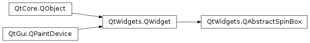

# 笔记

<!-- TOC -->

- [笔记](#笔记)
    - [QComboBox](#qcombobox)
        - [QComboBox常用方法](#qcombobox常用方法)
        - [QComboBox常用信号](#qcombobox常用信号)
    - [QSpinBox, QDoubleSpinBox](#qspinbox-qdoublespinbox)
        - [QSpinbox, QDoubleSpinBox常用的方法](#qspinbox-qdoublespinbox常用的方法)
        - [QSpinBox, QDoubleSpinBox常用信号](#qspinbox-qdoublespinbox常用信号)
    - [QSlider](#qslider)
        - [QSlider常用方法](#qslider常用方法)
        - [QSlider常用信号](#qslider常用信号)

<!-- /TOC -->

下拉列表QComboBox, 计数器QSpinBox, 滑动条QSlider

## QComboBox

`PyQt5.QWidgets.QComboBox` , 下拉列表框, 是一个集按钮和下拉选项于一体的控件.

### QComboBox常用方法

addItem() : 添加一个下拉选项  
addItems() : 从列表中添加下拉选项  
clear() : 删除下拉选项集合中的所有选项  
count() : 返回下拉选项集合中的数目  
currentText() : 返回选中选项的文本  
itemText(index: int) : 获取对应索引的item的选项文本  
currentIndex() : 返回选中项的索引  
setItem(index: int, text: str) : 设置序号为index项的文本

### QComboBox常用信号

activated : 当用户选中一个下拉选项时触发  
currentIndexChanged : 当下拉选项的索引发生改变时触发, 会向槽函数隐式传入索引值  
highlighted : 当选中一个已经选中的下拉选项时触发

## QSpinBox, QDoubleSpinBox

`PyQt5.QtWidgets.QSpinBox` , `PyQt5.QtWidgets.QDoubleSpinBox`, 计数器控件, 允许用户选择一个整数值, 通过单击向上/向下按钮或键盘上的上/下箭头来增加/减少当前显示的值, 当然用户也可以输入值.

默认情况下, QSpinBox的取值范围是0~99, 步长1. QDoubleSpinBox默认精度两位小数, 范围0.0~99.99, 步长1.

QSpinBox和QDoubleSpinBox都继承于PyQt5.QtWidgets.QAbstractSpinBox.

### QSpinbox, QDoubleSpinBox常用的方法

setMinimum() : 设置计数器下界  
setMaximum() : 设置计数器上界  
setRange() : 设置计数器的最小值, 最大值  
setSingleStep() : 设置计数器的步长  
singleStep() : 返回步长  
setValue() : 设置计数器当前值  
value() : 返回计数器当前值  

**QDoubleSpinBox中特有的** setDecimals() : 设置精度

### QSpinBox, QDoubleSpinBox常用信号

valueChanged : 每次单击向上/向下时触发, 会向槽函数发送更改后的值

## QSlider

`PyQt5.QtWigets.QSlider`, 滑动条控件, 提供了一个垂直或水平的滑动条. 其允许沿水平或垂直方向在一个范围内移动滑块, 并将滑块所在的位置转换成一个合法范围内的整数值. 有时候这种方式比输入数字或者使用SpinBox(计数器)更自然. 在槽函数中对滑块所在位置的处理相当于从整数之间的最小值和最高值进行取值.

设置水平还是垂直, 可以在初始化时就给参数, 即调用构造函数时, `PyQt5.QtCore.Qt.Horizontal`水平, `PyQt5.QtCore.Qt.Vertical`垂直.

    slider = QSlider(Qt.Horizontal)
    slider = QSlider(Qt.Vertical)

QSlider的值范围为0~99的整数.

### QSlider常用方法

setMinimum() : 设置滑动条控件的最小值  
setMaximum() : 设置滑动条控件的最大值  
setRange() : 设置最小值, 最大值  
setSingleStep() : 设置活动条控件的步长  
singleStep() : 返回步长  
setValue() : 设置控件的值  
value() : 返回控件的值  
setTickInterval() : 设置刻度间隔  
setTickPosition() : 设置刻度标记的位置, 可以输入一个枚举值, 这个枚举值制定刻度线相对于滑块和用户操作的位置.  
  + QSlider.NoTicks 不绘制任何刻度线
  + QSlider.TicksBothSides 在滑块的两侧绘制刻度线
  + QSlider.TicksAbove 在(水平)滑块上方绘制刻度线
  + QSlider.TicksBelow 在(水平)滑块下方绘制刻度线
  + QSlider.TicksLeft 在(垂直)滑块左侧绘制刻度线
  + QSlider.TicksRight 在(垂直)滑块右侧绘制刻度线

### QSlider常用信号

valueChanged : 当滑块的值发生改变时触发, 会自动向槽函数传入更改后的值  
sliderPressed : 当按下滑块时触发  
sliderMoved : 当拖动滑块时触发  
sliderReleased : 当释放滑块时触发
