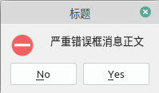

# 笔记

<!-- TOC -->

- [笔记](#笔记)
    - [QDialog](#qdialog)
        - [QDialog常用方法](#qdialog常用方法)
        - [QDialog信号](#qdialog信号)
    - [QMessageBox](#qmessagebox)
        - [QMessageBox常用方法](#qmessagebox常用方法)
        - [QMessageBox中的标准按钮类型](#qmessagebox中的标准按钮类型)
    - [QInputDialog](#qinputdialog)
        - [QInputDialog常用方法](#qinputdialog常用方法)
        - [QInputDialog常用信号](#qinputdialog常用信号)
    - [QFontDialog](#qfontdialog)
        - [QFontDialog常用方法](#qfontdialog常用方法)
        - [QFontDialog常用信号](#qfontdialog常用信号)
    - [QFileDialog](#qfiledialog)
        - [QFileDialog常用方法](#qfiledialog常用方法)
        - [QFileDialog信号](#qfiledialog信号)

<!-- /TOC -->

为了更好的交互, 一般可视化系统都会提供一系列的标准对话框来完成特定场景下的功能, 如询问是否, 选中字体, 选择颜色等.

对话框类控件QDialog, QMessageBox, QInputDialog, QFontDialog, QFileDialog

QColorDialog, QErrorMessage, QProgressDialog, QWizard

## QDialog

`PyQt5.QtWidgets.QDialog` , 是所有对话框的父类.

### QDialog常用方法

setWindowTitle() : 设置对话框标题  
setWindowModality() : 设置窗口模态.
  + PyQt5.QtCore.Qt.NonModal , 非模态, 可以和程序的其他窗口交互
  + PyQt5.QtCore.Qt.WindowModal , 窗口模态, 程序在未处理完当前对话框前, 不能与父窗口交互
  + PyQt5.QtCore.Qt.ApplicationModal , 应用程序模态, 阻止和程序任何其他窗口进行交互

**补充:**

result() : 返回模态对话框的结果码, Accepted 或 Rejected  
setResult() : 设置模态对话框的结果码.  
accept() : 隐藏模态对话框, 并设置Accepted给结果码  
reject() : 隐藏模态对话框, 并设置Rejected给结果码  
done() : 完成对话框, 并返回指定的结果码  
close() : 关闭  
destroy() : 销毁, 销毁了就再也没有了  
exec() : 显示模态对话框, 并阻塞知道关闭. 这个功能返回一个DialogCode结果.  

QDialog的accept()方法和reject()方法, 两者都能够隐藏QDialog, 但是返回值不同, 一个是Accepted, 一个是Rejected, 
返回值不同的作用是: 区分用户按下的OK按钮, 还是Cancel按钮.

1.如果使用exec（）默认为模态的。如果用show（）需要设置setModel（true）才是模态的。

2.当删除一个dialog对象时，exec（）返回QDialog：：Rejected，因此在删除dialog时要特别小心。

### QDialog信号

accepted : 确认  
finished : 向槽函数中传入result  
rejected : 拒绝  
destroied : 销毁  

## QMessageBox

`PyQt5.QtWidgets.QMessageBox` , 是一种通用的弹出式对话框, 用于显示消息, 允许用户通过单击不同的标准按钮对消息进行反馈. 每个标准按钮都有一个预定义的文本, 角色和十六进制数(返回值). 

QMessageBox类提供了许多常用的弹出式对话框, 如: 提示, 警告, 错误, 询问, 关于等对话框. 这些不同样式的对话框当然也就只是样式不同了.

### QMessageBox常用方法

各参数: parent-父窗口控件; title-对话框标题; text-对话框文本; buttons-多个标准按钮, 默认为OK按钮; defaultButton-默认选中的标准按钮, 默认是第一个标准按钮.  

information(parent, title, text, buttons, defaultButton) : 类方法, 弹出消息对话框  
question(parent, title, text, buttons, defaultButton) : 类方法, 弹出问答对话框  
warning(parent, title, text, buttons, defaultButton) : 类方法, 弹出警告对话框  
ctitical(parent, title, text, buttons, defaultButton) : 类方法, 弹出严重错误对话框  
about(parent, title, text, buttons, defaultButton) : 类方法, 弹出关于对话框  
setTitle() : 设置标题  
setText() : 设置消息正文  
setIcon() : 设置弹出对话框的图片

### QMessageBox中的标准按钮类型
<raw>
QMessage.OK : 同意  
QMessage.Cancel : 取消   
QMessage.Yes : 可以  
QMessage.No : 不行  
QMessage.Abort : 终止   
QMessage.Retry : 重试  
QMessage.Ignore : 忽略  
</raw>

使用"|"或运算来组合按钮. 对话框返回的值就是按钮的值.

    info = QMessageBox.information(widget, "标题", "消息对话框正文", QMessageBox.Yes | QMessageBox.No, QMessageBox.Yes)

    question = QMessageBox.question(widget, "标题", "提问框消息正文", QMessageBox.Yes | QMessageBox.No, QMessageBox.Yes)

    warn = QMessageBox.warning(widget, "标题", "警告框消息正文", QMessageBox.Yes | QMessageBox.No, QMessageBox.Yes)

    critical = QMessageBox.critical(widget, "标题", "严重错误框消息正文", QMessageBox.Yes | QMessageBox.No, QMessageBox.Yes)

    about = QMessageBox.about(widget, "标题", "关于对话框消息正文")

## QInputDialog

`PyQt5.QWidgets.QInputDialog` , 输入对话框, 用以提示获取必要的信息, 由一个文本框和两个按钮(OK, Cancel)组成. 当用户单击OK或按enter键后, 在父窗口可以收集通过 QInputDialog控件输入的信息. 其可以输入数字, 字符串或列表中的选项.

### QInputDialog常用方法

setInt() : 设置整形值  
setIntRange() : 设置整型范围  
setIntStep() : 设置整型步长  
setDouble() : 设置浮点值  
setDoubleRange() : 设置浮点范围  
setDoubleDecimals() : 设置浮点精度  
setDoubleStep() : 设置浮点步长  
setLabelText() : 设置标签文本  
setComboBoxItems() : 设置下拉框的内容  
setTextEchoMode() : 设置文本框模式  

**静态方法**

QInputDialog.getInt() : 从控件中获得标准整数输入  
QInputDialog.getDouble() : 从控件中获得标准浮点数输入  
QInputDialog.getText() : 从控件中获得标准字符串输入  
QInputDialog.getItem() : 从控件中获得列表里的选项输入  

返回一个元组, `(内容, bool)`

    num, ok = QInputDialog.getInt(self, "整型输入框", "输入数字", value=0, min=0, max=100, step=1)

    text, ok = QInputDialog.getText(self, "文本输入框", "输入内容", echo=QLineEdit.Normal)

    item, ok = QInputDialog.getItem(self, "下拉框输入框", "语言列表", items, current=0, editable=False)

### QInputDialog常用信号

doubleValueChanged : 浮点数值改变, 向槽函数传入改变值  
doubleValueSelected : 浮点数值选中, 向槽函数传入选中值  
intValueChanged : 整数型值改变, 向槽函数传入改变值  
intValueSelected : 整型数值选中, 向槽函数传入选中值  
textValueChanged : 字符串值改变, 向槽函数传入改变值  
textValueSelected : 字符串值选中, 向槽函数传入选中值

## QFontDialog

`PyQt5.QtWidgets.QFontDialog` , 字体选择对话框, 可以选择所显示文本的字号大小, 样式和格式. 

### QFontDialog常用方法

setCurrentFont : 设置当前字体

**静态方法**

getItem() :　从字体选择对话框中选择文本的显示字号大小, 样式和格式, 返回一个元组, (QFont, bool)  

### QFontDialog常用信号

currentFontChanged : 当前字体变动触发, 并向槽函数传入变化的QFont  
fontSelected : 字体选择时触发, 并向槽函数传入QFont

返回一个元组, (QFont, bool)

    font, ok = QFontDialog.getFont()

## QFileDialog

`PyQt5.QtWidgets.QFileDialog` , 文件对话框, 用于打开和保存文件的标准对话框. QFileDialog在打开文件时使用了文件过滤器, 用于显示指定拓展名的文件. 也可以设置使用QFileDialog打开文件时的起始目录和指定拓展名的文件.

### QFileDialog常用方法

exec() : 调用  
setDirectory() : 设置目录, 可使用Unicode码或者PyQt5.QtCore.QDir  
setDirectoryUrl() : 设置目录url, 使用PyQt5.QtCore.QUrl
setReadOnly() : 设置是否只读, 默认是  
setFilter() : 设置过滤器, 只显示过滤器允许的文件类型, 在PyQt5.QtCore.QDir中  
setNameFilter() : 设置过滤器, 通过字符串指定规律, 一般会读取在"()"中的, 如 images (*.jpg *png)  
setFileMode() : 可以选择的文件类型
  + QFileDialog.AnyFile , 任何文件
  + QFileDialog.ExistingFile , 已存在的文件
  + QFileDialog.ExistingFiles , 已经存在的多个文件 
  + QFileDialog.Directory , 文件目录

**静态方法**

getExistingDirectory() : 返回选中的已存在的目录  
getExistingDirectoryUrl() : 返回选中的已存在的PyQt5.QtCore.QUrl  
getOpenFileName() : 返回用户所选择文件的名称, 和是否成功的元组  
getOpenFileUrl() : 返回用户选择文件的PyQt5.QtCore.QUrl
getSaveFileName() : 使用用户选择的文件名并保存文件, 文件并不存在  
getSaveFileUrl() : 使用用户选择的文件PyQt5.QtCore.QUrl并保存文件, 文件不存在  
saveFileContent (fileContent[, fileNameHint=””])

### QFileDialog信号

currentChanged : 当前路径改变时触发, 并向槽函数发动路径  
currentUrlChanged : 当前url改变时触发, 并向槽函数发送url
directoryEntered : 目录输入时触发, 并向槽函数发送目录  
directoryUrlEntered : 目录url输入时触发, 并向槽函数发送目录  
fileSelected : 文件选择时触发, 并向槽函数发送文件  
filesSelected : 多个文件选择时触发, 并向槽函数发送多个文件  
filterSelected : 过滤器选择时触发, 并向槽函数发送过滤器  
urlSelected : url选择时触发, 并向槽函数发送url  
urlsSelected : 多个url选择时触发, 并向槽函数发送urls

    class FileDialogDemo(QWidget):
    .....

        root_dir = "c://" if sys.platform == "win32" else "/home"

        def get_directory(self):
            """只获取目录地址"""
            directory = QFileDialog.getExistingDirectory(parent=self, caption="获取目录", directory=FileDialogDemo.root_dir)
            self.linedit.setText(directory)

        def get_pic_file(self):
            """读取一个已经存在的图片"""
            picfile, ok = QFileDialog.getOpenFileName(parent=self, caption="获取图片文件", directory=FileDialogDemo.root_dir, filter="Image files(*.jpg *.png *.gif *.svg *.bmp)")
            if ok:
                self.label.setPixmap(QPixmap(picfile))

        def get_text_file(self):
            """读取文本内容"""
            file_dialog = QFileDialog(parent=self, caption="获取文本文件", directory=FileDialogDemo.root_dir)
            file_dialog.setFileMode(QFileDialog.AnyFile)
            # file_dialog.setFilter(QDir.Files)
            file_dialog.setNameFilter("all files (*)")

            if file_dialog.exec():
                filenames = file_dialog.selectedFiles()   # -> list(str)
                file = open(filenames[0], 'r', encoding="utf-8", errors='ignore')
                with file:
                    data = file.read()
                    self.textedit.setText(data)