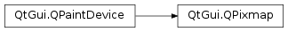

# 笔记

<!-- TOC -->

- [笔记](#笔记)
    - [补充](#补充)
    - [QPainter](#qpainter)
        - [QPainter常用绘制方法](#qpainter常用绘制方法)
        - [在PyQt5.QtCore.Qt中的预制画笔风格](#在pyqt5qtcoreqt中的预制画笔风格)
    - [QPen](#qpen)
    - [QBrush](#qbrush)
    - [QPixmap](#qpixmap)
        - [QPixmap常用方法](#qpixmap常用方法)

<!-- /TOC -->

在PyQt5中, 一般可以通过QPainter, QPen, QBrush这三个类实现绘图功能. QPixmap, QIcon的作用是加载并呈现本地图片, 而图像的呈现本质上也是通过绘图方式实现的.

## 补充

`PyQt5.QtGui.QColor`, 提供RGB, HSV, CMYK表示法的颜色对象.

`PyQt5.QtGui.QFont`, 指定一系列的参数, 用于绘画文字.

Qt提供了四种处理图像数据的类: `PyQt5.QtGui.QImage`, `PyQt5.QtGui.QPixmap`, `PyQt5.QtGui.QBitmap`, `PyQt5.QtGui.QPicture`. QImage被设计用于I/O操作和直接访问与操作. QPixmap被优化用于在屏幕上展示图片. QBitmap只是简单的继承了QPixmap, 并确保了深度为1. 如果一个QPixmap对象实际是bitmap, isQBitmap()方法会返回True, 其他False. QPicture是一个记录和重放QPainter命令的涂料板.

`PyQt5.QtGui.QIcon` 用于处理不同模式和状态的可缩放图标.

## QPainter

`PyQt5.QtGui.QPainter` , 绘图控件, 其能在QWidget上执行绘图操作, 是一个绘制工具, 为大部分图形界面提供了高度优化的函数, 使QPainter类可以绘制从简单的直线到复杂的饼图.

绘制操作在`PyQt5.QWidget.paintEvent()`中完成. 绘制方法必须放在QtGui.QPainter对象的`begin()`和`end()`之间. QPainter类在控件或其他绘图设备上执行较低级别的图形绘制功能.

### QPainter常用绘制方法

begin() : 开始在目标设备上绘制  
end() : 结束在目标设备上绘制  
drawArc() : 在起始角度和最终角度之间画弧  
drawEllipse() : 在一个举行内画一个椭圆  
drawLine(x1: int, y1: int, x2: int, y2: int) : 绘制一条制定了端点坐标的线. 绘制从(x1, y1)到(x2, y2)的直线, 并设置当前画笔位置为(x2, y2)  
drawPixmap() : 从图像文件提取Pixmap并将其显示在指定的位置  
drawPolygon() : 使用坐标数组绘制多边形  
drawRect(x: int, y: int, w: int, h: int) : 已给定的宽度w和高度h从左上角坐标(x, y)绘制一个矩形  
drawText() : 显示给定坐标处的文字  
fillRext() : 使用QColor参数填充矩形  
setBrush() : 设置画笔风格  
setPen() : 设置用于绘制的笔的颜色, 大小和样式  

### 在PyQt5.QtCore.Qt中的预制画笔风格

PyQt5.QtCore.Qt.NoPen : 没有线. 不如QPainter.DrawRect填充, 但没有绘制任何边界线  
PyQt5.QtCore.Qt.SolidLine : 实线  
PyQt5.QtCore.Qt.DashLine : 虚线  
PyQt5.QtCore.Qt.DotLine : 用点构成的线
PyQt5.QtCore.Qt.DashDotLine : 轮流交替的电和短线  
PyQt5.QtCore.Qt.DashDotDotLine : 一条短线, 两个点轮流交替构成的线  
PyQt5.QtCore.Qt.MPenStyle : 画笔风格的掩码  

    class DrawFont(QWidget):
    ......

        def paintEvent(self, QPaintEvent):
            # 重载QWidget.paintEvent
            painter = QPainter(self)
            painter.begin(self)
            # 自定义绘制方法
            self.to_draw_text(QPaintEvent, painter)
            painter.end()

        def to_draw_text(self, event, painter):
            # 设置字体
            painter.setFont(QFont("monospace", 20))
            # 设置画笔的颜色
            painter.setPen(Qt.red)   # 使用QColor自定义也可以
            # 绘制文字
            painter.drawText(event.rect(), Qt.AlignCenter, "你是个憨憨. hello, world.")

QPainter类负责所有低级别的绘制, 所有绘制方法都要放在begin()和end()之间QtGui.

## QPen

`PyQt5.QtGui.Qpen`是一个基本的图形对象, 用于绘制直线, 曲线或者给轮廓换出矩形, 椭圆形及其他形状等.

    class DrawLine(QWidget):
    ......

        def paintEvent(self, QPaintEvent):
            painter = QPainter()
            painter.begin(self)
            self.to_draw_lines(painter)
            painter.end()

        def to_draw_lines(self, painter):
            # 初始化, 使用实线
            pen = QPen(Qt.black, 2.0, Qt.SolidLine)
            painter.setPen(pen)
            painter.drawLine(20, 40, 250, 40)

            pen.setStyle(Qt.DashLine)   # 使用虚线
            painter.setPen(pen)
            painter.drawLine(20, 80, 250, 80)

            pen.setStyle(Qt.DashDotLine)   # 使用线点
            painter.setPen(pen)
            painter.drawLine(20, 120, 250, 120)

            pen.setStyle(Qt.DotLine)   # 使用点
            painter.setPen(pen)
            painter.drawLine(20, 160, 250, 160)

            pen.setStyle(Qt.DashDotDotLine)   # 使用线点点
            painter.setPen(pen)
            painter.drawLine(20, 200, 250, 200)

            pen.setStyle(Qt.CustomDashLine)   # 使用自定线
            painter.setPen(pen)
            painter.drawLine(20, 240, 250, 240)

## QBrush

`PyQt5.QtGui.QBrush`是一个基本的图形对象, 用于填充如矩形, 椭圆形或多边形等形状. QBrush有三种类型: 预定义, 过渡, 纹理图形.

    class DrawBrush(QWidget):
    ......

        def paintEvent(self, QPaintEvent):
            painter = QPainter()
            painter.begin(self)
            self.to_draw_lines(painter)
            painter.end()

        def to_draw_lines(self, painter):
            # 初始化刷子, 使用实心刷子
            brush = QBrush(Qt.SolidPattern)
            painter.setBrush(brush)
            painter.drawRect(10, 15, 90, 60)

            brush = QBrush(Qt.Dense1Pattern)
            painter.setBrush(brush)
            painter.drawRect(130, 15, 90, 60)

            brush = QBrush(Qt.Dense2Pattern)
            painter.setBrush(brush)
            painter.drawRect(250, 15, 90, 60)

            brush = QBrush(Qt.Dense3Pattern)
            painter.setBrush(brush)
            painter.drawRect(10, 105, 90, 60)

            brush = QBrush(Qt.DiagCrossPattern)
            painter.setBrush(brush)
            painter.drawRect(10, 105, 90, 60)

            brush = QBrush(Qt.Dense5Pattern)
            painter.setBrush(brush)
            painter.drawRect(130, 105, 90, 60)

            brush = QBrush(Qt.Dense6Pattern)
            painter.setBrush(brush)
            painter.drawRect(250, 105, 90, 60)

            brush = QBrush(Qt.HorPattern)
            painter.setBrush(brush)
            painter.drawRect(10, 195, 90, 60)

            brush = QBrush(Qt.VerPattern)
            painter.setBrush(brush)
            painter.drawRect(130, 195, 90, 60)

            brush = QBrush(Qt.BDiagPattern)
            painter.setBrush(brush)
            painter.drawRect(250, 195, 90, 60)

## QPixmap

`PyQt5.QtGui.QPixmap`用于绘图设备的图像显示, 它可以作为一个QPaintDevice对象(这也是其父类), 也可以加载到一个控件中, 通常是标签或按钮, 用于在标签或按钮上显示图像.

QPixmap可以读取的图像文件类型有bmp, gif, jpg, jpeg, png, pbm, pgm, ppm, xbm, xpm等.

### QPixmap常用方法

copy() : 从QRect对象复制到QPixmap对象  
fromImage() : 将QImage对象转换为QPixmap对象  
grabWidget() : 从给定的窗口小控件创建一个像素图  
grabWindow() : 在窗口中创建数据的像素图  
load() : 加载图像文件作为QPixmap对象  
save() : 将Pixmap对象保存为文件  
toImage() : 将QPixmap对象转换为QImage对象
