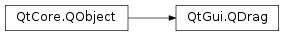
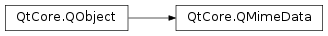
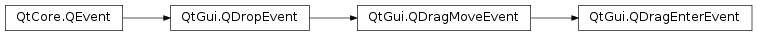
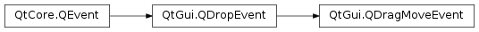
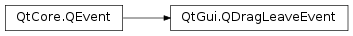
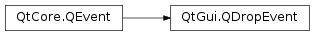

# 笔记

<!-- TOC -->

- [笔记](#笔记)
    - [MIME详细介绍, 来自维基百科](#mime详细介绍-来自维基百科)
        - [内容类型](#内容类型)
        - [内容传输编码](#内容传输编码)
        - [内容标识符(可选)](#内容标识符可选)
        - [内容描述(可选)](#内容描述可选)
    - [Drag(拖动)与Drop(放下)](#drag拖动与drop放下)
        - [支持拖曳的QWidget控件常用的拖曳事件](#支持拖曳的qwidget控件常用的拖曳事件)
        - [QMimeData的常用方法](#qmimedata的常用方法)
    - [QClipboard](#qclipboard)
        - [QClipboard常用方法](#qclipboard常用方法)
        - [QClipboard常用信号](#qclipboard常用信号)

<!-- /TOC -->

## MIME详细介绍, 来自维基百科

多用途互联网邮件扩展(英语: Multipurpose Internet Mail Extensions, 缩写: MIME)是一个互联网标准, 它扩展了电子邮件标准, 使其能够支持:

+ 非ASCII字符文本;
+ 非文本格式附件(二进制、声音、图像等);
+ 由多部分(multiple parts)组成的消息体;
+ 包含非ASCII字符的头信息(Header information). 这个标准被定义在 RFC 2045、RFC 2046、RFC 2047、RFC 2048、RFC 2049 等RFC中.

MIME改善了由 RFC 822 转变而来的 RFC 2822 , 这些旧标准规定电子邮件标准并不允许在邮件消息中使用7位ASCII字符集以外的字符. 正因如此, 一些非英语字符消息和二进制文件, 图像, 声音等非文字消息原本都不能在电子邮件中传输(MIME可以). MIME规定了用于表示各种各样的数据类型的符号化方法. 此外, 在万维网中使用的HTTP协议中也使用了MIME的框架, 标准被扩展为互联网媒体类型. 

### 内容类型

内容类型(Content-Type), 这个头部领域用于指定消息的类型. 一般以下面的形式出现. 

`Content-Type: [type]/[subtype]; parameter`

**type有下面的形式.**

Text：用于标准化地表示的文本信息, 文本消息可以是多种字符集和或者多种格式的;  
Multipart：用于连接消息体的多个部分构成一个消息, 这些部分可以是不同类型的数据;  
Application：用于传输应用程序数据或者二进制数据;  
Message：用于包装一个E-mail消息;  
Image：用于传输静态图片数据;  
Audio：用于传输音频或者音声数据;  
Video：用于传输动态影像数据, 可以是与音频编辑在一起的视频数据格式.  

**subtype用于指定type的详细形式.**

content-type/subtype配对的集合和与此相关的参数, 将随着时间而增长. 为了确保这些值在一个有序而且公开的状态下开发, MIME使用Internet Assigned Numbers Authority (IANA)作为中心的注册机制来管理这些值. 常用的subtype值如下所示：

text/plain : (纯文本)  
text/html : (HTML文档)  

image/gif : (GIF图像)  
image/jpeg : (JPEG图像)【PHP中为：image/pjpeg】  
image/png : (PNG图像)【PHP中为：image/x-png】  
audio/basic : (AU声音文件)  
audio/midi : (MID声音文件)  
video/mpeg : (MPEG动画)  
video/x-msvideo : (AVI动画)

application/pdf : (PDF文档)  
application/rtf : (RTF文档)  
application/msword : (Microsoft Word文件)  
application/xhtml+xml : (XHTML文档)  
application/x-www-form-urlencoded : (使用HTTP的POST方法提交的表单)  
application/x-tar : (tar压缩文件)  
application/x-gzip : (gzip压缩文件)  
application/octet-stream : (任意的二进制数据)  
application/vnd.wap.xhtml+xml : (wap1.0+)  
application/xhtml+xml : (wap2.0+)  

message/rfc822 : (RFC 822形式)  
multipart/alternative : (HTML邮件的HTML形式和纯文本形式, 相同内容使用不同形式表示)  
multipart/form-data : (同上, 但主要用于表单提交时伴随文件上传的场合)  

此外, 尚未被接受为正式数据类型的subtype, 可以使用x-开始的独立名称(例如application/x-gzip). vnd-开始的固有名称也可以使用(例：application/vnd.ms-excel).

**parameter可以用来指定附加的信息**

更多情况下是用于指定text/plain和text/htm等的文字编码方式的charset参数. 

MIME根据type制定了默认的subtype, 当客户端不能确定消息的subtype的情况下, 消息被看作默认的subtype进行处理. Text默认是text/plain, Application默认是application/octet-stream而Multipart默认情况下被看作multipart/mixed. 

### 内容传输编码

内容传输编码(Content-Transfer-Encoding), 这个区域使指定ASCII以外的字符编码方式成为可能. 形式如下：

`Content-Transfer-Encoding: [mechanism]`

其中, mechanism的值可以指定为“7bit”, “8bit”, “binary”, “quoted-printable”, “base64”.

7bit : 7位元ASCII码.  
8bit : 8位元ASCII码.  
binary : 不仅会出现非ASCII字符, 而且对于SMTP队列长度不用足够短.  
quoted-printable : 因为欧洲的一些文字和ASCII字符集中的某些字符有部分相同. 如果邮件消息使用的是这些语言的话, 与ASCII重叠的那些字符可以原样使用, ASCII字符集中不存在的字符采用形如“=??”的方法编码. 这里“??”需要用将字符编码后的16进制数字来指定. 采用quoted-printable编码的消息, 长度不会变得太长, 而且大部分都是ASCII中的字符, 即使不通过解码也大致可以读懂消息的内容.  
base64 : base64是一种将二进制的01序列转化成ASCII字符的编码方法. 编码后的文本或者二进制消息, 就可以运用SMTP等只支持ASCII字符的协议传送了. Base64一般被认为会平均增加33%的报文长度, 而且, 经过编码的消息对于人类来说是不可读的.  
x-encodingname : 这个值是预留的扩展.

### 内容标识符(可选)

### 内容描述(可选)

## Drag(拖动)与Drop(放下)

提供拖拽功能很直观, 在很多桌面应用中, 复制或移动对象都可以通过拖拽来完成.

`PyQt5.QtGui.QDrag` , 基于MIME类型的拖拽的数据传输.

`PyQt5.QtCore.QMimeData` , 与对应的MIME数据类型相关联. 允许检测和使用方便的MIME类型.

    drag =  QDrag(self)
    mimeData =  QMimeData()

    mimeData.setText(commentEdit.toPlainText())
    drag.setMimeData(mimeData)

### 支持拖曳的QWidget控件常用的拖曳事件

DragEnterEvent : 当执行一个拖曳控件操作, 鼠标指针进入该控件时触发. 在这个事件中可以获得被操作的窗口控件, 还可以有条件地接受或拒绝该拖曳操作  
DragMoveEvent : 在拖曳操作进行时触发  
DragLeaveEvent : 当执行一个拖曳控件操作, 并且鼠标指针离开该控件时触发  
DropEvent : 当拖曳操作在目标控件上被释放时, 这个事件将被触发  

这四个事件的顺序DragEnter -> DragMove -> DragLeave -> Drop

`PyQt5.QtGui.QDragEnterEvent` ,

    class QDragEnterEvent(pos, actions, data, buttons, modifiers)
        param modifiers
            KeyboardModifiers

        param actions
            DropActions

        param buttons
            MouseButtons

        param pos
            QPoint

        param data
            QMimeData
    
    Methods
        accept(...)
            accept(self)
            accept(self, QRect)
        
        answerRect(...)
            answerRect(self) -> QRect
        
        ignore(...)
            ignore(self)
            ignore(self, QRect)
        
        acceptProposedAction(...)
            acceptProposedAction(self)
        
        dropAction(...)
            dropAction(self) -> Qt.DropAction
        
        keyboardModifiers(...)
            keyboardModifiers(self) -> Qt.KeyboardModifiers
        
        mimeData(...)
            mimeData(self) -> QMimeData
        
        mouseButtons(...)
            mouseButtons(self) -> Qt.MouseButtons
        
        pos(...)
            pos(self) -> QPoint
        
        posF(...)
            posF(self) -> QPointF
        
        possibleActions(...)
            possibleActions(self) -> Qt.DropActions
        
        proposedAction(...)
            proposedAction(self) -> Qt.DropAction
        
        setDropAction(...)
            setDropAction(self, Qt.DropAction)
        
        source(...)
            source(self) -> QObject

`PyQt5.QtGui.QDragMoveEvent` ,

    class QDragMoveEvent(pos, actions, data, buttons, modifiers[, type=DragMove])
        param type
            Type

        param modifiers
            KeyboardModifiers

        param actions
            DropActions

        param buttons
            MouseButtons

        param pos
            QPoint

        param data
            QMimeData

    Methods
        QDragMoveEvent.accept(r: QRect)
            与accept（）相同，但还通知，如果将来的移动保留在小部件上给定的矩形内，则也可以接受。这可以提高性能，但也可能被基础系统忽略。如果矩形为空，则将连续发送拖动移动事件。如果源在计时器事件中滚动，这将很有用。

        QDragMoveEvent.answerRect() -> QRect
        返回接受放置的控件的矩形. 可以使用此信息将控件的能放置的矩形限制在想要的位置上.

        QDragMoveEvent.ignore(r: QRect)
        和accept(const QRect &)相反. 在矩形内移动是不可接受的，将被忽略.
        
        acceptProposedAction(...)
            acceptProposedAction(self)
        
        dropAction(...)
            dropAction(self) -> Qt.DropAction
        
        keyboardModifiers(...)
            keyboardModifiers(self) -> Qt.KeyboardModifiers
        
        mimeData(...)
            mimeData(self) -> QMimeData
        
        mouseButtons(...)
            mouseButtons(self) -> Qt.MouseButtons
        
        pos(...)
            pos(self) -> QPoint
        
        posF(...)
            posF(self) -> QPointF
        
        possibleActions(...)
            possibleActions(self) -> Qt.DropActions
        
        proposedAction(...)
            proposedAction(self) -> Qt.DropAction
        
        setDropAction(...)
            setDropAction(self, Qt.DropAction)
        
        source(...)
            source(self) -> QObject
        
        isAccepted(...)
            isAccepted(self) -> bool
        
        registerEventType(...)
            registerEventType(hint: int = -1) -> int
        
        setAccepted(...)
            setAccepted(self, bool)
        
        spontaneous(...)
            spontaneous(self) -> bool
        
        type(...)
            type(self) -> QEvent.Type

`PyQt5.QtGui.QDragLeaveEvent` ,

    class QDragLeaveEvent
        Constructs a QDragLeaveEvent .

`PyQt5.QtGui.QDropEvent` ,

    class QDropEvent(pos, actions, data, buttons, modifiers[, type=Drop])
        param type
            Type

        param modifiers
            KeyboardModifiers

        param actions
            DropActions

        param buttons
            MouseButtons

        param pos
            QPointF

        param data
            QMimeData

    Methods
        QDropEvent.acceptProposedAction()
            将放置事件设置为推荐事件

        QDropEvent.dropAction()
            返回目标要对数据执行的操作. 如果已调用setDropAction()来显式选择放置动作, 则此动作可能与proposalAction()中提供的动作不同.

        QDropEvent.keyboardModifiers() -> KeyboardModifiers
            返回被按下的修饰键.

        QDropEvent.mimeData() -> QMimeData
            返回被放置到控件中的数据和其MIME类型信息
            
        QDropEvent.mouseButtons() -> MouseButtons
            返回被按下的鼠标键.

        QDropEvent.pos() -> QPoint
            返回放置事件发生的坐标位置.

        QDropEvent.posF() -> QPointF
            返回放置位置.

        QDropEvent.possibleActions() -> DropActions
            返回可能的QR组合

        QDropEvent.proposedAction() -> DropAction
            返回建议的放置动作

        QDropEvent.setDropAction(action) -> DropAction
            设置目标要对传入数据的动作. 可用此来重载建议的行为

        QDropEvent.source() -> QObject
            返回对应拖曳操作的控件的源, 如果有的话.

### QMimeData的常用方法

|判断函数     | 获取函数      | 设置函数        | MIME类型       |
|-           |-            |-               |-              |
| hasText()  | text()      | setText()      | text/plain    |
| hasHtml()  | html()      | setHtml()      | text/html     |
| hasUrls()  | urls()      | setUrls()      | text/uri-list |
| hasImage() | imageData() | setImageData() | image/*       |
| hasColor() | colorData() | setColorData() | application/x-color |

许多QWidget对象都支持拖曳动作, 语序拖曳数据的控件必须设置`QWidget.setDragEnabled()`为True. 另外, 控件应给影响拖曳事件, 以便存储所拖曳的数据.

    class ComboxAcceptDrop(QComboBox):
        """自定义QComBox, 让其能够接受拖曳数据"""
        def __init__(self, parent=None):
            super().__init__(parent=parent)
            # 让QComboBox能接受拖曳
            self.setAcceptDrops(True)

        def dragEnterEvent(self, QDragEnterEvent):
            """重载拖拽入控件时事件"""
            print(QDragEnterEvent)
            mime_data = QDragEnterEvent.mimeData()
            if mime_data.hasText():
                QDragEnterEvent.accept()
            else:
                QDragEnterEvent.ignore()

        def dropEvent(self, QDropEvent):
            """重载拖曳释放事件"""
            print(QDropEvent)
            self.addItem(QDropEvent.mimeData().text())

    class Win(QWidget):
        """主窗口"""
        def __init__(self, parent=None):
            super().__init__(parent=parent)
            self.resize(420, -1)
            # 设置窗口控件本身支持拖拽事件
            self.setAcceptDrops(True)

            form_layout = QFormLayout(parent=self)
            self.lable = QLabel("可以将左边的文本拖拽到右边的下拉控件中")
            # 用于产生拖拽内容的单行编辑框
            self.linedit = QLineEdit()
            self.linedit.setDragEnabled(True)   # 设置单行编辑框内容可以拖拽
            self.linedit.setStyleSheet("background: rgb(230,230,200); color: red; min-width: 200px;")
            # 用于接受拖拽的下拉框
            self.combox = ComboxAcceptDrop()
            self.combox.setMaximumWidth(160)

            form_layout.addRow(self.lable)
            form_layout.addRow(self.linedit, self.combox)
            self.setLayout(form_layout)

## QClipboard

`PyQt5.QtGui.QClipboard` , 剪贴板, 提供了对系统剪贴板的访问, 可以在应用程序之间复制和粘贴数据. 其操作类似于QDrag类, 也使用类似的数据类型(MIME).

QApplication类有一个静态方法`clipboard()`, 它返回对剪切板对象的引用. 任何类型的QMimeData都可以从剪贴板复制或粘贴.

### QClipboard常用方法

clear() : 清除剪贴板内容  
setImage() : 将`PyQt5.QtGui.QImage`对象复制到剪贴板中  
setMimeData() : 将MIME数据复制到剪贴板  
setPixmap() : 从系统剪贴板中复制Pixmap对象  
setText() : 从系统剪贴板中复制文本  
text() : 从系统剪贴板中检索文本  

### QClipboard常用信号

dataChanged : 当剪贴板内容发生变化时触发  

    class Win(QWidget):
    ......

        def copy_html(self):
            mime_data = QMimeData()
            mime_data.setHtml("<b> Bold and Red</b>")
            clipboard = QApplication.clipboard()
            clipboard.setMimeData(mime_data)   # 将html文本设置入剪贴板
        
        def paste_html(self):
            clipboard = QApplication.clipboard()
            mime_data = clipboard.mimeData()
            if mime_data.hasHtml():
                self.text_label.setText(mime_data.html())   # 将剪贴板中的html文本 设置到label
