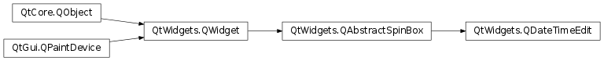
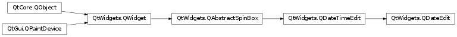
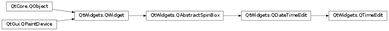

# 笔记

<!-- TOC -->

- [笔记](#笔记)
    - [补充](#补充)
    - [QCalendarWidget](#qcalendarwidget)
        - [QCalendarWidget常用方法](#qcalendarwidget常用方法)
    - [QDateTimeEdit](#qdatetimeedit)
        - [QDateTimeEdit常用方法](#qdatetimeedit常用方法)
        - [QDateTimeEdit常用信号](#qdatetimeedit常用信号)
        - [QDateTimeEdit的子类](#qdatetimeedit的子类)
        - [初始化QDateTimeEdit](#初始化qdatetimeedit)
        - [设置日期时间显示格式](#设置日期时间显示格式)
        - [设置日期时间范围](#设置日期时间范围)
        - [弹出日历](#弹出日历)
        - [获取日期时间](#获取日期时间)
        - [信号和槽函数](#信号和槽函数)

<!-- /TOC -->

## 补充

`PyQt5.QtCore.QDate` , 用于日期, 可以用于决定日期, 比较日期, 操纵日期.

`PyQt5.QtCore.QTime` , 用于时钟时间, 可以用于决定时钟时间, 比较时钟时间, 操纵时钟时间.

`PyQt5.QtCore.QDateTime` , 将QDate和QTime都整合在一起的对象.

## QCalendarWidget

`PyQt5.QtWidgets.QCalendarWidget` , 日历控件, 其提供了一个基于月份的视图, 允许用户通过鼠标或键盘选择日期, 默认选中的是今天的日期. 也可以对日历的日期范围进行规定.

### QCalendarWidget常用方法

setDateRange() : 设置日期范围供选择  
setFirstDayOfWeek() : 设置以哪个星期为第一天, 默认是星期日.
  + PyQt5.QtCore.Qt.Monday
  + PyQt5.QtCore.Qt.Tuesday
  + PyQt5.QtCore.Qt.Wednesday
  + PyQt5.QtCore.Qt.Thursday
  + PyQt5.QtCore.Qt.Friday
  + PyQt5.QtCore.Qt.Saturday
  + PyQt5.QtCore.Qt.Sunday

setMinimumDate() : 设置最大日期  
setMaximumDate() : 设置最小日期  
setSelectedDate() : 设置一个`PyQt5.QtCore.QDate`对象, 作为日期控件所选定的日期  
maximumDate() : 获取日历控件最大日期  
minimumDate() : 获取日历控件最小日期  
selectedDate() : 返回当前选定的日期  
setGridvisible() : 设置日历控件是否显示网格

## QDateTimeEdit

`PyQt5.QtWidgets.QDateTimeEdit` , 日期编辑控件, 允许编辑日期时. 可以使用键盘和上下箭头按钮来增加或减少日期时间值. 

### QDateTimeEdit常用方法

setDateRange(min: QDate, max: QDate) : 设置日期范围, 要单独设置看文档  
setTimeRange(min: QTime, max: QTime) : 设置时刻范围, 要单独设置看文档  
setDateTimeRange(min: QDateTime, max: QDateTime) : 设置日期时间, 单独设置看文档  
setCalendarPopup() : 是否允许弹出日历控件  
setCalendarWidget() : 设置日历控件  
calendarWidget() : 返回日历控件  
setDisplayFormat() : 设置日期时间[格式](https://docs.python.org/3/library/datetime.html#strftime-and-strptime-format-codes)  
setMaximumDate() : 设置控件的最大日期  
setMinimumDate() : 设置控件的最小日期  
date() : 返回编辑的日期  
time() : 返回编辑的时间  
dateTime() : 返回日期时间  

### QDateTimeEdit常用信号

dateChanged : 当日期改变时触发  
timeChange : 当时间改变时触发  
dateTimeChanged : 当日期时间改变时触发  

### QDateTimeEdit的子类

`PyQt5.QtWidgets.QDateEdit`, 用来编辑控件的日期, 仅包含年, 月, 日

    datedit = QDateEdit()
    datedit.setDisplayFormat("yyyy-MM-dd")

`PyQt5.QtWidgets.QTimeEdit`, 用来编辑时刻, 仅包含小时, 分钟, 秒

    timedit = QTimeEdit()
    timedit.setDisplayFormat("HH:mm:ss")

QDateEdit, QTimeEdit 许多特性和功能都由QDateTimeEdit类提供.

### 初始化QDateTimeEdit

如果QDateTimeEdit类构造时不指定日期时间, 那么系统会为其设置一个和本地相同的日期格式, 并且值为2000年1月1日0时0分0秒. 也可以手动制定控件显示的日期时间.

    widget = QWidget()
    
    datetimedit_1 = QDateTimeEdit(parent=widget)
    datetimedit_2 = QDateTimeEdit(QDateTime.currentDateTime(), widget)
    datedit = QDateTimeEdit(QDate.currentDate(), widget)
    timedit = QDateTimeEdit(QTime.currentTime(), widget)

除了构造函数, 也可以使用QDateTimeEdit的提供的方法来设置: `setDateTime(dt: QDateTime)`, `setDate(d: QDate)`, `setTime(t: QTime)`

### 设置日期时间显示格式

使用`setDisplayFormat(s: str)`来自定义日期时间显示格式

    widget = QWidget()

    datetimedit_1 = QDateTimeEdit(parent=widget)
    datetimedit_2 = QDateTimeEdit(QDateTime.currentDateTime(), widget)
    datedit = QDateTimeEdit(QDate.currentDate(), widget)
    timedit = QDateTimeEdit(QTime.currentTime(), widget)

    # 使用setDisplayFormat设置格式
    datetimedit_1.setDisplayFormat("yyyy-MM-dd HH:mm:ss")
    datetimedit_2.setDisplayFormat("yyyy/MM/dd HH-mm-ss")
    datedit.setDisplayFormat("yyyy.MM.dd")
    timedit.setDisplayFormat("HH:mm:ss")

### 设置日期时间范围

下面代码创建了QDateTimeEdit对象, 并设置日期时间为今天(currentDate), 同时限制有效日期的范围距今天±365

    widget = QWidget()

    datedit = QDateTimeEdit(QDateTime.currentDateTime(), widget)
    datedit.setDisplayFormat("yyyy-MM-dd HH:mm:ss")
    # 单独设置日期时间范围
    datedit.setMaximumDate(QDate.currentDate().addDays(365))
    datedit.setMinimumDate(QDate.currentDate().addDays(-365))

### 弹出日历

默认情况下, 只能通过上下箭头来改变日期时间. 如果要弹出日历控件, 只需要用setCalendarPopup(True)即可.

    widget = QWidget()

    datedit = QDateTimeEdit(QDateTime.currentDateTime(), widget)
    datedit.setMaximumDate(QDate.currentDate().addDays(365))
    datedit.setMinimumDate(QDate.currentDate().addDays(-365)
    # 设置可以弹出日历控件
    datedit.setCalendarPopup(True)

### 获取日期时间

可以通过date(), dateTime()等方法来获取日期时间对象, 如果要获取年, 月, 日等信息, 则可以调用QDate的year(), month(), day()等函数.

    widget = QWidget()
    datedit = QDateTimeDate(widget)

    date_time = datedit.dateTime()   # PyQt5.QtCore.QDateTime
    # 最大日期时间
    max_date_time = datedit.maximumDateTime()   # PyQt5.QtCore.QDate
    # 最大日期
    max_date = datedit.maximumDate()   # PyQt5.QtCore.QDate
    # 最大时间
    max_time = datedit.maximumTime()   # PyQt5.QtCore.QDate
    # 最小日期时间
    min_date_time = datedit.minimumDateTime()   # PyQt5.QtCore.QTime
    # 最小日期
    min_date = datedit.minimumDate()   # PyQt5.QtCore.QTime
    # 最小时间
    min_time = datedit.minimumTime()   # PyQt5.QtCore.QTime

### 信号和槽函数

QDateTimeEdit控件常用的信号是dateTimeChanged, dateChanged, timeChanged, 分别在改变日期时间, 日期, 时间的时候触发.

    datedit.dateTimeChanged.connect(hand_date_time)   # 会向槽函数传递一个QDateTime
    datedit.dateChanged.connect(hand_date)   # 会向槽函数传递一个QDate
    datedit.timeChanged.connect(hand_time)   # 会向槽函数传递一个QTime

    def hand_date_time(date_time):
        pass

    def hand_date(date):
        pass

    def hand_time(time):
        pass
