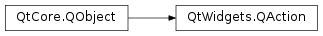
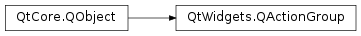

# 笔记

<!-- TOC -->

- [笔记](#笔记)
    - [补充](#补充)
    - [QMenuBar](#qmenubar)
        - [设计菜单系统时的一些重要方法和信号](#设计菜单系统时的一些重要方法和信号)
    - [QToolBar](#qtoolbar)
        - [QToolBar常用方法](#qtoolbar常用方法)
        - [QToolBar常用信号](#qtoolbar常用信号)
    - [QStatusBar](#qstatusbar)
        - [QToolBar常用方法](#qtoolbar常用方法-1)

<!-- /TOC -->

## 补充

`PyQt5.QtWidgets.QMenu`

    QWidget
        |
        +-QMenu

**常用方法**

actionAt : 返回Action的坐标  
actionGeometry : 返回Action的geometry  
activeAction() : 返回当前突出显示显示的Action  
addAction() : 添加Action, 可以直接使用str添加, 此时返回一个新的QAction, 也可添加配置好的QAction  
addMenu() : 添加菜单, 可以直接使用str添加, 并配置icon, 此时返回一个新的QMenu  
addSeparator() : 添加分割  
insertMenu (before, menu)  
insertSection (before, icon, text)  
insertSection (before, text)  
insertSeparator (before)  
clear()  
popup (pos[, at=None])  : 通过atAction返回的菜单将显示在指定位置  
mapToGlobal() : 转换一个控件的本地坐标为全局坐标  
setIcon (icon)  
setTitle()  
title()  
toolTipsVisible ()  

**信号**

aboutToHide ()  
aboutToShow ()  
hovered (action)  
triggered (action)  

**静态方法**

exec_  : 同步执行此菜单

`PyQt5.QtWidgets.QAction`

**常用方法**

data() : 返回设置的数据  
setData() : 设置任意类型数据  
text() : 返回文本  
setText() : 设置文本  
toolTip() : 返回提示  
setToolTip() : 设置提示  
shortcut() : 返回快捷键  
setShortcut() : 设置快捷键  

**常用事件**

triggered : 触发事件  
toggled : 切换事件  

    openAct =  QAction(QIcon(":/images/open.png"), tr("&Open..."), self)
    openAct.setShortcuts(QKeySequence.Open)
    openAct.setStatusTip(tr("Open an existing file"))
    connect(openAct, SIGNAL("triggered()"), self, SLOT("open()"))

`PyQt5.QtWidgets.QAcitonGroup` , 可以像QButtonGroup一样, 以分组的的方式统一的管理QAction

**常用方法**

actions ()  
addAction (a)  
addAction (icon, text)  
addAction (text)  
checkedAction ()  
exclusionPolicy ()  
isEnabled ()  
isExclusive ()  
isVisible ()  
removeAction (a)  

**槽函数**

setDisabled  
setEnabled  
setExclusionPolicy  
setExclusive  
setVisible  

**常用信号**

triggered : 触发事件

## QMenuBar

`PyQt5.QtWidgets.QMenuBar`

    QWidget
        |
        +-QMenuBar

`PyQt5.QtWidgets.QMenu`

    QWidget
        |
        +-QMenu

`PyQt5.QtWidgets.QAction`

    QWidget
        |
        +-QAction

在QMainWindow对象的标题栏下方, 水平的QMenuBar被保留显示QMenu对象.

QMenu类提供了一个可以添加到菜单栏的控件, 也用于创建上下文菜单和弹出菜单. 每个QMenu对象都可以包含一个或多个QAction队形或级联的QMenu对象.

要创建一个弹出菜单, PyQt API提供了`createPopupMenu()`函数. 在QMainWindow为主窗口的时候, 可以调用QMainWindow的`menuBar()`方法函数, 用于返回主窗口QMenuBar对象. 对于返回的QMenuBar对象, 该对象的方法`addMenu()`函数可以将菜单添加到菜单栏中; 通过`addAction()`函数可以在菜单中进行添加操作.

**note**: 只用顶层窗口是QMainWindow才能引用QMenuBar对象.

### 设计菜单系统时的一些重要方法和信号

QMainWindow.menuBar() : 返回主窗口QMenuBar对象  
addMunu() : 在菜单栏中添加一个新的QMenu对象  
addAction() : 向QMenu控件中添加一个操作按钮  
setEnabled() : 是否启用  
addSeperator() : 菜单中添加一条分割线  
clear() : 删除菜单/菜单栏的内容  
setText() : 设置菜单项的文本  
setTitle() : 设置QMenu控件的标题  
text(): 返回QAction对象关联的文本  
title() : 返回QMenu控件的标题  

单击任何QAction按钮时, QMenu对象都会触发`triggered`信号

menubar = QMenuBar()   # 新建一个QMenuBar

        class MainWin(QMainWindow):
            def __init__(self, parent=None):
            ......
                menubar = self.menuBar()   # 从QMainWindow中获得其QMenuBar

                menu_file = menubar.addMenu("文件(&F)")   # 新建QMenu
                menu_file.addAction("新建(&N)")   # 新建QAction

                action_save = QAction("保存(&S)", parent=self)   # 新建QAction
                action_save.setShortcut("Ctrl+S")
                menu_file.addAction(action_save)   # 将该新建的动作添加到菜单中

                menu_edit = menu_file.addMenu("编辑(&E)")   # 新建QMenu
                menu_edit.addAction("复制")   # 向刚建的菜单中添加新的QAction, 没有做获取其QACtion对象
                menu_edit.addAction("粘贴")

                action_quit = QAction("退出", parent=self)   # 新建QAction
                menu_file.addAction(action_quit)   # 将该新动作添加到菜单中
                action_quit.triggered.connect(self.to_quit)   # 绑定触发事件
            
            def to_quit(self):
                pass

## QToolBar

`PyQt5.QtWidgets.QToolBar` , 工具框, 是由文本按钮, 图标或其他小控件按钮组成的可移动面板, 通常位于菜单栏下方.

    QWidget
        |
        +-QToolBar

### QToolBar常用方法

QMainWindow.addToolBar() : 使用QMainWindow类的方法添加一个新的工具栏, 返回该工具栏对象  
addAction() : 添加具有文本或图标的工具按钮  
addSeperator() : 分组显示工具按钮  
addWidget() : 添加工具栏中按钮以外的控件  
setMovable() : 工具栏变得可移动  
setOrientation() : 工具栏的方向可以设置为Qt.Horizontal或Qt.Vertical

### QToolBar常用信号

actionTriggered : 每当单击工具栏中的按钮时. 会将关联的QAction对象作为参数传递给槽函数.  
triggered : 单击时触发. 会将关联的QAction对象作为参数传递给槽函数.  

下面使用QActionGroup统一的为aciton绑定triggered事件

    class MainWin(QMainWindow):
        """主窗口"""
        def __init__(self, parent=None):
        ......
            self.label = QLabel(parent=self)
            self.label.setAlignment(Qt.AlignCenter)
            self.label.setText("------")
            self.label.setOpenExternalLinks(True)   # 可以打开链接
            self.setCentralWidget(self.label)
    
            toolbar = self.addToolBar("编程语言")   # 向QMianWindow 中添加QToolBar
            toolbar.setMovable(True)    # 设置QToolBar可以移动
            group_actions = QActionGroup(self)   #　设置一个QActionGroup, 用于包容所有的acitons
            action_python = QAction(QIcon("02_基本窗口控件/示例内容/sources/images/python-simple-color-96.png"), "Python", parent=self)
            action_python.setActionGroup(group_actions)
            action_golang = QAction(QIcon("02_基本窗口控件/示例内容/sources/images/golang-96.png"), "Golang", parent=self)
            action_golang.setActionGroup(group_actions)
            action_javascript = QAction(QIcon("02_基本窗口控件/示例内容/sources/images/javascript-96.png"), "JavaScript", parent=self)
            action_javascript.setActionGroup(group_actions)
            action_c = QAction("C" , parent=self)
            action_c.setData("C Language Wiki")   # 设置传输的数据, 任意类型
            action_c.setActionGroup(group_actions)
            
            group_actions.triggered.connect(self.language)   # 设置QActionGroup的好处就是可以都共同绑定一个槽函数
            
            toolbar.addAction(action_python)
            toolbar.addAction(action_golang)
            toolbar.addAction(action_javascript)
            toolbar.addAction(action_c)

## QStatusBar

`PyQt5.QtWidgets.QStatusBar`, 状态栏, 用于显示永久或临时的状态信息.

    QWidget
        |
        +-QStatusBar

QMainWindow对象在底部保留有一个水平条, 通过`setStatusBar()`方法函数设置状态栏.

    mainwin = QMainWindow()
    status_bar = QStatusBar()
    mainwin.setStatusBar(status_bar)

### QToolBar常用方法

addWidget() : 在状态栏中添加给定的窗口控件对象  
addPermanentWidget() : 在状态栏中永久添加给定的窗口控件对象  
removeWidget() : 从状态栏中删除制定的控件  
showMessage() : 在状态栏中显示一条临时信息  
clearMessage() : 清空正在显示的临时信息  

    class MainWin(QMainWindow):
        """主窗口"""
        def __init__(self, parent=None):
        ......
            self.textedit = QTextEdit(parent=self)
            self.textedit.setAlignment(Qt.AlignLeft)
            self.textedit.textChanged.connect(lambda : self.text_change(self.textedit.toPlainText()))

            self.setCentralWidget(self.textedit)

            self.status_bar = QStatusBar()
            self.setStatusBar(self.status_bar)
