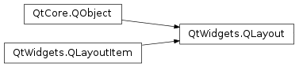
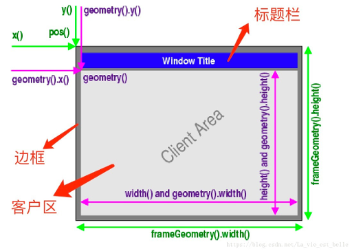

# 笔记

## 窗口类型介绍

在PyQt中把没有嵌入到其他控件中的控件称为窗口, 一般窗口都有边框, 标题. 窗口是指程序的整体界面, 可以包含标题栏, 菜单栏, 工具栏, 关闭按钮, 最小化按钮, 最大化按钮等; 控件是指按钮, 复选框, 文本框, 表格,进度条等这些组成程序的基本元素.

QWidget(基础控件), QMainWindow(主窗口控件), QDialog(对话框控件) 三个类都是用来创建窗口的, 可以直接使用, 也可以继承后再使用.

QWidget 是所有用户界面对象的基类, 是在PyQt中建立界面的主要元素.  
QMainWindow 主窗口可以包含菜单栏, 工具栏, 状态栏, 标题栏等, 是最常见的窗口形式, 也可以说是GUI程序的主窗口.  
QDialog 是对话框窗口的基类. 对话框主要用来执行短期任务, 或者与用户进行互动, 它可以是模态(modal), 也可以非模态(not modal). QDialog窗口没有菜单栏, 工具栏, 状态栏等.

如果是主窗口, 就使用QMainWindow类; 如果会对话框, 就使用QDialog类; 如果不确定, 或者有可能作为顶层窗口, 也有可能嵌入到其他窗口中, 那么就是用QWidget类.

支持XML方式的文字标记表示法.

## 一些常用的窗口控件

### PyQt5.QtWidget

QApplication.instance() 方法, 这是一个类方法, 返回应用对象的实例, 这样就可以在任何地方使用应用实例了.

PyQt5.QtWidgets.QToolTip 类, 冒泡提示框类, 向支持的控件中设置.

PyQt5.QtWidgets.QDesktopWidget 类, 用于描述系统桌面屏幕. 如: 用QDesktopWidget().screenGeometry()会返回屏幕的QRect

PyQt5.QtWidgets.QLayout 类, 作为垂直布局器, 水平布局器, 表格布局器, 格栅布局器的父类存在.

PyQt5.QtWidgets.QVBoxLayout 类, 垂直布局管理器, 可以使用addWidget向其中添加控件, 然后使用父窗口.addLayout(布局对象)添加布局

PyQt5.QtWidgets.QFormLayout 类, 表格布局管理器. 
  + addRow(可以使str, QWidget对象, Layout)
  + setItem (row, role, item)
  + setLabelAlignment (alignment)
  + setLayout (row, role, layout)
  + setRowWrapPolicy (policy)
  + setVerticalSpacing (spacing)
  + setWidget (row, role, widget)

PyQt5.QtWidgets.QGridLayout 类, 格栅布局管理器. 添加控件的各参数: 行(row), 列(column), 占用行(rowSpan), 占用列数(columnSpan), 对齐方式(alignment)
  + addItem (item, row, column[, rowSpan=1[, columnSpan=1[, alignment=Qt.Alignment()]]])
  + addLayout (arg__1, row, column, rowSpan, columnSpan[, alignment=Qt.Alignment()])
  + addLayout (arg__1, row, column[, alignment=Qt.Alignment()])
  + addWidget (arg__1, row, column, rowSpan, columnSpan[, alignment=Qt.Alignment()])
  + addWidget (arg__1, row, column[, alignment=Qt.Alignment()])
  + cellRect (row, column)

### PyQt5.QtCore

PyQt5.QtCore.Qt 类, 存储Qt的常用设置用的参数值

PyQt5.QtCore.QRect 长方形, PyQt5.QtCore.QSize 大小, PyQt5.QtCore.QPoint 坐标

PyQt5.QtCore.QRegExp 对象, 用于设置正则表达式

### PyQt5.QtGui

PyQt5.QtGui.QIcon 图标对象, 可以向支持图标的对象中设置图标, PyQt5.QtGui.QPixmap 图片对象, 可以向支持图片显示的对象中设置图片. 如果使用相对位置指定图片位置, 那相对位置的起始目录是整个项目的根目录.

PyQt5.QtGui.QPalette 调色板对象, 可以设置支持setPalette的控件的颜色

PyQt5.QtGui.QFont 字体对象, 可以设置字体样式和大小, 用于放入支持setFont的控件中

## QWidget

`PyQt5.QtWidgets.QWidget` 窗口控件, 简称控件, 是在PyQt中建立界面的主要元素. QWidget类是所有用户界面对象的基类或间接基类.

### 窗口坐标系统

PyQt使用统一的坐标系统来定位窗口空间的位置和大.

电脑屏幕和应用窗口都是以左上角为原点(0, 0), 从左向右为x正向, 从上到下为y轴正向. ↓→

原点, x轴, y轴围城的区域叫Client Area(客户区), 在客户区的周围则是标题栏(Window Title)和边框(Frame).

**QWidget的成员函数可以分三类**

坐标 x , y 函数, 宽高 width , height 函数

+ QWidget直接提供的成员函数
    + 获得左上角坐标 QWidget().x(), QWidget().y(); 获得客户区宽高 QWidget().width(), QWidget().height()

+ QWidget的geometry()提供的成员函数
    + 获得客户区左上角坐标 QWidget().geometry().x(), QWidget().geometry().y(); 获得客户区宽高 QWidget().geometry().width(), QWidget().geometry().height()

+ QWidget的frameGeometry()提供的成员函数
    + 获得窗口左上角坐标 QWidget().frameGeometry().x(), QWidget().frameGeometry().y(); 获取包含客户区, 标题栏, 边框在内的整个窗口的宽高 QWidget().frameGeometry().width(), QWidget().frameGeometry().height()

### 常用的几何机构

QWidget有两种常用的几何结构
+ 不包含外边各种边框的几何结构
+ 包含外边各种边框的几何结构

#### QWidget不包含边框的常用函数

一般, 不包含边框的部分是客户区, 这里面就是正常操作的地方, 可以添加子控件. 该部分是一个长方形, 会有大小(width, height参数)和位置(屏幕上的x, y参数). Qt中保存这个长方形使用的是PyQt5.QtCore.QRect类, 这个类也有自己的大小和位置. 要改变派生的QWidget对象中的QRect, 可以使用如下的方法:

更改客户区的面积

    QWidget.resize(width, height)
    QWidget.resize(QSize)   # PyQt5.Qtcore.QSize

获得客户区大小

    QWidget.size() -> QSize

获得客户区的宽度和高度

    QWidget.width() -> int
    QWidget.height() -> int

设置客户区的宽度和高度, fixed(固定的)

    # 高度将固定不可变, 可以改变宽度
    QWidget.setFixedWidth(width: int)

    # 宽度将固定不可变, 可以改变高度
    QWidget.setFixedHeight(height: int)

    # 宽度和高度都固定, 不可以通过鼠标来改变窗口大小
    QWidget.setFixedSize(size: QSize)
    QWidget.setFixedSize(width: int, height: int)

    # 固定宽度和高度更改
    QWidget.setGeometry(x: int, y: int, width: int, height: int)
    QWidget.setGeometry(rect: QRect)

#### QWidget包含边框的常用函数

边框会有大小和位置, 是窗口在屏幕上显示的整个区域. 下边是一些操作整个窗口的函数:

获得窗口的大小和位置

    QWidget.frameGeometry()

设置窗口的位置

    QWidget.move(x: int, y: int)
    QWidget.move(point: QPint)   # PyQt5.QtCore.QPoint

获得窗口左上角的坐标

    QWidget.pos() -> QPoint

## QMain Window

`PyQt5.QtWidgets.QMainWindow` 是一个类, 继承自QWidget类, 拥有所有QWidget的方法和属性.

    QWidget
        |
        +- QMainWindow

如果一个窗口没有父窗口, 其就是顶层窗口, QMainWindow就是一个用于顶层窗口的类. 它可以包含很多界面元素, 如菜单栏, 工具栏, 状态栏, 子窗口等.

QMainWindow提供的布局如下图.

**note:** QMainWindow不能设置布局(使用setLayout()方法), 因为其有自己的布局.

### QMainWindow类中比较重要的方法

addToolBar() : 添加工具栏  
centralWidget() : 返回窗口中心的一个控件, 未设置时返回NULL  
menuBar() : 返回主窗口的菜单栏  
setCentralWidget() : 设置窗口中心的控件  
setStatusBar() : 设置状态栏  
statusBar() : 获得状态栏对象后, 调节状态栏对象的showMessage(message, int timeout=0)方法, 像是状态信息.

**常用方法补充**

QMainWindow.setWindowTitle() : 设置主窗口标题  
QMainWindow.resize() : 重置窗口大小  
QMainWindow.move() : 移动应用窗口的位置  
QMainWindow.geometry() -> QRect : 获取QWidget窗口的大小  
QMainWindow.setGeometry() : 设置QWidget窗口的位置, 大小  
QMainWindow.sender() : 返回信号发送对象  

## QLabel

`PyQt5.QtWidgets.QLabel`, 作为一个占位符可以显示不可编辑的文本或图片, 也可以放置一个GIF动图, 还可以被用作提示标记. 其内容可以是纯文本, 链接, 富文本. 就是界面中的标签类, 它继承自QFrame类.

    QObject
        |
        +-QPaintDevice
                |
                +-QWidget
                    |
                    +-QFrame
                        |
                        +-QLabel

### QLabel中常用的方法

setAlignment() : 按固定值方式对齐文本
  + PyQt5.QtCore.Qt.AlignLeft , 水平方向靠左对齐, 默认选项
  + PyQt5.QtCore.Qt.AlignRight , 水平方向靠右对齐
  + PyQt5.QtCore.Qt.AlignCenter , 水平方向居中对齐
  + PyQt5.QtCore.Qt.AlignJustify , 水平方向调整间距两端对齐
  + PyQt5.QtCore.Qt.AlignTop , 垂直方向靠上对齐
  + PyQt5.QtCore.Qt.AlignButtom , 垂直方向靠下对齐
  + PyQt5.QtCore.Qt.AlignVCenter , 垂直方向居中对齐

setIndent() : 设置文本缩进值  
setPixmap() : 设置QLabel为一个QPixmap图片  
text() : 返回QLabel文本内容  
setText() : 设置QLabel文本内容, 支持富文本, 超链接  
setTextInteractionFlags() : 设置文本的交互方式, 如可以被选中, 默认是没有交互的  
selectedText() : 返回所选的字符  
setBuddy() : 设置QLabel的助记符及buddy(伙伴), 即使用QLabel设置快捷键, 会在快捷键后讲焦点设置到其buddy上, 这里用到了QLabel的交互控件功能. 此外, buddy可以是任何一个Widget空间. 使用setBuddy(QWidget *)设置, 其QLabel必须是文本内容, 并且使用"&"符号设置了助记符  
setWordWrap() : 设置是否允许换行  
setOpenExternalLinks() : 设置是否允许打开链接

**设置快捷键**

    name_label = QLabel("&Name", parent=self)   # Alt+N
    name_edit = QLineEdit(parent=self)
    name_label.setBuddy(name_edit)

直接在QLabel初始化名称的时候使用"&"+单个字母 助记符就可以绑定一个快捷键, 运行是使用Alt+该单个字母就可以了. 以上还使用setBuddy()绑定一个控件, 这样使用快捷键后, 焦点就会切换到该控件上.

### QLbel中常用的信号事件

linkActivated : 当单击标签中嵌入的超链接, 希望在新窗口中打开这个超连接时, setOpenExternalLinks属性必须设置为true  
linkHovered : 当鼠标指针滑过标签中嵌入的超链接时, 需要用槽函数与这个信号事件进行绑定

## 文本框类控件

`PyQt5.QtWidgets.QLineEdit` 类, 单行文本框控件; `PyQt5.QtWidgets.QTextEdit` 类, 文本框控件.

### QLineEdit

#### QLineEdit类中常用方法

setAlignment() : 按固定值方式对齐文本
  + PyQt5.QtCore.Qt.AlignLeft , 水平方向靠左对齐, 默认选项
  + PyQt5.QtCore.Qt.AlignRight , 水平方向靠右对齐
  + PyQt5.QtCore.Qt.AlignCenter , 水平方向居中对齐
  + PyQt5.QtCore.Qt.AlignJustify , 水平方向调整间距两端对齐
  + PyQt5.QtCore.Qt.AlignTop , 垂直方向靠上对齐
  + PyQt5.QtCore.Qt.AlignButtom , 垂直方向靠下对齐
  + PyQt5.QtCore.Qt.AlignVCenter , 垂直方向居中对齐

clear() : 清除文本框内容  
setEchoMode() : 设置文本框显示格式  
  + QLineEdit.Normal , 正常显示所输入的字符, 默认选项
  + OLineEdit.NoEcho , 不显示任何输入的字符, 常用于密码类型的输入, 且其密码长度需要保密时
  + QLineEdit.Password , 显示与平台相关的密码掩码字符, 而不是实际输入的字符
  + QLineEdit.PasswordEchoOnEdit , 在编辑时显示字符, 负责显示密码类型的输入

setPlaceholderText() : 设置文本框浮显文字  
setReadOnly() :　设置文本框是否为只读  
setText() : 设置文本框内容  
Text() : 返回文本框内容  
setDragEnabled() : 设置文本框是否接受拖动  
setFont() : 设置字体, 接受PyQt5.QtGui.QFont 对象
setMaxLength() : 设置允许输入字符的最大长度  
selectAll() : 全选  
setFocus() : 得到焦点  
setValidator() : 设置文本框的验证器(验证规则), 将限制任何可能输入的文本.
  + PyQt5.QtGui.QintValidator , 限制输入整数
  + PyQt5.QtGui.QDoubleValidator , 限制输入浮点数
  + PyQt5.QtGui.QRegexpValidator , 匹配正则表达式

setInputMask() : 设置掩码  

验证器需要先定义, 然后在放入控件中, 设置了验证器的输入框, 只能输入符合验证器定义的内容

    reg = PyQt5.QtCore.QRegExp("[a-zA-Z0-9]+$")
    validator_regex = PyQt5.QtWidgets.QLineEdit()
    validator_regex = PyQt5.QtGui.QRegExpValidator(parent=None)
    validator_regex.setRegExp(reg)

**掩码字符**

A : ASCII字母字符是必须输入的(A-Z, a-z)  
a : ASCII字母字符是允许输入的, 但不是必须  
N : ASCII字母字符是必须输入的(A-Z, a-z, 0-9)  
n : ASCII字母字符是允许输入的, 但不是必须  
X : 任何字符都是必须输入的  
x : 任何字符都是允许输入的, 但不是必须  
9 : ASCII数字字符是必须输入的(0-9)  
0 : ASCII数字字符是允许输入的, 但不是必须  
D : ASCII数字字符是必须输入的(1-9)  
d : ASCII数字字符是允许输入的, 但不是必须(1-9)  
\# : ASCII数字字符或加/减符号是允许输入的, 但不是必须  
H : 十六进制格式字符是必须输入的(A-F, a-f, 0-9)  
h : 十六进制格式字符是允许输入的, 但不是必须  
B : 二进制格式字符是必须输入的(0, 1)  
b : 二进制格式字符是允许输入的, 但不是必须  
\> : 所有的字母字符都要大写  
< : 所有的字母字符都要小写  
! : 关闭大小写转换  
\ : 使用"\"转义是上面列出的字符

掩码由掩码字符和分隔符字符串组成, 后面可以跟一个分号和空白字符, 空白字符在编辑后会从文本中删除.

**常见的掩码方式**

000.000.000.000;_ : IP地址, 空白字符是"_"  
HH:HH:HH:HH:HH:HH; : MAC地址  
0000-00-00  : 日期, 空白字符是空格  
\>AAAAA-AAAAA-AAAAA-AAAAA-AAAAA;# : 许可证号, 空白字符是"-", 所有字母字符转换为大写

掩码和正则验证器很相似, 都是规定按照什么样的格式输入, 但是掩码在窗口上是会有输入格式的体现的

#### QLineEdit常用信号事件

selectionChanged : 只要选择改变了, 触发  
textChanged : 当修改文本内容时, 触发  
editingFinished : 当编辑文本结束时, 判断依据是焦点的转移动, 触发

更改信号会将更改后的内容传递给槽响应函数

    linedit = QLineEdit()
    linedit.textChanged.connect(text_change_hint)   # 触发文本改变事件

    def text_change_hint(text):
        print("现在在输入框中的内容是: %s", %text)

### QTextEdit

QTextEdit类是一个多行文本框控件, 可以显示多行文本内容, 当文本内容超出控件显示范围时, 自动显示水平和垂直滚动条. QTextEdit不仅可以显示文本还可以显示HTML文档.

#### QTextEdit常用方法

setPlainText() : 设置多行文本框的文本内容  
toPlainText() : 返回多行文本框的文本内容  
setHtml() : 设置多行文本框的内容为HTML文档  
toHtml() : 返回多行文本框的HTML内容  
cleat() : 清除多行文本框内容

多文本框虽说能支持HTML内容, 但是却打不开超链接和支持多媒体.
