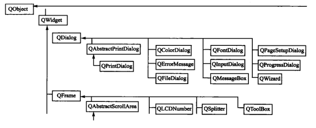
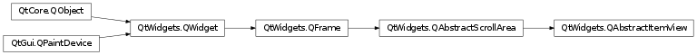
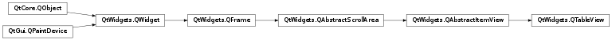
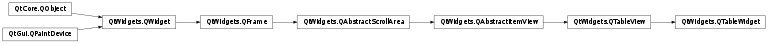
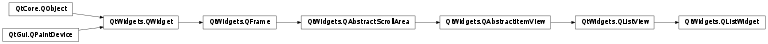
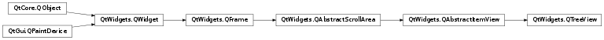
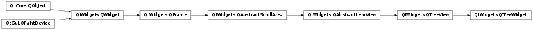

# 笔记

<!-- TOC -->

- [笔记](#笔记)
    - [补充](#补充)
        - [类结构](#类结构)
        - [PyQt5.QtCore.Qt match flag 匹配标志](#pyqt5qtcoreqt-match-flag-匹配标志)
        - [QAbstractItemView](#qabstractitemview)
    - [QTableView](#qtableview)
        - [使用模型](#使用模型)
    - [QTableWidget](#qtablewidget)
        - [QTableWidget常用方法](#qtablewidget常用方法)
        - [通常使用](#通常使用)
        - [设置单元格](#设置单元格)
        - [支持右键菜单](#支持右键菜单)
    - [QListView](#qlistview)
        - [QListView常用方法](#qlistview常用方法)
        - [QListView常用信号](#qlistview常用信号)
    - [QListWidget](#qlistwidget)
        - [QListWidget常用方法](#qlistwidget常用方法)
        - [QListWidget常用信号](#qlistwidget常用信号)
    - [QTreeView, QTreeWidget](#qtreeview-qtreewidget)
        - [QTreeWidget常用方法](#qtreewidget常用方法)
        - [QTreeWidgetItem常用方法](#qtreewidgetitem常用方法)
        - [树形结构的实现](#树形结构的实现)

<!-- /TOC -->

表格结构的控件类, 树形结构的控件类, 用以解决在一个控件中有规律地展现更多的数据.

## 补充

### 类结构

### PyQt5.QtCore.Qt match flag 匹配标志

用于控件的支持 UnionQtMatchFlags 或 QtMatchFlag 的类似find方法的查询

**字段常量**  
MatchExactly : 完整匹配.  
MatchContains : 搜索项包含在目标中.  
MatchStartsWith : 匹配符合开头的目标.  
MatchEndsWith : 匹配符合结尾的目标.  
MatchRegExp : 匹配基于字符串的正则.  
MatchWildcard : 匹配基于字符串的通配符.  
MatchFixedString : 执行基于字符串的匹配. 不区分大小写.  
MatchCaseSensitive : 执行基于字符串的匹配. 区分大小写.  
MatchWrap : 执行环绕搜索, 以便当搜索到达模型中的最后一个项目时, 它再次从第一个项目开始, 一直持续到检查完所有项目为止.  
MatchRecursive : 搜索整个层次结构.  

**方法**  
values() : public static Qt.MatchFlag[] values()  
valueOf() : public static Qt.MatchFlag valueOf(java.lang.String name)  
value() : public int value(). This function should return an integer value for the enum values of the enumeration that implements this interface.  
createQFlags : public static Qt.MatchFlags createQFlags(Qt.MatchFlag[] values). This function creates a com.trolltech.qt.core.Qt$MatchFlags with the specified com.trolltech.qt.core.Qt$MatchFlag[] Qt$MatchFlag values set.  
resolve : public static Qt.MatchFlag resolve(int value). Returns the Qt$MatchFlag constant with the specified int.  

### QAbstractItemView

继承自QAbstractScrollArea, 这是一个低层级的提供滚动区域的抽象类. 这个区域提供了一个核心控件-viewport(可视区域), 用于滚动浏览内容(比如可视部分的内容通过viewport呈现).

`PyQt5.QtWidgets.QAbstractItemView`

QAbstractItemView 类是对于每个使用QAbstractItemModel标准视图的基础类. QAbstractItemView是一个抽象类所以不能被实例化. 其提供一个模型与信号和槽共同工作的标准接口, 让子类能随着模型的更改而保证最新.. 这个类提供了对键盘和鼠标的使用, 可视区域的滑动, item的编辑和选择的标支持. 

## QTableView

`PyQt5.QtWidgets.QTableView`

如果一个应用需要和一批数据(比如数组, 列表)进行交互, 然后以表格的形式输出这些信息, 这时就要用到QTableView类了. 在QTableView中可以使用自定义的数据模型显示内容, 通过setModel来绑定数据源.

### 使用模型

QTableView控件可以绑定一个模型数据用来更新控件上的内容, 在PyQt5.QtGui中有:

PyQt5.QtGui.QStringListModel : 储存一组字符串  
PyQt5.QtGui.QStandardItemModel : 储存任意层次结构的数据  
PyQt5.QtGui.QDirModel : 对文件系统进行封装  
PyQt5.QtGui.QSqlQueryModel : 对SQL的查询结果进行封装  
PyQt5.QtGui.QSqlTableModel : 对SQL中的表格进行封装  
PyQt5.QtGui.QSqlTableModel : 对带有foreign key 的SQL表格进行封装  
PyQt5.QtGui.QSortFilterProxyModel : 对模型中的数据进行排序或过滤  

    # 初始化一个模型
    model = QStandardItemModel(4, 4)   # 共4行4列
    model.setHorizontalHeaderLabels(["标题1", "标题2", "标题3", "标题4"])   # 设置标题行

    item = QStandardItem("内筒")   # 创建一个标准item
    model.setItem(1, 1, item)   # 向模型中添加item

    # 创建QTableView控件
    table_view = QTableView()
    table_view.setModel(model)   # 设置模型

如果要填满窗口, 可以使用

    table_view.horizontalHeader().setStretchLastSection(True)   # 通过设置拉升
    table_view.horizontalHeader().seSectionResizeMode(QHeaderView.stretch)   # 重设尺寸策略

按行添加数据

    model.appendRow(
        [
            QStandardItem("行1"),
            QStandardItem("行2"),
            QSrandardItem("行3"),
        ]
    )

    model.appendColumn(
        [
            QStandardItem("列1"),
            QStandardItem("列2"),
            QSrandardItem("列3"),
        ]
    )

删除数据

model.removeRows(row: int, count: int, parent: ...) -> bool
model.removeColumns(column: int, count: int, parent: ...) -> bool

    # 选取模块所有的索引计数
    indexes = table_view.selectionModel().selction().indexes()

第一种方法: 

    # 取当前选中的所有行
    if len(indexes) > 0:
        # 去第一行的索引
        index = indexes[0]
        model.removeRows(index.row(), 1)

第二种方法:

    index = table_view.currentIndex()
    model.removeRow(index.row())   # 获取当前行, 并删除当前行

## QTableWidget

`PyQt5.QtWidgets.QTableWidget`

QTableWidget继承自QTableView, 主要区别是QTableView可以使用自定义的数据模型来显示内容(先要通过setModel来绑定数据源), 而QTableWiget只能使用标准的数据模型, 并且其单元格数据是通过QTableWidgetItem对象来实现的. 通常使用QTableWidget就能够满足一般的需求了.

`PyQt5.QtWidgets.QTableWidgetItem`

QTableWidget是Qt程序中常用的显示数据表格的控件. QTableWidget使用标准的数据模型, 并且其单元格数据是通过QTableWidgetItem对象来实现的. 使用QTableWidget时就需要QTableWidgetItem, 用来表示表格中的一个单元格, 整个表格就是用各种单元格构建起来的.

### QTableWidget常用方法

setRowCount(row: int) : 设置QTableWidget表格控件的行数  
setColumnCounmt(col: int) : 设置QTableWidget表格控件的列数  
setHorizontalHeaderLables() : 设置QTableWidget表格控件的水平标签  
setVerticalHeaderLables() : 设置QTableWidget表格控件的垂直标签  
setItem(row: int, col: int, QTableWidgetItem) : 在指定的行列中添加item  
setAutoScroll() : 是否自动启用滑块  
setWordWrap() : 是否自动换行, 默认开启  
horizontalHeader() : 获得QTableWidget表格控件的表格头, 返回父控件使用的`PyQt5.QtWidgets.QHeaderView`  
verticalHeader() : 获得QTableWidget表格控件的行标签, 返回父控件使用的`PyQt5.QtWidgets.QHeaderView`  
horizontalScrollBat() : 获得QTableWidget表格控件的水平滑动控件, 返回父控件使用的`PyQt5.QtWidgets.QScrollBar`  
verticalScrollBar() : 获得QTableWidget表格控件的垂直滑动控件, 返回父控件使用的`PyQt5.QtWidgets.QScrollBar`  
item(row: int, column: int) : 返回对应行列的QTableWidgetItem对象  
rowCount() : 获得行数  
columnCount() : 获得列数  
setEditTriggers(EditTriggers triggers) : 设置表格是否可以编辑. 设置编辑规则的枚举值  
  + PyQt5.QtWidgets.QAbstractItemView.noEditTriggers0No : 0, 不能对表格内容进行修改
  + PyQt5.QtWidgets.QAbstractItemView.CurrentChanged1Edditing : 1, 任何时候都能对单元格进行修改
  + PyQt5.QtWidgets.QAbstractItemView.DoubleClicked2Editing : 2, 双击单元格  
  + PyQt5.QtWidgets.QAbstractItemView.SelectedClicked4Editing : 4, 单击已选中的内容
  + PyQt5.QtWidgets.QAbstractItemView.EditKeyPressed8Editing : 8, 当修改键被按下时修改单元格
  + PyQt5.QtWidgets.QAbstractItemView.AnyKeyPressed16Editing : 16, 按任意键修改单元格
  + PyQt5.QtWidgets.QAbstractItemView.AllEditTriggers31Editing : 31, 包括以上所有条件

setSelectionBehavior() : 设置单元格的选择行为  
  + PyQt5.QtWidgets.QAbstractItemView.SelectItems0Selecting : 0, 选中一个单元格
  + PyQt5.QtWidgets.QAbstractItemView.SelectRows1Selecting : 1, 选中一行
  + PyQt5.QtWidgets.QAbstractItemView.SelectCoumns2Selecting : 2, 选中一列

setTextAlignment() : 设置单元格内文字对齐方式  

水平方向的
  + PyQt5.QtCore.Qt.AlignLeft : 将单元格的内容沿单元格的左边缘对齐
  + PyQt5.QtCore.Qt.AlignRight : 将单元格的内容沿单元格右边缘对齐
  + PyQt5.QtCore.Qt.AlignHCenter : 在可用空间中, 居中显示在水平方向上
  + PyQt5.QtCore.Qt.AlignJustify : 将文本在可用空间中对齐, 默认是从左到右

垂直方向的
  + PyQt5.QtCore.Qt.AlignTop : 与顶部对齐
  + PyQt5.QtCore.Qt.AlignBottom : 与底部对齐
  + PyQt5.QtCore.Qt.AlignVCenter : 在可用空间中, 居中显示在垂直方向上
  + PyQt5.QtCore.Qt.AlignBaseline : 与基线对齐

setSpan(row: int, clomun: int, rowSpanCount: int, columnSpanCount: int) : 合并单元格, 要改变单元格的第row行第column列, 要合并rowSpanCount行数和columnSpanCount列数  
  + row: 要改变的单元格行数
  + column: 要改变的单元格列数  
  + rowSpanCount: 需要合并的行数 
  + columnSpanCount: 需要合并的列数

setShowGrid() : 是否显示网格线, 默认为True显示  
setRowHeight(row: int, height: int) : 设置单元格行高  
setColumnWidth(colmun int, width: int) : 设置单元格列宽  

### 通常使用

    from PyQt5.QtWidgets import QWidget, QTableWidget, QTableWidgetItem

    class TableForm(QWidget):
        """主窗口"""
        def __init__(self, parent=None):
        ......
            self.table_widget = QTableWidget()
            self.table_widget.setRowCount(4)   # 共4行
            self.table_widget.setColumnCount(3)   # 共3列
            self.table_widget.setHorizontalHeaderLabels(["姓名", "性别", "体重(kg)"])   # 水平标签
            self.table_widget.setVerticalHeaderLabels(["行1", "行2", "行3", "行4"])   # 垂直标签
            self.table_widget.horizontalHeader().setSectionResizeMode(QHeaderView.Stretch)   # 设置表格拉伸

            self.create_table_item()
        ......

        def create_table_item(self):
            """向表格控件中添加QTableWidgetItem"""
            new_item = QTableWidgetItem("名称 1")
            self.table_widget.setItem(0, 0, new_item)

            new_item = QTableWidgetItem("性别 1")
            self.table_widget.setItem(0, 1, new_item)

            new_item = QTableWidgetItem("体重 1")
            self.table_widget.setItem(0, 2, new_item)

**设置表格头为伸缩**

    # 设置父控件中的QHeaderView
    table_widget.horizontalHeader().setSectionResizeMode(QHeaderView.Stretch)

**将表格变为禁止编辑**

    table_widget.setEditTriggers(QAbstractItemView.NoEditTriggers)

**设置表格整行选中**

    table_widget.setSelectionBehavior(QAbstractItemView.SelectRows)

**将行和列的宽度, 高度设置为与所显示内容的宽度, 高度相匹配**

    table_widget.resizeColumnsToContents()
    table_widget.resizeRowsToContents()

**表格头的显示与隐藏**

    # 设置父控件中的QHeaderView
    table_widget.vertticalHeader().setVisible(False)   # 水平方向的表头

    table_widget.horizontalHeader().setVisible(False)   # 垂直方向的表头

**在单元格中放置控件**  
QTableWidget不仅允许向单元格中放置文字, 还允许放置控件, 通过QTableWidget.setCellWidget(), QTableWidget.setIndexWidget(), QTableWidget.setCornerWidget()来添加PyQt的基本控件.

    combo_box = QComboBox()
    conbo_box.addItems(["男", "女"])

    btn = QPushButton("修改")
    btn.setDown(True)

    table_widget.setCellWidget(0, 1, comb_box)   # 将0行1列的单元格设置为comb_box控件
    table_widget.setCellWidget(0, 2, btn)   # 将0行2列的单元格设置为btn控件

**在表格中快速定位到指定行**  
当表格的行数很多时, 可以通过输入行号进行直接定位并显示

findItems(self, str, Union[Qt.MatchFlags, Qt.MatchFlag]) -> List[QTableWidgetItem]

    # 遍历表格查询对应的具体单元格
    table_items = table_widget.findItems(text, QtCore.Qt.MatchExactly)

    # 获取行号
    row = table_items[0].row()
    # 模拟鼠标滚轮快速定位到指定行
    table_widget.verticalScrollBar().setSliderPosition(row)

### 设置单元格

**设置单元格文本颜色**  

    from PyQt5.QtGui import QBrush, QColor

    table_item = QTableWidgetItem("内容 1")
    table_item.setForeground(QBrush(QColor(255, 0, 0)))
    table_widget.setItem(0, 0, table_item)

**将字体加粗**  

    from PyQt5.QtGui import QFont

    table_item = QTableWidgetItem("内容 1")
    table_item.setFont(QFont("fangsong", 12, QFont.Black))
    table_widget.setItem(0, 0, table_item)

**设置单元格的排序方式**  
`PyQt5.QtCore.Qt.DescendingOrder` 表示降序排列, `PyQt5.QtCore.AscendingOrder` 表示升序排列.  
sortItems(self, int, order: Qt.SortOrder = Qt.AscendingOrder)

    from PyQt5.QtCore import Qt

    table_widget.sortItems(2, Qt.DescendingOrder)

**设置单元文本的对齐方式**  
QTableWidgetItem.setTextAlignment(int)

    table_item = QTableWidgetItem("内容 1")
    table_item.setTextAlignment(Qt.AlignRight | Qt.AlignBottom)
    table_widget.setItem(0, 0, table_item)

**合并单元格效果的实现**  

    # 表格中第一行第一列的单元格, 改为占据3行1列
    table_widget.setSpan(0, 0, 3, 1)

**设置单元格的大小**  

    # 将第一列的单元格宽度设置为150
    table_widget.setColumnWidth(0, 150)

    # 将第一行的单元格高度设置为120
    table_widget.setRowHeight(0, 120)

**在表格中不显示分割线**  
QTableWidget类的setShowGrid()函数是从QTableView类继承的, 用来设置是否显示表格的分割线, 默认显示分割线.

    # 这样就不显示
    table_widget.setShowGrid(False)

**为单元格添加图片**  

    from PyQt5.QtGui import QIcon

    # 在初始化的时候设置图片
    table_item = QTableWidgetItem(QIcon("./images/python.png"), "python language")
    tabel_widget.setItem(0, 3, table_item)

    # 可以单独的设置图片
    table_item.setIcon(QIcon("./images/python.png"))

**改变单元格显示的图片的大小**  

    from PyQt5.QtCore import Qt, QSize

    table_widget.setIconSize(QSize(128, 128))   # 设置内容物图片的大小

    for m in range(ROW):
        table_widget.setColumnWidth(m, 128)   # 设置列宽

    for m in range(COLUMN):
        table_widget.setRowHeight(m, 128)   # 设置行高

    for ....
    table_item = QTableWidgetItem()
    table_item.setFlags(Qt.ItemIsEnabled)   # 点击时, 图片能选中
    table_item.setIcon(QIcon(file_path))

    table_widget.setItem(table_item)

**获得单元格的内容**  

    table_widget.itemClicked.connect(do_something)   # 会向槽函数传递QTableWidgetItem

    def do_something(item):
        print(item.text())

### 支持右键菜单

    from PyQt5.QtCore import Qt
    from PyQt5.QtWidgets import (QApplication, QWidget, QMenu, QTableWidget, QTableWidgetItem, 
                                 QHBoxLayout, QHeaderView)

    class TableForm(QWidget):
        """主窗口"""
        def __init__(self, parent=None):
            super().__init__(parent=parent)
        ......
            # 允许右键产生
            self.table_widget.setContextMenuPolicy(Qt.CustomContextMenu)
            # 将右键菜单绑定到槽函数
            self.table_widget.customContextMenuRequested.connect(self.generate_menu)   # 传递一个QtCore.QPoint() 对象

        def generate_menu(self, pos):
            row_num = -1
            for item in self.table_widget.selectionModel().selection().indexes():   # QItemSelctionModel对象, 获得选中的item
                row_num = item.row()   # 获取item的hanghao
            
            # 当选中的行号大于多少的时候才弹出菜单
            if row_num > -1:
                menu = QMenu()
                action_1 = menu.addAction("选项 1")
                action_2 = menu.addAction("选项 2")
                action_3 = menu.addAction("选项 3")
                action = menu.exec_(self.table_widget.mapToGlobal(pos))   # 从全局点选中菜单
                if action == action_1:
                    print(
                        action.text(), "触发1, 对应", 
                        self.table_widget.item(row_num, 0).text(), 
                        self.table_widget.item(row_num, 1).text(), 
                        self.table_widget.item(row_num, 2).text()
                    )
                elif aciton == action_2:
                .......

## QListView

`PyQt5.QtWidgets.QListView`

QListView是基于模型(model)的, 需要程序来建立模型, 然后再保存数据.

### QListView常用方法

setModel() : 哟昂来设置view所关联的model, 可以使用Python原生list作为数据源model  
selectedItem() : 选中model中的条目  
isSelected() : 是否model中的某条目被选中  

### QListView常用信号

clicked : 单击时触发, 向槽函数中传递QModelIndex  
doubleClicked : 双击时触发, 向槽函数中传递QModelIndex

    qlist = ["Item 1", "Item 2", "Item 3", "Item4"]

    # 创建字符串列表模型
    string_model = QStringListModel()
    # 设置字符串列表模型
    string_model.setStringList(qlist)
    
    # 创建QListView
    list_view = QListView()
    # 向QListView中添加模型
    list_view.setModel(string_model)
    list_view.clicked.connect(item_clicked)

    def item_clicked(model_index):
        print(model_index.row())   # 打印行数

## QListWidget

`PyQt5.QtWidgets.QListWidget`

QListWidget是QListView的子类. 其定制化更多, 其已经建立了一个数据存储模型(QListWidgetItem), 直接调用addItem()函数, 就可以添加条目(Item).

QListWidget类是一个基于条目的接口, 用于从列表中添加或删除条目. 列表中的每一个条目都是一个QListWidgetItem对象. QListWidget可以设置为多重选择.

### QListWidget常用方法

addItem() : 在列表中添加QListWidgetItem对象或字符串  
addItems() : 添加列表中的每个条目  
insertItem() : 在指定的索引处插入条目  
cliar() : 删除列表的所有内容  
setCurrentItem() : 设置当前所选条目  
sortItems() : 按生序重新排列条目  

### QListWidget常用信号

currentItemChanged : 当列表中的条目发生改变时触发  
itemClicked : 当点击列表中的条目时触发  

    class ListWidget(QListWidget):
        """继承QListWidget"""
        def __init__(self, parent=None):
            super().__init__(parent=parent)
            self.setWindowTitle("QListWidget 窗口使用")
            self.resize(300, 120)

            self.create_item()
            self.itemClicked.connect(self.click_item)   # 绑定item点击触发的槽函数

        def create_item(self):
            self.addItem("Item 1")
            self.addItem("Item 2")
            self.addItems(["Item 3", "Item 4"])

    def click_item(self, QListWidgetItem):
        """重载itemClicked"""
        QMessageBox.information(self, "list widget item", "selected: " + QListWidgetItem.text())

## QTreeView, QTreeWidget

`PyQt5.QtWidgets.QTreeView`, 实现了树形结构.

`PyQt5.QtWidgets.QTreeWidget`, 继承自QTreeView

### QTreeWidget常用方法

setColumnWidth(column: int, width: int) : 指定列的宽度设置为给定的值  
  + column, 指定的列
  + width, 指定列的高度

addTopLevelItem() : 在视图顶层中加入项目
addTopLevelItems() : 在视图顶层中加入项目表  
insertTopLevelItem() : 在视图的顶层索引加入项目  
insertTopLevelItems() : 在视图的顶层索引中插入项目列表  
expandAll() : 展开所有的树形节点  
invisibleRootItem() : 返回树形控件中不可见的根选项(Root Item)  
selectedItems() : 返回所有选定的非隐藏项目列表  
currentItem() : 返回当前选中的QTreeWidgetItem  

### QTreeWidgetItem常用方法

addChild() : 将子项目追加到子列表中  
setText() : 设置显示的节点文本  
setCheckState(column, state) : 设置指定列的选中状态  
  + QtCore.Qt.Checked, 节点选中
  + QtCore.Qt.Unchecked, 节点未选中

setIcon(column, icon) : 在指定的列中显示图标  
setData() : 指定绑定的数据
setExpand() : 展开

### 树形结构的实现

树形结构是通过QTreeWidget和QTreeWidgetItem类实现的, 其中 QTreeWidgetItem类实现了节点的添加.

    tree_widget = QTreeWidget()

    # 设置列数
    tree_widget.setColumnCount(2)
    # 设置树形控件头部的标题
    tree_widget.setHeaderLabels(["键", "值"])
    # 设置树形控件的列宽度
    tree_widget.setColumnWidth(0, 160)

    # 设置根节点
    root = QTreeWidgetItem(tree_widget)
    root.setText(0, "根")
    root.setIcon(0, QIcon("./images/linux.png"))

    # 设置子节点 1
    child_1 = QTreeWidgetItem(root)
    child_1.setText(0, "子 1 键")   # 第1列
    child_1.setText(1, "子 1 值")   # 第2列
    child_1.setIcon(0, QIcon("./images/python.png"))   # 为第1列添加图标

    # 设置子节点 2
    child_2 = QTreeWidgetItem(root)
    child_2.setText(0, "子 2 键")   # 第1列
    child_2.setText(1, "子 2 值")   # 第2列
    child_2.setIcon(0, QIcon("./images/golang.png"))   # 为第2列添加图标

    # 树形控件添加根
    tree_widget.addTopLevelItem(root)
    # 节点全部展开
    tree_widget.expandAll()

**设置节点背景颜色**  
可以使用QBrush类来设置节点的背景颜色. 如下设置根节点的背景颜色.

    root = QTreeWidgetItem(tree_widget)
    root.setText(0, "根")
    root.setIcon(0, QIcon("./images/linux.png"))
    
    brush_red = QBrush(Qt.red)
    root.setBackground(0, brush_red)   # 列1刷成红色
    brush_green = QBrush(Qt.green)
    root.setBackgroung(1, brush_green)   # 列2刷成绿色

**事件相应**  
可以使用clicked信号

    self.tree_widget.clicked.connect(do_something)   # 会想槽传入一个QModelIndex, 索引当前点击的QTreeWidgetItem

    def do_something(self, model_index):
        item = self.tree_widget.currentItem()   # 也可以使用QTreeWidget.currentItem()获得当前选中item

        item.text(0); item.text(1)   # item不同列的文本, 如果设置了data, 可以使用item.data()返回设置的数据