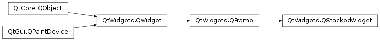
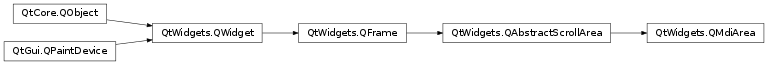
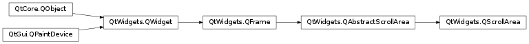
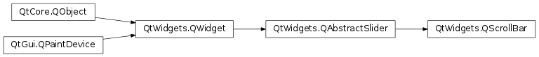

# 笔记

<!-- TOC -->

- [笔记](#笔记)
    - [QTabWidget](#qtabwidget)
        - [QTabWidget常用方法](#qtabwidget常用方法)
        - [QTabWidget常用信号](#qtabwidget常用信号)
    - [QStackedWidget](#qstackedwidget)
        - [QStackedWidget常用方法](#qstackedwidget常用方法)
        - [QStackedWidget常用信号](#qstackedwidget常用信号)
    - [QDockWidget](#qdockwidget)
        - [QDockWidget常用方法](#qdockwidget常用方法)
        - [QDockWidget信号](#qdockwidget信号)
        - [使用方式](#使用方式)
    - [多文档界面](#多文档界面)
        - [QMdiArea方法](#qmdiarea方法)
        - [QMdiArea槽](#qmdiarea槽)
        - [QMdiArea信号](#qmdiarea信号)
        - [QMdiSubWindow方法](#qmdisubwindow方法)
        - [QMdiSubWindow槽](#qmdisubwindow槽)
        - [QMdiSubWindow信号](#qmdisubwindow信号)
        - [子窗口的使用](#子窗口的使用)
    - [滚动条](#滚动条)
        - [QScrollArea常用方法](#qscrollarea常用方法)
        - [QScrollArea使用](#qscrollarea使用)
        - [QScrollBar常用信号](#qscrollbar常用信号)
        - [QScrollBar使用](#qscrollbar使用)

<!-- /TOC -->

所开发的程序包含了太多的控件, 导致一个窗口装载不下或者装载的控件太多而降低交互性. 就可以使用以下控件

容器QTabWidget, QStackedWidget, QDockWidget.  
多文档界面QMdiArea, QMdiSubWindow.  
滑块QScrollArea, QScrollBar  

## QTabWidget

`PyQt5.QtWidgets.QTabWidget` 选项卡窗口控件, 提供了一个选项卡和一个页面区域, 默认显示第一个选项卡 的页面. 通过单击各选项卡可以查看对应的页面. 如果在一个窗口中显示的输入字段很多, 则可以对这些字段进行拆分, 分别放在不同页面的选项卡中.

    QWidget
        |
        +-QTabWidget

### QTabWidget常用方法

addTab() : 将一个控件添加到Tab控件的选项卡中  
insertTab() : 将一个Tab控件的选项卡插入到指定的位置  
removeTab() : 根据指定的索引删除Tab控件  
setCurrentIndex() : 设置当前可见的选项卡所在的索引  
setCurrentWidget() : 设置当前可见的页面  
setTabBar() : 设置选项卡栏的小控件  
setTabPosition() : 设置选项卡的位置  
  + QTabWidget.North, 显示在页面的上方, 默认
  + QTabWidget.South, 显示在页面的下方
  + QTabWidget.West, 显示在页面的左边
  + QTabWidget.East, 显示在页面的右边

setTabText() : 定义Tab选项卡的显示值  
setMovable() : 选项卡是否可以移动, 默认False  
widget(index) : 获得索引位置的窗口控件  
indexOf(widget) : 窗口控件的索引  

### QTabWidget常用信号

currentChanged(index) : 切换当前页面时触发  
tabBarClicked(index) : 单击触发  
tabBarDoubleClicked(index) 双击触发  

    class TabForm(QTabWidget):
        """QTabWidget主窗口"""
        def __init__(self, parent=None):
            super().__init__(parent=parent)
            self.setWindowTitle("QTabWidget 使用")

            self.widget_1 = QWidget()
            self.widget_2 = QWidget()
            self.widget_3 = QWidget()
            self.set_widget_1()
            self.set_widget_2()
            self.set_widget_3()

            # 选项卡中添加窗口控件
            self.addTab(self.widget_1, "姓名")
            self.addTab(self.widget_2, "操作系统")
            self.addTab(self.widget_3, "使用开发语言")
        ......

## QStackedWidget

`PyQt5.QtWidgets.QStackedWidget`, 堆栈控件, 可以填充一些控件, 但同一时间只用一个控件可以显示. QStackedWidget使用QStackedLayout布局. QStackedWidget控件与QTabWidget类似, 可以有效地显示窗口中的控件.

### QStackedWidget常用方法

addWidget() : 添加控件  
currentIndex() : 当前选中索引  
currentWidget() : 当前选中控件  
insertWidget(index, widget) : 在指定索引插入控件  
removeWidget(widget) : 移除控件  
widget(index) : 索引对应的控件  
indexOf(widget) : 控件对应的索引  

### QStackedWidget常用信号

currentChanged(arg__1) : 切换当前时触发  
widgetRemoved(index) : 控件移除时触发  

    class StackedForm(QWidget):
        """主窗口"""
        def __init__(self, parent=None):
            super().__init__(parent=parent)
        ......
            self.widget_1 = QWidget()
            self.widget_2 = QWidget()
            self.widget_3 = QWidget()
            self.set_widget_1()
            self.set_widget_2()
            self.set_widget_3()

            # 在左边的QListWidget
            self.leftlist = QListWidget()
            self.leftlist.addItem("姓名")
            self.leftlist.addItem("操作系统")
            self.leftlist.addItem("使用开发语言")
            self.leftlist.currentRowChanged.connect(self.display)   # 向槽函数传入索引

            # 实例化QStackedWidget, 并向其中添加窗口控件
            self.stack_widget = QStackedWidget()
            self.stack_widget.addWidget(self.widget_1)
            self.stack_widget.addWidget(self.widget_2)
            self.stack_widget.addWidget(self.widget_3)

            h_layout = QHBoxLayout()
            h_layout.addWidget(self.leftlist)   # 添加左边的listWidget
            h_layout.addWidget(self.stack_widget)   # 右边放的是stackedWidget, 使用QStackedLayout
            self.setLayout(h_layout)

        def display(self, index):
            """切换StackedWidget的当前显示"""
            self.stack_widget.setCurrentIndex(index)   # QListWidget的索引正好对应QStackedWidget的索引
        ......

## QDockWidget

`PyQt5.QtWidgets.QDockWidget`, 是一个可以停靠在QMainWindow内的窗口控件, 它可以保持在浮动状态或者在指定位置作为子窗口附加到主窗口中. QMainWindow类的主窗口对象保留一个用于停靠窗口的 区域, 这个区域在控件的中央周围.

    QWidget
     |
     +-QDockWidget

QMainWindow 的布局

QDockWidget控件在主窗口内可以移动到新的区域.

### QDockWidget常用方法

setWidget() : 在Dock窗口区域设置QWidget  
setFloating() : Dock窗口是否可以浮动  
setAllowedAreas() : 设置窗口可以停靠的区域
  + PyQt5.QtCore.Qt.LeftDockWidgetArea, 左边停靠区域
  + PyQt5.QtCore.Qt.RightDockWidgetArea, 右边停靠区域
  + PyQt5.QtCore.Qt.TopDockWidgetArea, 顶部停靠区域
  + PyQt5.QtCore.Qt.BottomDockWidgetArea, 底部停靠区域
  + PyQt5.QtCore.Qt.NoDockWidgetArea, 不显示Widget

setFeatures() : 设置停靠窗口的功能属性
  + QDockWidget.DockWidgetClosable, 可关闭
  + QDockWidget.DockWidgetMovable, 可以移动
  + QDockWidget.DockWidgetFloatable, 可漂浮
  + QDockWidget.DockWidgetVerticalTitleBar, 在左边显示垂直的标签栏
  + QDockWidget.AllDockWidgetFeatures, 具有可关闭, 可移动, 可浮动, 默认
  + QDockWidget.NoDockWidgetFeatures, 不能关闭, 不能移动, 不能浮动

setTitleBarWidget (widget) : 设置标题控件  
widget() : 获取其中的控件

### QDockWidget信号

allowedAreasChanged (allowedAreas) : 可浮动区域改变触发  
dockLocationChanged (area) : 移动触发  
featuresChanged (features) : 属性改变触发  
topLevelChanged (topLevel) : 显示层级变化触发  
visibilityChanged (visible) : 可视性变化触发  

### 使用方式

QMainWindow中使用addDockWidget(self, Qt.DockWidgetArea, QDockWidget)或addDockWidget(self, Qt.DockWidgetArea, QDockWidget, Qt.Orientation)向其中添加QDockWidget

    main_win = QMainWindow()

    dock_widget = QDockWidget("Dock控件", parent=main_win)   # 实例化
    dock_widget.setWidget(list_widget)   # 向其中设置显示的控件为list_widget
    dock_widget.setFloating(False)

    main_win.addDockWidget(Qt.RightDockWidgetArea, dock_widget)   # 向主窗口中添加

## 多文档界面

一个典型的GUI应用程序可能有多个窗口, 选项卡控件和堆栈窗口允许一次使用其中的一个窗口. 然而, 很多时候这种方法不是很用用, 因为其他窗口的视图是不可见的.

一种同时显示多个窗口的方法是, 创建多个独立的窗口, 这些独立的窗口被称为SDI(Single Document Interface, 单文档界面), 每个窗口都可以有自己的菜单系统, 工具栏等. 这需要占用较多的内存资源.

MDI(Multiple Document Interface, 多文档界面)应用程序占用较少的内存资源, 子窗口都可以放在主窗口容器中, 这个容器控件被称为QMdiArea.

QMdiArea控件通常占据在QMainWindow对象的中央位置, 子窗口在这个区域是QMdiSubWindow类的实例, 可以设置任何QWidget作为子窗口对象的内部控件, 子窗口在MDI区域进行级联排列布局.

`PyQt5.QtWidgets.QMdiArea`

`PyQt5.QtWidgets.QMdiSubWindow`

    QWidget
        |
        +-QMdiSubWindow

### QMdiArea方法

addSubWindow(widget[, flags=Qt.WindowFlags()]) : 将一个控件添加在MDI区域作为一个新的子窗口  
removeSubWindow(widget) : 从MDI区域删除一个子窗口中的控件, 这个控件必须是QMdiSubWindow或者在QMdiSubWindow中的一个控件. 如果是QMdiSubWindow, 将会移除它, 如果是包含在QMdiSubWindow中的控件, 那么之后移除该控件, 其父控件不会移除.  
currentSubWindow() : 返回当前的子窗口  
activeSubWindow() : 返回当前活动的QMdiSubWindow  
setActivationOrder(order) : 设置活动的顺序  
setBackground(background) : 使用QBrush是指背景  
setDocumentMode(enabled) : 是否文档模式  
setOption(option[, on=true]) : 设置MDI选项, True将启用, False将禁用  
setTabPosition(position) : 选项位置  
setTabShape(shape) : 选项形状  
setTabsClosable(closable) : 选项是否可以关闭  
setTabsMovable(movable) : 选项是否可以移动  
setViewMode(mode) : 设置视图模式  
subWindowList([order=CreationOrder]) : 返回MDI区域包含的控件列表CreatationOrder以创建的顺序呢, StackingOrder以堆叠的顺序, ActivationHistoryOrder活动历史顺序  

### QMdiArea槽

activateNextSubWindow () : 键盘焦点移到下一个子窗口上  
activatePreviousSubWindow () : 键盘焦点移到上一个子窗口上  
closeActiveSubWindow () : 关闭活动的子窗口  
closeAllSubWindows () : 关闭所有子窗口  
setActiveSubWindow (window) :设置活动的子窗口  
cascadeSubWindows () : 以级联模式在MDI区域排列所有子窗口  
tileSubWindows () : 以平铺的方式在MDI区域显示  

### QMdiArea信号

subWindowActivated(arg__1) : QMdiSubWindow活动时触发, 向槽函数传递该子窗口

### QMdiSubWindow方法

isShaded() : 窗口是否被遮挡  
keyboardPageStep()  
keyboardSingleStep()  
maximizedButtonsWidget()  
maximizedSystemMenuIconWidget()  
mdiArea() : 返回包含当前子窗口的QMdiArea  
setKeyboardPageStep(step)  
setKeyboardSingleStep(step)  
setOption(option[, on=true])  
testOption (arg__1)  
setSystemMenu (systemMenu) : 设置系统菜单, 默认使用系统默认的菜单  
systemMenu ()  
setWidget (widget) : 设置控件作为QMdiSubWindow实例对象的内部控件
widget ()

### QMdiSubWindow槽

showShaded () : 让窗口进入遮挡模式, 当被遮挡了, 就只有title bar能够被看见  
showSystemMenu () : 在标题栏中系统菜单图标下方显示系统菜单  

### QMdiSubWindow信号

aboutToActivate ()  
windowStateChanged (oldState, newState)

### 子窗口的使用

    mdiArea = QMdiArea()
    
    subWindow1 = QMdiSubWindow()
    subWindow1.setWidget(internalWidget1)
    subWindow1.setAttribute(Qt.WA_DeleteOnClose)
    mdiArea.addSubWindow(subWindow1)

    subWindow2 = QMdiSubWindow()
    mdiArea.addSubWindow(internalWidget2)
    
    mainWindow = QMainWindow()
    mainWindow.setCentralWidget(mdiArea)

## 滚动条

上面的几个窗口控件的共同点是新建一些窗口来装载更多的控件, 而QScrollBar让这个窗口控件提供水平或垂直的滚动条, 这样就可以扩大当前窗口的有效装载面积, 从而装载更多的控件.

`PyQt5.QtWidgets.QScrollArea`

`PyQt5.QtWidgets.QScrollBar`

### QScrollArea常用方法

alignment()  
ensureVisible(x, y[, xmargin=50[, ymargin=50]]) : 滚动滚动区域的内容, 以使点(x, y)在视口区域内部可见, 其边距由xmargin和ymargin以像素指定. 如果无法达到指定点, 则将内容滚动到最近的有效位置. 两个边距的默认值为50像素.  
ensureWidgetVisible(childWidget[, xmargin=50[, ymargin=50]]) : 滚动滚动区域的内容, 以便widget()的childWidget在视口内可见, 其边距由xmargin和ymargin以像素指定. 如果无法达到指定点, 则将内容滚动到最近的有效位置. 两个边距的默认值为50像素.  
setAlignment(arg__1)  
setWidgetResizable(resizable)  
widgetResizable()  
takeWidget() : 移除滚动区域的控件, 并将控件的所有权传给调用者  
widget() : 返回滚动区域的控件  
setWidget(widget) : 设置滚动区域的控件. 该控件将成为滚动区域的子级, 并且在删除滚动区域或设置新的控件时将被销毁. 控件的autoFillBackground属性将设置为True. 如果添加控件时滚动区域可见, 则必须显式show(). 注意, 调用此函数之前, 必须添加控件的布局；如果稍后添加它, 则该控件将不可见-不论何时show()滚动区域. 在这种情况下, 以后也无法show()控件.  

### QScrollArea使用

    imageLabel = QLabel()
    image = QImage("happyguy.png")
    imageLabel.setPixmap(QPixmap.fromImage(image))

    scrollArea = QScrollArea()
    scrollArea.setBackgroundRole(QPalette.Dark)
    scrollArea.setWidget(imageLabel)

### QScrollBar常用信号

valueChanged : 当滑动条的值改变时触发  
sliderMoved :  当拖动滑块时触发

### QScrollBar使用

    self.scroll= QScrollBar()
    self.scroll.setRange(0, 255)
    self.scroll.sliderMoved.connect(do_something)

    def do_something():
        print(self.scroll.value())