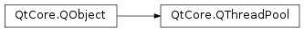

# 笔记

<!-- TOC -->

- [笔记](#笔记)
    - [补充](#补充)
        - [窗口样式设置](#窗口样式设置)
        - [QtConcurrent](#qtconcurrent)
        - [QRunnable](#qrunnable)
        - [QThreadPool](#qthreadpool)
        - [QEventLoop](#qeventloop)
        - [信号](#信号)
        - [其它](#其它)
    - [QTimer](#qtimer)
        - [QTimer常用方法](#qtimer常用方法)
        - [QTimer常用信号](#qtimer常用信号)
        - [QTimer使用](#qtimer使用)
    - [QThread](#qthread)
        - [QThread方法](#qthread方法)
        - [QThread常用信号](#qthread常用信号)
        - [QThread使用](#qthread使用)
    - [QMutex 文件锁](#qmutex-文件锁)
    - [事件处理](#事件处理)
    - [如何选择](#如何选择)

<!-- /TOC -->

一般情况下, 应用程序都是单线程运行的, 但是对于GUI程序来说, 单线程有时候不能满足需求. 比如执行一个特别耗时的操作, 在执行过程.

多线程技术的实现在QT中一般有使用计时器模块QTimer, 使用多线程模块QThread, 使用事件处理的功能.

## 补充

### 窗口样式设置

    win = QWidget()
    win.setWindowFlags(Qt.SplashScreen|Qt.FramelessWindowHint)   # 模仿开机画面, 程序设置为无边框

### QtConcurrent

`PySide2.QtConcurrent.QtConcurrent`

QtConcurrent名称空间提供一个高级的可以不使用低等级线程语言的能使用多线程程序的API.

PySide2.QtConcurrent.QtConcurrent.ThreadFunctionResult

PySide2.QtConcurrent.QtConcurrent.ReduceOption : This enum specifies the order of which results from the map or filter function are passed to the reduce function.

常量

QtConcurrent.UnorderedReduce : Reduction is done in an arbitrary order.  
QtConcurrent.OrderedReduce : Reduction is done in the order of the original sequence.  
QtConcurrent.SequentialReduce : Reduction is done sequentially: only one thread will enter the reduce function at a time. (Parallel   reduction might be supported in a future version of Qt Concurrent.)  

### QRunnable

`PyQt5.QtCore.QRunable`

QRunnable类是一个接口, 用于代表一个需要执行的任务或一段代码, 重载run()实现自己的业务代码.

可以使用QThreadPool来单独的执行代码. 如果autoDelete()返回True, QThreadPool会自动的删除QRunnable(默认处理方式). 使用setAutoDelete()来改变自动删除标记.

QThreadPool支持使用通过从run()中执行tryStartt(this)重复调用相同的QRunnable. 如果autoDelete开启, QRunnable将会在最后一个线程退出run()方法时被删除. 当autoDelete开启时调用同一个QRunnable的start()方法多次将会造成竞争, 这是不推荐的.

**方法**

autoDelete () : 是否开启了autoDelete.  
setAutoDelete (_autoDelete) : 设置是否开启autoDelete, 设置True开启, 其他关闭. 开启, QThreadPool将会在这个runnable自动地删除它; 其他, 所有者就会保留它. 注意, 其必须在start()之前被设置, 如果在之后调用这个方法, 将没有任何表现.

**虚函数**

run () : 抽象函数, 用于继承后实现.

### QThreadPool

`PyQt5.QtCore.QThreadPool`

QThreadPool管理和回收单独的QThread对象, 以帮助减少使用线程的程序中创建线程的成本. 每个Qt应用有一个全局的QThreadPool 对象, 可以使用globalInstance() 来获得它.

使用QThreadPool中的一个线程, 可通过子类QRunnable并实现它的run()虚函数. 然后创建一个该类的对象, 并将这个对象传递给QThreadPool的start()方法.

    class HelloWorldTask(QRunnable):
        def run(self):
            print "Hello world from thread", QThread.currentThread()

    hello = HelloWorldTask()
    # QThreadPool takes ownership and deletes 'hello' automatically
    QThreadPool.globalInstance().start(hello)

QThreadPool默认自动删除QRunnable. 使用setAutoDelete()来改变自动删除标记.

QThreadPool支持通过从run()内调用tryStart(this)执行同样的QRunnable多次. 如果autoDelete是开启的, QRunnable将在最后一次run()的exit()执行后被删除. 当autoDelete开启的时候调用同一个QRunnable的start()多次会造成竞争, 这是不被推荐的.

在一定时间内没有使用的线程将会过期. 默认的过期时间为30000毫秒(30秒). 可以使用setExpiryTimeout()设置. 设置一个负数deep过期时间将禁用过期机制.

调用maxThreadCount()查询可用的线程最大值. 如果需要, 可以改变这个限制使用setMaxThreadCount(). 默认的maxThreadCount()是idealThreadCount(). activeThreadCount()方法返回当前运行中的线程数.

reverseThread()方法保留一个线程用于额外deep使用. 使用releaseThread()用来释放做完事儿的线程, 这样就可以在次使用它了. 实质上, 这些方法临时增加或减少活动线程的数量, 用以实现不可见的QThreadTool的耗时操作很有用.

注意: QThreadPool是一个用于管理线程的底层类.

**方法**  

activeThreadCount ()  
clear () : 移除那些还没有运行的QRunnable对象. 那些runnable.autoDelete()返回Truedeep将会被删除.  
expiryTimeout ()  
maxThreadCount () :  
releaseThread () : 释放先前通过调用reserveThread()保留的线程. 调用这个方法的时候没有预先临时保留一个线程会增加maxThreadCount(). 当一个线程睡眠等待更多事务时是很有用的, 允许其他的线程继续. 当需要保留线程的时候, 确保调用reserveThread(), 这样线程池可以正确的维护activeThreadCount().  
reserveThread () : 保留一个线程, 不顾activeThreadCount() 和 maxThreadCount(). 当完成一个线程, 调用releaseThread()来确保其可在使用. 注意, 这个方法总是会增加活动的线程数. 这意味者调用这个方法可能会让activeThreadCount()的返回值比maxThreadCount()还大.  
setExpiryTimeout (expiryTimeout)  
setMaxThreadCount (maxThreadCount)  
setStackSize (stackSize)  
stackSize ()  
start (runnable[, priority=0]) : 保留一个线程并使用它来运行runnable, 除非这个线程会让当前线程计数超过maxThreadCount(). 在这样的情况下, 只将runnable加入到执行队列中. priority参数可以用来定义在队列中的执行优先级. 注意, 如果runnable.autoDelete()返回True, 线程池将会获得该runnable的所有权. 并且, 如果runnable.run()返回了的话, 该runnable将会被自动地被删除. 如果runnable.autoDelete()返回False, 所有权将依然在其创建者手里. 需要知道的是, 在调用start()后改变runnable的自动删除设置, 将会造成未知行为.  
tryStart (runnable) : 尝试保留一个线程来运行runnable. 如果在使用该方法时没有任何一个线程可用, 其将不会做任何操作并返回False. 之外, runnable将会立刻被使用一个可用的线程执行, 并且该方法返回True. 注意, 如果runnable.autoDelete()返回True, 线程池将会获得该runnable的所有权. 并且, 如果runnable.run()返回了的话, 该runnable将会被自动地被删除. 如果runnable.autoDelete()返回False, 所有权将依然在其创建者手里. 需要知道的是, 在调用tryStart()后改变runnable的自动删除设置, 将会造成未知行为.  
tryTake (runnable) : 尝试移除在队列中指定的runnable, 当然前提是这个runnable没有启动. 如果runnable没有启动, 返回True, 并且runnable的所有权将会被传给该runnable的调用者(即使runnable.autoDelete()==True). 其他情况返回False. 注意, 如果runnable.autoDelete()==True, tryTake()将会移除错误的runnable. 这被称为ABA问题: 原始的runnable也许已经执行了并且已经被删除了. 内存被另一个runnable重用, 这将会导致这个runnable被移除. 所以, 推荐调用这个方法只在runnable没有设置自动删除的时候.  
waitForDone ([msecs=-1]) : 等所有线程退出并从线程池中移除所有的线程. 移除成功返回True, 失败返回False. 如果毫秒设置为-1(默认值), 超时将会被忽略(等待最后一个线程退出).

**静态方法**

globalInstance () : 返回全局的QThreadPool对象.

### QEventLoop

`PyQt5.QtCore.QEventLoop`

At any time, you can create a QEventLoop object and call exec() on it to start a local event loop. From within the event loop, calling exit() will force exec() to return.

任何时间, 都能创建一个QEventLoop对象并在其上调用exec()以开始一个本地事件循环. 从这个事件循环中, 调用exit()将会强制exec()返回.

**方法**

exec_ ([flags=QEventLoop.AllEvents]) : 进入事件并等待其退出, 返回值将交给exit()  
exit ([returnCode=0]) : 告诉事件退出, 并返回执行码  
isRunning () : 是否运行中  
processEvents ([flags=QEventLoop.AllEvents])  
processEvents (flags, maximumTime)  
  + **note**: 所有事件中deleteLater()是单独处理的.
  + QEventLoop.ExcludeUserInputEvents : 不处理用户输入事件, 比如: 按钮点击和键盘点击. 注意: 这些事件没有被丢弃, 而是放到了下一个没有设置flag的processEvents()来处理
  + QEventLoop.ExcludeSocketNotifiers : 不处理套接字通知事件. 注意: 这些事件没有被丢弃, 而是放到了下一个没有设置flag的processEvents()来处理
  + QEventLoop.WaitForMoreEvents : 如果没有事件处理, 等待.

**槽函数**

quit()

### 信号

`PyQt5.QtCore.pyqtSignal`

`PySide6.QtCore.Signal`

可以为控件绑定一个自定义的信号. 可以用在线程的信号交流.

    from PyQt5.QtCore import pyqtSignal

    class MyThread(QThread):
        """线程对象"""

        MySignal = pyqtSignal( str )   # 指定了一个传递给槽的数据类型

        ......

        def run(self):
            ....
            self.MySignal.emit( str_data )
            ....

    thread = MyThread()
    thread.MySignal.connect(do_something)   # 如果设置了传递值, 槽函数还会接收值
    thread.start()
    thread.wait()

### 其它

QSocketNotifier  
QNetworkAccessManager  
QIODevice.readyRead()

这是一个替代技术, 替代有一个或多个线程在慢速网络执行阻塞读的情况. 只要响应部分的计算可以快速执行, 这种设计比在线程中实现的同步等待更好. 与线程相比这种设计更不容易出错且更节能(energy efficient). 在许多情况下也有性能优势. 

## QTimer

`PyQt5.QtCore.QTimer`

如果要在应用程序中周期性地进行某项操作, 比如周期行地检测主机的CPU值, 则可以使用QTimer(定时器), QTimer类提供了重复的和单次的定时器. 要使用定时器, 要先创建一个QTimer实例, 将其timeout信号连接到相应的槽, 并调用start(). 然后, 定时器会以恒定的间隔发出timeout信号.

当窗口控件收到timeout信号后, 它就会停止这个计时器. 这是在图形用户界面中实现复杂工作的一个典型方法, 更现代的方法则是使用线程来替代.

### QTimer常用方法

start(milliseconds) : 启动或重新启动定时器, 时间间隔为毫秒. 如果定时器已经运行, 它将被停止并重新启动. 如果singleShot信号为真, 定时器将仅被激活一次  
stop() : 停止定时器  

### QTimer常用信号

singleShot(int, QtTimerType, PYQT_SLOT) : 在给定的时间间隔后调用一个槽函数时发射此信号  
timeout : 当定时器超时时发射此信号  

### QTimer使用

    from PyQt5.QtCore import QTimer

    timer = QTimer()
    
    # 使用timeout, 以一定间隔时间触发一个事件
    timer.timeout.connect(do_something)   # 每隔一个timeout将会启动do_something
    timer.start(1000)   # 设置间隔时间1s
    ...
    timer.stop()   # 停止这个计时器    

    # 使用singleShot, 就在一个时间间隔内触发一次
    timer.singleShot(1000, do_something)   # 在指定时间后启动一次do_something

## QThread

`PyQt5.QtCore.QThread`

QThread是Qt线程类中最核心的底层类. 由于Qt的跨平台性, QThread要隐藏所有与平台相关的代码.

一个QThread对象管理程序中的一个线程. QThread开始于执行run(). 默认的, run()通过调用exec()开始事件循环并且开始一个Qt事件循环代替线程.

使用moveToThread()把一个工作对象移入线程.

### QThread方法

start([priority=InheritPriority]) : 启动线程, 可指定优先级  
wait([time=ULONG_MAX]) : 阻塞线程, 直到满足以下条件  
  + 与此QThread对象关联的线程已经完成执行(即从run()返回时). 如果线程完成执行, 此函数返回True; 如果线程尚未启动, 此函数也返回True
  + 等待事件单位是ms(毫秒). 如果事件是ULONG_MAX(默认值), 则等待, 永远不会超时(线程必须从run返回) 如果等待超时, 此函数将返回False

exec_ () : 进入事件循环, 等待到exit()被执行, 返回值传递给exit(). 通过quit()调用的exit(), 返回值为0. 该方法在run()内被被调用, 必须调用此函数来开始事件处理.  
exit ([retcode=0]) : 告诉线程的事件循环退出并返回状态码. 在调用该方法之后, 线程将离开事件循环并从exec()返回值. exec()方法返回returnCode. 通常的, 一个returnCode为0表示成功, 任何非零值表示一个错误. 注意, 不像C中同名库, 这个方法不会返回一个调用器-事件处理停止了. 直到exec()被在此滴啊用, 没有QEventloop会被启动. 如果在exec()中的Eventloop没有在运行, 下一个调用的exec()也会立刻返回.  

requestInterruption () : 请求线程中断. 该请求是建议性的, 并取决于在线程上执行的代码来决定是否与怎样来对该请求做出反应. 这个方法不会停止任何在线程上运行的事件循环, 也不会以某种方式终止它.  
isInterruptionRequested ()  
eventDispatcher () : 返回线程的一个指向调度对象的指针. 如果线程没有事件调度存在, 这个方法返回None.  
setEventDispatcher (eventDispatcher) : 为线程设置事件调度
将线程的事件调度器设置为eventDispatcher. 这只适用于没有事件调度的线程. 在线程使用start()开始之前, 或对于主线程来说, 在QCoreApplication之前. 该方法将会接管该对象.  
isFinished ()  
isRunning ()  
loopLevel ()  
priority ()  
setPriority (priority)  
setStackSize (stackSize)  
stackSize ()  

**虚函数**

run () : 一个线程的开始点. 在调用start()之后, 新建的线程将会调用这个方法. 默认 实现只是调用exec(). 可以重载此方法用以实现业务逻辑. 该方法的返回将会结束对应的线程.

**槽函数**

quit () : 告诉线程的事件循环退出并返回0(成功). 等价于调用exit(0). 如果线程没有一个事件循环, 该方法不会做任何事.  
start ([priority=InheritPriority]) : 通过调用run()开始执行线程. 操作系统将会根据设置的优先级参数调度线程任务. 如果该线程已经在运行了, 该方法不会做任何事. 优先级参数的实现依赖于操作系统的调度策略. 不支持的系统会忽略(如Linux).  
terminate () : 终结执行的线程. 线程可能不会被立刻终止, 这取决于操作系统的调度策略. 在这之后使用wait(), 可确保线程终止. 当线程终止了, 所有等待该线程的线程将会被唤醒. 警告, 该方法是危险的并不被推荐. 因为线程可能在任何时候被终结, 如果此时线程正在做一些事, 可能会导致一些错误. 终止通过调用setTerminationEnabled()可以被显式地启用或禁止. 在终止情况下调用此方法会导致终止延迟, 直到终止再被开启.  

**静态方法**

currentThread ()  
idealThreadCount () : 返回系统推荐的线程数. 由系统的进程核心数来决定. 当进程核心数无法判断, 该方法返回1.  
msleep (arg__1)  
setTerminationEnabled ([enabled=true]) : 启用或禁用终止当前的线程. 必须是已经通过QThread启用的线程. 如果禁用, 调用terminate()将会立刻返回没有做任何事. 相对的, 终止将延迟到启用终止为止. 如果启用, 在之后调用terminate()将会正常的终止线程. 如果终止被延迟(比如禁用时terminate()被调用), 这个方法将会立刻终止调用线程. 在这种情况下, 此函数不会返回.  
sleep (arg__1)  
usleep (arg__1)  
yieldCurrentThread () : 产生当前线程的执行到另一个runnable线程, 如果有. 注意, 这是由操作系统来决定如何切换线程.

### QThread常用信号

started : 在开始执行线程的run()函数之前, 从相关线程触发  
finished : 当程序完成业务逻辑时, 从相关线程触发  

### QThread使用

要使用QThread开始一个线程, 可以创建它的一个子类, 重载QThread.run()方法就可以.

初始化定义的线程类可以直接得到Thread实例, 调用其start()方法即可启动线程. 线程启动后, 会滴啊用其实现的run方法.

业务的线程任务就写在run方法中, 当run退出之后, 线程基本就结束了.

    class MyThread(QThread):
        def __init__(self, parent=None):
            super().__init__(parent=parent)

        def run(self):
            # 主代码
            pass

    th = MyThread()
    th.start()

当在窗口中显示的数据比较简单时, 可以把读取数据的业务逻辑放在窗口的初始化代码中; 但是如果读取数据的时间比较长, 比如网络数据请求, 则可以把这部分逻辑放在QThread线程中, 实现界面的数据显示和数据读取的分离, 以满足MVC设计模式的要求.

    from PyQt5.QtCore import QThread, pyqtSignal
    from PyQt5.QtWidgets import QApplication, QWidget, ......

    class ThreadWorker(QThread):
        """线程对象"""

        single_out = pyqtSignal(str)   # 自定义的信号, str为传递给槽函数的数据类型

        def __init__(self, parent=None):
            super().__init__(parent=parent)
            ......
        
        def __del__(self):
            self.wait()   # 在删除QThread的时候等候完成, 这样就不用在主线程中阻塞了

        def run(self):
            ......
            self.single_out.emit(str_info)   # 自定义的信号发出
            # 线程休眠2s
            self.sleep(2)

    class WinForm(QWidget):
        """主窗口"""
        def __init__(self, parent=None):
            super().__init__(parent=parent)
            ......
            self.thread = ThreadWorker()   # 创建一个线程对象
            self.thread.single_out.connect(self.slot_handle_thread)   # 将信号绑定槽函数
            ......          
            

        def slot_handle_thread(self, str_info):
            ......

分离UI主线程与工作线程. 这样可以不让窗口卡死.

    import sys

    from PyQt5.QtCore import QTimer, QThread, pyqtSignal
    from PyQt5.QtWidgets import QApplication, QWidget, QVBoxLayout, QLCDNumber, QPushButton

    global sec
    sec = 0

    class WorkThread(QThread):
        """工作线程"""

        finish_signal = pyqtSignal()   # 自定义的信号

        def __init__(self, parent=None):
            super().__init__(parent)

            def run(self):
                for i in range(2e16):   # 耗时操作, 放入线程中
                    pass

                # 循环完成后触发自定义的事件
                self.finish_signal.emit()   # self.finish_signal.emit(data) 也可传递值

    def countTime():
        global sec
        sec += 1
        # LED显示数字
        lcd_number.display(sec)

    def work():   # 用于开启计时器, 和线程
        # 计时器每秒计数
        timer.start(1000)
        # 开始线程 计时开始
        work_thread.start()
        work_thread.finish_signal.connect(timeStop)    # 处理线程的完成信号

    def timeStop():
        # 关闭计时器
        timer.stop()
        print("运行结束用时", lcd_number.value())
        # 重设全局时间
        global sec
        sec = 0

    if __name__ == "__main__":

        app = QApplication(sys.argv)
        win = QWidget()
        win.resize(300, 120)

        lcd_number = QLCDNumber()
        button = QPushButton("测试启用线程")
        button.clicked.connect(work)   # 点击开始计时器, 开始工作线程

        layout = QVBoxLayout()
        layout.addWidget(lcd_number)
        layout.addWidget(button)
        win.setLayout(layout)

        timer = QTimer()
        timer.timeout.connect(countTime)   # 计时器时间间隔触发, 刷新led时间
        work_thread = WorkThread()

        win.show()
        sys.exit(app.exec())

## QMutex 文件锁

QMutex 是 Qt 框架提供的一个互斥锁类，用于在多线程程序中保护共享资源，防止多个线程同时访问同一资源而引发竞态条件。QMutex 提供了基本的互斥锁功能，确保在同一时刻只有一个线程可以访问受保护的资源。

以下是 QMutex 的一些主要功能：

锁定和解锁：

    lock()：锁定互斥锁。如果互斥锁已经被另一个线程锁定，则调用线程将被阻塞，直到互斥锁被解锁。  
    unlock()：解锁互斥锁，允许其他线程锁定它。

尝试锁定：

    tryLock()：尝试锁定互斥锁，但不阻塞调用线程。如果互斥锁可以被锁定，则返回 true 并锁定它；如果互斥锁已经被锁定，则返回 false。

递归锁定：

    QMutex 支持递归锁定，即同一个线程可以多次锁定同一个互斥锁，只要它也相应地多次解锁。

使用 QMutex 的典型场景包括：

    保护共享数据，如全局变量或类的静态成员。
    在多线程环境中安全地访问资源，如文件、网络连接等。
    实现线程安全的对象，确保对象的方法在多线程调用时不会产生冲突。
    以下是一个简单的示例，展示了如何使用 QMutex 来保护共享资源：

## 事件处理

PyQt为事件处理提供了两种机制: 高级的信号与槽机制, 以及低级的事件处理函数. 下面介绍一个低级的事件处理程序processEvents()函数. 其作用是处理事件, 简单说就是刷新页面.

对于执行很耗时的程序来说, 由于PyQt需要等待程序执行完毕才能进行下一步, 这个过程表现在界面上就是卡顿; 而如果在执行这个耗时程序时不多地运行QApplication.processEvents(), 那么就可以实现一边执行耗时程序, 一边刷新页面的功能, 给人的感觉就是程序运行流畅. 因此使用QApplication.processEvents()的使用方法就是在主函数执行耗时操作的地方, 加入QApplication.processEvents().

    class WinForm(QWidget):
        """主窗口"""
        def __init__(self, parent=None):
            super().__init__(parent)
            self.setWindowTitle("processEvents 使用")

            self.list_file = QListWidget()
            self.button_start = QPushButton("开始")
            
            grid_layout = QGridLayout()
            grid_layout.addWidget(self.list_file, 0, 0, 1, 2)   # 0行0列, 占1行, 占2列
            grid_layout.addWidget(self.button_start, 1, 1)   # 1行1列
            self.setLayout(grid_layout)

            self.button_start.clicked.connect(self.slot_add)
        
        def slot_add(self):
            for n in range(10):
                str_n = "file index{}".format(n)
                self.list_file.addItem(str_n)
                QApplication.processEvents()   # 刷新界面, 效果不好
                time.sleep(2)

## 如何选择

应该使用 Qt 线程的哪种技术？  
有时候，你需要的不仅仅是在另一线程的上下文中运行一个函数。您可能需要有一个生存在另一个线程中的对象来为GUI线程提供服务。也许你想在另一个始终运行的线程中来轮询硬件端口并在有关注的事情发生时发送信号到GUI线程。Qt为开发多线程应用程序提供了多种不同的解决方案。解决方案的选择依赖于新线程的目的以及线程的生命周期。

| 生命周期 | 开发任务 | 解决方案 |
|-        |-       |-        |
| 一次调用 |在另一个线程中运行一个函数，函数完成时退出线程|1.编写函数，使用QtConcurrent::run 运行它 2.派生QRunnable，使用QThreadPool::globalInstance()->start() 运行它 3.派生QThread，重新实现QThread::run() ，使用QThread::start() 运行它|
| 一次调用 |需要操作一个容器中所有的项。使用处理器所有可用的核心。一个常见的例子是从图像列表生成缩略图。|QtConcurrent 提供了map()函你数来将操作应用到容器中的每一个元素，提供了fitler()函数来选择容器元素，以及指定reduce函数作为选项来组合剩余元素。|
| 一次调用 |一个耗时运行的操作需要放入另一个线程。在处理过程中，状态信息需要发送会GUI线程。|使用QThread，重新实现run函数并根据需要发送信号。使用信号槽的queued连接方式将信号连接到GUI线程的槽函数。|
| 持久运行 |生存在另一个线程中的对象，根据要求需要执行不同的任务。这意味着工作线程需要双向的通讯。|派生一个QObject对象并实现需要的信号和槽，将对象移动到一个运行有事件循环的线程中并通过queued方式连接的信号槽进行通讯。|
| 持久运行 |生存在另一个线程中的对象，执行诸如轮询端口等重复的任务并与GUI线程通讯。|同上，但是在工作线程中使用一个定时器来轮询。尽管如此，处理轮询的最好的解决方案是彻底避免它。有时QSocketNotifer是一个替代。|