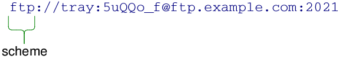
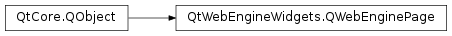

# 笔记

<!-- TOC -->

- [笔记](#笔记)
    - [补充](#补充)
        - [QUrl](#qurl)
        - [QDir](#qdir)
        - [QWebChannel](#qwebchannel)
        - [pyqtProperty](#pyqtproperty)
    - [QWebEngineView](#qwebengineview)
        - [QWebEngineView方法](#qwebengineview方法)
        - [QWebEngineView虚函数](#qwebengineview虚函数)
        - [QWebEngineWidgets槽](#qwebenginewidgets槽)
        - [QWebEngineView信号](#qwebengineview信号)
    - [QWebEnginePage](#qwebenginepage)
        - [QWebEnginePage常量](#qwebenginepage常量)
        - [QWebEnginePage方法](#qwebenginepage方法)
        - [QWebEnginePage虚函数](#qwebenginepage虚函数)
        - [QWebEnginePage信号](#qwebenginepage信号)
    - [使用例子](#使用例子)
        - [调用页面中的js脚本](#调用页面中的js脚本)
        - [js调用PyQt代码](#js调用pyqt代码)

<!-- /TOC -->

**使用PyQtWebEngine**

apt-get 安装

    sudo apt-get install python3-pyqt5.qtwebengine

pip 安装

    pip install PyQtWebEngine

## 补充

### QUrl

`PyQt5.QtCore.QUrl`, 提供了对统一资源定位符(Uniform Resource Locator)的解码与编码的功能. 同时其还支持国际化域名(IDNs).

通常使用QUrl的方式就是在初始化的时候构造或者使用setUrl()方法进行构造. 

QUrl包含编码(encode)定位符和非编码(unencode)定位符. 编码的定位符一般用于向服务器请求, 而非编码的一般用于展示内容. 比如“http://bühler.example.com/List of applicants.xml” 将会被以 “http://xn–bhler-kva.example.com/List%20of%20applicants.xml” 发送到服务器.

QUrl可以也通过setScheme(), setUserName() , setPassword() , setHost() , setPort() , setPath() , setQuery() and setFragment() 来一个部分一个部分的组合. setAuthority()可以一口气设置用户名, 密码, 主机和端口. setUserInfo()可以一口气设置用户名和密码.

使用isValid()来检查所设置的链接是否有效. 如果返回False则表示无效, 此时可以使用clear()来清除设置, 或者使用setUrl()进行重新设置.

构造一个查询可以方便的通过QUrlQuery类和其setQueryItems(), addQueryItem(), removeQueryItem()方法来进行. 对生成查询字符串, 使用setQueryDelimiters()自定义分隔符.

使用fromParentEncodeing()和toParentEncoding()两个静态方法, 可以方便的生成编码的URL字符串或查询字符串. 这两个方法处理百分比编码和解码QString对象.

fromLocalFile()通过一个本地的文件路径构造一个QUrl. toLocalFile()将一个URL转换为本地文件路径.

具有可读性的URL可以通过toString()获取. 将会展现一个非编码的URL. 使用toEncode()可以获取编码的, 用于传递给网路服务器, 邮件客户端等. 这两种格式都代表同一个URL, 其实不论传递给setUrl()哪种格式的, 都会生成同样的QRrl对象.

QUrl符合来自RFC3986(Uniform Resource Identifier: Generic Syntax)对URI定义, 并包含了RFC1738(Uniform Resource Locators)的协议拓展. QUrl中的大小写折叠规则符合RFC3491(Nameprep: A Stringprep Profile for Internationalized Domain Names (IDN)). 其也兼容来自freedesktop.org对文件URI定义, 提供基于UTF8的本地文件名的编码(需要IDN).

**方法**  
<raw>__eq__</raw> (url) : 等于  
<raw>__lt__</raw> (url) : 小于  
<raw>__ne__</raw> (url) : 不等于  
<raw>__reduce__</raw> () : 减  
<raw>__repr__</raw> () : 报告  
adjusted (options) : 返回调整后的URL. 可以通过options来自定义.  
authority ([options=QUrl.PrettyDecoded]) : 返回URL的权限(如果已经定义), 无则返回None.  
clear () : 重置QUrl内容.  
errorString () : 返回最后一次更改QUrl的操作的错误信息. 如果没有, 返回空, 调用isValid()返回True.  
fileName ([options=QUrl.FullyDecoded]) : 返回文件名, 没有目录路径的. 如果路径是以斜杠结尾的, 那么会被认为是空.  
fragment ([options=QUrl.PrettyDecoded]) : 返回URL的分段信息.
hasFragment () : 检查是否具有分段.  
hasQuery () : 是否具有查询.  
host ([arg__1=QUrl.FullyDecoded]) : 返回Url的主机.  
isEmpty () : 是否空  
isLocalFile () : 是否为本地文件  
isParentOf (url) : 是否是childUrl()的父. 如果两个Url共同分享同样的协议和验证, 这样的urls的路径就被叫父.  
isRelative () : 是否相关  
isValid () : 是否非空且有效  
matches (url, options) : 是否给定的url符合options  
operator= (url) 　
password ([arg__1=QUrl.FullyDecoded]) : 返回密码, 无则返回空.
path ([options=QUrl.FullyDecoded]) : 返回Url的路径. options可以指定返回的编码格式    
port ([defaultPort=-1]) : 返回Url的端口 
query ([arg__1=QUrl.PrettyDecoded]) : 返回Url的查询字符串如果有  
resolved (relative) : 返回url和相关的合并后的结果. 这个Url被用作一个基础用于转换相对路径到绝对路径.  
scheme () : 返回Url的协议. 如果返回空, 就说明这个url没有协议, Url是相对路径.  
setAuthority (authority[, mode=TolerantMode]) : 设置Url的认证. 
setFragment (fragment[, mode=TolerantMode]) : 设置Url的分段. 即在Url最后以"#"跟随的字符串.  
setHost (host[, mode=DecodedMode]) : 设置Url的host. host是认证的一部分.  
setPassword (password[, mode=DecodedMode]) : 设置Url的密码部分. 属于用户信息的一部分.  
setPath (path[, mode=DecodedMode]) : 设置Url的路径, 路径一般在认证之后, 查询字符串之前.  
setPort (port) : 设置端口. 是认证的一部分  
setQuery (query) : 设置查询字符串  
setQuery (query[, mode=TolerantMode]) : 设置查询字符串
  + TolerantMode, 宽松模式, 接受所有字符, 并且会更正分布的"%", 而不是两个十六进制字符
  + StrictMode, 严格模式, 每一个"%"后都要根两个表示十六进制字符串的字符, 如空格这些字符不被允许以未编码的形式写入
  + DecodedMode, 解码模式, "%"代表自己, 无法使用编码字符

setScheme (scheme) : 设置Url的协议. 一个协议只能包含ASCII字符, 在输入时没有转换或者解码. 其也必须以ASCII字符开头.  
setUrl (url[, mode=TolerantMode]) : 分析输入的url, 并将这个对象设置为该值. QUrl将会自动地百分比编码那些不能在URL中使用的所有字符并解码代表一个不是保留字符(字母, 数字, 连字符, 下划线, 点, 波浪线)的表百分比编码的序列. 所有别的字符将会保留.
 + TolerantMode, 宽松模式, 默认的, QUrl将会自动修正错误, 如明显的"%"没有跟随两个十六进制数, 其将会接受任何字符在任何位置.
 + StrictMode, 严格模式, 编码错误将不会那么宽松, QUrl也会检查一些禁止的没有被编码为百分比格式的字符. 如果发现一个错误, 将会产生一个运行时警告.

setUserInfo (userInfo[, mode=TolerantMode]) : 设置Url的用户信息. 用户信息是Url认证的可选部分. 由用户名和密码组成.  
setUserName (userName[, mode=DecodedMode]) : 设置用户名  
swap (other) : 使用此URL交换其他URL. 此操作非常快, 并且永远不会失败.  
toDisplayString ([options=QUrl.FormattingOptions(PrettyDecoded)]) : 返回一个代表Url的可读的字符串. 输出能通过options定义. 选项的RemovePassword总是使用的.  
toEncoded ([options=QUrl.FullyEncoded]) : 返回代表的可用Url编码. 另一些情况, 一个空的QByteArray会被返回.  
toLocalFile () : 返回本地文件路径的URL格式的地址. 一般是使用"/"作为分隔符.  
toString ([options=QUrl.FormattingOptions(PrettyDecoded)]) : 返回一个代表URL的字符.  
topLevelDomain ([options=QUrl.FullyDecoded]) : 返回网址的TLD(Top-Level Domain 顶级域)(例如.co.uk, .net). 注意, 除非URL不包含有效的TLD, 否则返回值的前缀为".", 在这种情况下, 该函数将返回一个空字符串.
url ([options=QUrl.FormattingOptions(PrettyDecoded)]) : 返回代表url的字符串  
userInfo ([options=QUrl.PrettyDecoded]) : 返回用户信息  
userName ([options=QUrl.FullyDecoded]) : 返回用户名字  

**静态方法**  
fromAce (arg__1) : 以Unicode形式返回给定的域名.  
fromEncoded (url[, mode=TolerantMode]) : 分析输入并返回相关的QUrl. 输入的内容假定是编码好的的, 即仅包含ASCII字符.  
fromLocalFile (localfile): 返回一个代表本地文件的QUrl. 可以接受"/"或"//"作为分隔符.   
fromPercentEncoding (arg__1) : 返回输入的解码版本的副本. 输入将会先被从百分比编码解码, 然后转换为UTF8格式的.  
fromStringList (uris[, mode=TolerantMode]) :　使用QUrl(str, mode)将列表中代表urls的字符串转换为一个包含urls的列表. 所有的字符串必须是符合urls格式的, 且不能是本地地址.  
fromUserInput (userInput) : 将用户输入的有效输入返回为一个QUrl.  
fromUserInput (userInput, workingDirectory[, options=QUrl.DefaultResolution]) : 将用户输入的有效输入返回为一个QUrl. 可以定义相对目录地址.  
idnWhitelist () : 返回顶级域的当前白名单, 这些顶级域的成分中可以包含非ASCII字符.  
setIdnWhitelist (arg__1) : 将允许在域中包含非ASCII字符的顶级域(TLD)白名单设置为list的值.  
toAce (arg__1)  : 返回给予的域名的ASCII兼容编码. 该方法和domain等价.  
toPercentEncoding (arg__1[, exclude=QByteArray()[, include=QByteArray()]]) : 返回输入的编码格式. 输入先回转换为UTF8, 所有的ASCII字符不会转换, 不是保留字符的将会被编码. 想要某些字符不被编码, 可以指定exclude参数, 强制编码指定字符使用include参数.  
toStringList (uris[, options=QUrl.FormattingOptions(PrettyDecoded)]) : 转换列表中的urls到QString()对象, 使用toString()  

**常量**  

一般用于options选项, 指定url字符串的编码或解码格式.

QUrl.FullDecoded : 全部解码  
QUrl.PrettyDecoded : 完美解码  
QUrl.FullyEncoded : 全部编码

    url = QUrl("/tmp/Mambo %235%3F.mp3")
    url.path(QUrl.FullyDecoded)    # "/tmp/Mambo #5?.mp3"
    url.path(QUrl.PrettyDecoded)   # "/tmp/Mambo #5?.mp3"
    url.path(QUrl.FullyEncoded)    # "/tmp/Mambo%20%235%3F.mp3"

**什么是认证**  

**什么是分段**  

**什么是Url路径**

**什么是协议**  

**什么是用户信息**  

### QDir

`PyQt5.QtCore.QDir`

提供了用于处理目录地址和其内容的函数. 类似与pathlib标准库. QDir用于操作路径名, 获得路径和文件的信息, 并操作底层的文件系统. 也可以用于链接Qt的资源系统.

Qt使用"/"作为一个普遍的目录分隔符, 同样的在URLs中"/"也作为一个路径的分隔符. 如果总是使用"/"作为目录的分隔符, Qt将会翻译用户的路径符合底层的操作系统的格式.

一个QDir可以使用相对路径或绝对路劲指出一个文件. 绝对路径开始于目录分隔符(或者在windows系统中是一个盘符). 相对路径文件名开始于一个目录名或一个文件名, 并指出一个和当前目录相关联的路径.

    # 绝对路径
    QDir("/home/user/Documents")
    QDir("C:/Documents and Settings")
    # 相对路径
    QDir("images/landscape.png")

可以使用isRelative()或isAbsolute()方法来检查当前的路径是什么类型的. 使用makeAbsolute()将一个相对的QDir转换为绝对的QDir.

**更多对目录或文件的类**

`PyQt5.QtCore.QDirIterator`, 可用于遍历目录.

`PyQt5.QtCore.QFile`, 提供了对文件的读取, 与写功能的接口.

### QWebChannel

`PyQt5.QtWebChannel.QWebChannel`

QWebChannel填充C++应用和HTML/JavaScript应用之间的空隙. 通过派生一个QObject派生对象到一个QWebChannel并在HTML页面上使用qwebchannel.js, 一个可以透明地接触属性和公共插槽并且是QObject的方法. 不需要手动地传提示也不需要序列化的数据, 在C++这边的属性更新和信号的发送自动地被传送到后台远端正在运行的HTML客户端. 在客户端这一边, 一个JavaScript对象会被任何派生的C++ QObject对象创建. 其反应了C++对象的API, 因此可以直观的使用.

C++ QWebChannel API 让和任何HTML客户端交流可行, 不论是本地的还是远程的都可以. 唯一的限制是HTML客户端通过qwebchannel.js支持JavaScript特性. 因为这样, 其基本可以和任何现代的HTML浏览器或独立的JavaScript运行环境进行交互, 如node.js.

这儿同样也存在一个声明性的WebChannel API.

**方法**  
blockUpdates ()  
deregisterObject (object) : 注销QWebChannel中的object. 远端的客户端将会从object收到destroyed信号.  
registerObject (id, object) : 注册一个object到QWebChannel. 该对象的属性, 信号和公共方法将会被传递给远端的客户端. 在那, 会用指定的id构造一个对象  
registerObjects (objects) : 注册一组对象到QWebChannel. 该对象的属性, 信号和可调用的公共方法将会被传递给远端的客户端. 在那, 一个在对象映射中使用标识符作为键的对象将会被构造.  
registeredObjects () : 返回在远程客户端中注册的对象  
setBlockUpdates (block)  

**槽**  
connectTo (transport) : 连接QWebChannel得到给定transport对象. transport对象之后会用来处理C++应用和一个远程的HTML客户端  
disconnectFrom (transport) : 从transport断开与QWebChannel的连接.  

**信号**  
def blockUpdatesChanged (block)  

### pyqtProperty

`PyQt5.QtCore.pyqtProperty()`

PyQt5.QtCore.pyqtProperty(type [, fget=None[, fset=None[, freset=None[, fdel=None[, doc=None[, designable=True[, scriptable=True[, stored=True[, user=False[, constant=False[, final=False[, notify=None]]]]]]]]]]]])

type : 必填, 属性的类型  
fget : 选填, 用于获取属性的值  
fset : 选填, 用于设置属性的值  
freset : 选填, 用于将属性的值重置为它的默认值  
fdel : 选填, 用于删除属性  
doc : 选填, 属性的文档字符串  
designable : 选填, 设置Qt DESIGNABLE标志  
scriptable : 选填, 设置Qt SCRIPTABLE标志  
stored : 选填, 设置Qt STORED标志  
user : 选填, 设置Qt USER标志  
constant : 选填, 设置Qt CONSTANT 标志  
final : 选填, 设置Qt FINAL标志  
notify : 选填, 未绑定的通知信号  
revision : 选填, 将版本导出到QML  

可以使用pyqtProperty()函数给类的属性赋值, 作为参数传入类的setter和getter方法名.

    from PyQt5.QtCore import QObject, pyqtProperty

    class MyObject(QObject):
        def __init__(self, inVal=20):
            self.val = inVal
        
        def readVal(self):
            print("readVal=%s" % self.val)
            return self.val

        def setVal(self):
            print("setVal=%s" % self.val)
            return self.val

        ppVal = pyqtProperty(int, readVal, setVal)

    if __name__ == "__main__":

        obj = MyObject()

        print("\n#1")
        obj.ppVal = 10

        print("\n#2)
        print("obj.ppVal=%s" % obj.ppVal)
        print("obj.readVal()=%s" obj.readVal())

输出

    #1
    setVal=10

    #2
    readVal=10
    obj.ppVal=10
    readVal=10
    obj.readVal()=10

## QWebEngineView

`PyQt5.QtWebEngineWidgets.QWebEngineView`, 网页视图, 其是Qt WebEngine的主要组成控件. 可以在多种应用中展示Internet的内容. 使用的是Chromium内核, 是基于Content API封装的.

一个页面可以使用load()方法载入. GET请求将会被用来加载URLs.

和很多Qt控件一样, 使用show()方法来展示载入的页面.

    view = QWebEngineView(parent);
    view.load(QUrl("http://qt-project.org/"));
    view.show();

作为另一种选择, setUrl()也可以用来载入一个页面. 使用setHTML()来载入已经存在的HTML文件.

loadStarted()信号, 当开始载入一个页面时触发. loadProgress()信号, 当页面中的一个元素完成载入时触发, 比如一个图片元素, 或一段脚本.  loadFinished()信号, 当页面载入完成时触发. 会向槽出入一个表达是否载入完成的bool值.

page()方法返回一个指向页面的对象. 一个QWebEngineView包含一个QWebEnginePage, 可以通过这个对象在页面上下文中使用QWebEngineHistory.

HTML文档的标题可以使title()方法访问. 另外的, 一个页面可能有图标, 这个可以通过icon()方法或者通过图标的URL使用iconUrl()方法获得. 如果页面标题或者图标改变了, 会发出titleChanged(), iconChanged()和iconUrlChanged()信号. zoomFactor()属性可以用来缩放页面大小.

控件特性一个上下文菜单, 这是为在手边的元素量身定制的, 包括在一个浏览器中的有用的动作. 对于一个定制的上下文菜单, 或者对于
在一个菜单或工具栏中嵌入的动作, 独立的动作可以通过pageAction()提供. 页面视图维持返回的动作的状态, 但是允许更改动作的属性, 比如文本或者图标. 动作也可以通过triggerPageAction()方法直接触发.

如果想要用户自己可以打开一个新的网页的窗口, 比如弹窗, 可以继承QWebEngineView并重新实现createWindow方法.

### QWebEngineView方法

findText (arg__1, arg__2, arg__3)  
findText (subString[, options=QWebEnginePage.FindFlags()])  
hasSelection ()  
history () : 返回指向该视图的导航网页历史记录的指针.  
icon ()  
iconUrl ()  
load (request)  
load (url)  
page () : 返回指向基础页面的指针.  
pageAction (action) : 返回那些指向QAction的指针, 这些QAciton封装了页面中的活动  
selectedText ()  
setContent (data[, mimeType=””[, baseUrl=QUrl()]]) : 将网络视图的内容设置为data. 默认的mimeType是text/plain,charset=US-ASCII. 内容中的外部对象位于相关的baseUrl. 当外部对象载入, baseUrl不能为空. data会被立刻载入, 外部对象会被异步载入.  
setHtml (html[, baseUrl=QUrl()]) : 设置网络视图的内容为指定的HTMl内容. 一些外部的内容比如图片, sheetstyle等都在相关的baseUrl中. 当使用该方法, Qt WebEngine将假设外部的对象(如 JavaScript, sheetstylle)使用的是UTF8的编码. 除非另外指定. 直接调用这个方法就相当于 setContent(html, "text/html;charset=UTF-8", baseUrl).　注意这个方法处理不了大于2MB的内容.  
setPage (page) : 使page成为页面视图的新页面. 提供的页面的父QObject仍然是对象的所有者. 如果当前页面是Web视图的子页面, 则将其删除.  
setUrl (url)  
setZoomFactor (factor)  
settings () : 返回设定  
title ()  
triggerPageAction (action[, checked=false]) : 触发指定的action. 如果这是可检查的操作, 则假定为指定的检查状态. 如这儿设置一个复制动作, 用于复制选中的 view.triggerPageAction(QWebEnginePage.Copy)  
url () :  
zoomFactor ()  

### QWebEngineView虚函数

createWindow (type) : 将会尝试创建一个给予type的新的窗口

### QWebEngineWidgets槽

back () : 便捷插槽, 用于通过导航链接创建的文档列表中的上一个文档. 等同 view.page().triggerAction(QWebEnginePage.Back)  
forward () : 便捷插槽, 用于通过导航链接构建的文档列表中的下一个文档.  等同 view.page().triggerAction(QWebEnginePage.Forward)  
reload () : 重载当前文档.  
stop () : 停止载入页面的快捷方法, 相当于 view.page().triggerAction(QWebEnginePage.Stop)  

### QWebEngineView信号

iconChanged (arg__1)  
iconUrlChanged (arg__1)  
loadFinished (arg__1)  
loadProgress (progress)  
loadStarted ()  
renderProcessTerminated (terminationStatus, exitCode)  
selectionChanged ()  
titleChanged (title)  
urlChanged (arg__1)  

## QWebEnginePage

`PyQt5.QtWebEngineWidgets.QWebEnginePage`

一个网页引擎包容了HTML文档的内容, 导航链接的历史, 和动作.

QWebEnginePage的API和QWebEngineView的很相似. 也提供了相同的方法如action()(在QWebEngineView是pageAction()), triggerAction()和findText().

一个页面可以使用load()或setUrl()载入. 如果有一个本地的HTML文件, 可以使用setHTML(). GET请求将会被用作载入URLs.

QWebEnginePage类也提供许多方法用以获得当前载入的页面(如 url())和URL请求(如 requestedUrl()). 这些方法可以查看DNS解析前后或在载入期间发生重定向的URL. requestedUrl()也可以匹配成功加入页面的历史(QWebEngineHistory).

可以使用title()方法获取页面的标题. 另外的, 一个页面也可能指定了一个icon, 可以使用icon()或通过URL的iconURL()获取. 如果一个标题或者icon发生了变化, titleChanged(), iconChanged() 和 iconUrlChanged()信号将会被触发. zoomFactor()属性可以控制页面缩放.

页面载入时发出loadStarted()信号, 在页面元素完成载入(比如一个图片或一段脚本, 会发出loadProress(信号). 当页面完成载入, loadFinished()将会被发出. 向槽传入一个bool值表示是否载入成功.

一个HTML文档会被载入到一个在网页中的主框架中. 如果其引用了子框架(通过<frame>和<iframe>元素定义), 其将被认为是内容一部分. 子框架只能通过JavaScript单独访问.

网站定义了安全来源, 用于安全访问彼此的客户端脚本, 或数据库. 一个来源由host名, 协议, 端口号组成. 默认情况下，本地方案（例如file：//和qrc：//）被视为具有相同的安全来源，并且可以访问彼此的资源。默认情况下，本地资源禁止访问远程内容，这意味着file：//将无法访问http://domain.com/foo.html。

页面中的脚本可以使用runJavaScript()执行, 在主JavaScript作用域, 随同剩余的页面的JavaScript, 或在它们自己的作用域中. 通过页面的DOM可以从不同作用域访问, JavaScript在一个作用域中定义的函数, 其中的变量不能被其它的访问. ScriptWorldId对此提供了一些预先定义的ID. 使用没有指定作用域ID的runJavaScript(), 就如同运行在主JavaScript主作用域.

FocusOnNavigationEnabled设置可用于使与页面关联的视图在发生导航操作时(例如加载或重新加载页面或浏览历史)自动接收焦点.

### QWebEnginePage常量

下面的枚举描述了可以在网页上执行的操作类型. 动作只有在适用时才有效. 可以通过在action()返回的动作上检查isEnabled()来确定动作的可用性.

QWebEnginePage.NoWebAction : 不触发任何动作  
QWebEnginePage.Back : 从导航链接的历史中回到上一个  
QWebEnginePage.Forward : 从导航链接的历史中到前一个  
QWebEnginePage.Stop : 停止加载当前页面  
QWebEnginePage.Reload : 重新加载当前页面  
QWebEnginePage.ReloadAndBypassCache : 重新加载当前页面, 但是不使用本地的缓存  
QWebEnginePage.Cut : 剪切当前选中的内容到剪贴板  
QWebEnginePage.Copy : 复制当前选中的内容到剪贴板  
QWebEnginePage.Paste : 粘贴剪贴板中的内容  
QWebEnginePage.Undo : 撤销上一次编辑  
QWebEnginePage.Redo : 返回上一次编辑  
QWebEnginePage.SelectAll : 全选. 这个动作只能作用于当前获得焦点的页面. 可以使用JavaScript的window.focus()强行获得页面焦点, 或者使用FocusOnNavigationEnabled设置用于自动获取焦点.  
QWebEnginePage.PasteAndMatchStyle : 从剪贴板粘贴出当前样式的内容  
QWebEnginePage.OpenLinkInThisWindow : 在当前窗口打开当前链接. (Added in Qt 5.6)  
QWebEnginePage.OpenLinkInNewWindow : 在新窗口打开当前链接. 需要调用createWindow(). (Added in Qt 5.6)  
QWebEnginePage.OpenLinkInNewTab : 在新的标签页打开当前链接. 需要调用createWindow(). (Added in Qt 5.6)  
QWebEnginePage.OpenLinkInNewBackgroundTab : 在新的标签页后台打开当前链接. 需要调用createWindow(). (Added in Qt 5.7)  
QWebEnginePage.CopyLinkToClipboard : 复制当前连接到剪贴板. (Added in Qt 5.6)  
QWebEnginePage.CopyImageToClipboard : 复制被点击的图片到剪贴板. (Added in Qt 5.6)  
QWebEnginePage.CopyImageUrlToClipboard : 复制被点击的图片的URL到剪贴板. (Added in Qt 5.6)  
QWebEnginePage.CopyMediaUrlToClipboard : 复制悬停的音频或视频的URL到剪贴板. (Added in Qt 5.6)  
QWebEnginePage.ToggleMediaControls : 切换显示或隐藏悬停的音频或视频元素的控制栏. (Added in Qt 5.6)  
QWebEnginePage.ToggleMediaLoop : 切换是否循环播放悬停的音频或视频. (Added in Qt 5.6)  
QWebEnginePage.ToggleMediaPlayPause : 切换悬停的音频或视频元素的播放/暂停状态. (Added in Qt 5.6)  
QWebEnginePage.ToggleMediaMute : 静音或不静音悬停的音频或视频元素. (Added in Qt 5.6)  
QWebEnginePage.DownloadLinkToDisk : 下载当前链接到磁盘. 需要调用downloadRequested()槽函数. (Added in Qt 5.6)  
QWebEnginePage.DownloadImageToDisk : 下载突出显示的图片到磁盘. 需要调用downloadRequested()槽函数. (Added in Qt 5.6)  
QWebEnginePage.DownloadMediaToDisk : 下载悬停的音频或视频到磁盘. 需要调用downloadRequested()槽函数. (Added in Qt 5.6)  
QWebEnginePage.InspectElement : 触发可以触发的页面检查器来检查突出显示的元素. (Added in Qt 5.6)  
QWebEnginePage.ExitFullScreen : 退出全屏模式. (Added in Qt 5.6)  
QWebEnginePage.RequestClose : 请求关闭网络页面. 如果定义了, window.onbeforeunload将会运行, 用户可以确认或拒绝关闭页面. 如果确认关闭, windowCloseRequested信号将会发出. (Added in Qt 5.6)  
QWebEnginePage.Unselect : 清除当前选中. (Added in Qt 5.7)  
QWebEnginePage.SavePage : 保存当前页面到磁盘. MHTML是被用来存储页面的默认格式. 需要调用downloadRequested(). (Added in Qt 5.7)  
QWebEnginePage.ViewSource : 在新标签展示当前页面的源. 需要调用createWindow(). (Added in Qt 5.8)  
QWebEnginePage.ToggleBold : 在选中的或光标位置切换加粗. 需要属性contenteditable="true". (Added in Qt 5.10)  
QWebEnginePage.ToggleItalic : 在选中的或光标位置切换斜体. 需要属性contenteditable="true". (Added in Qt 5.10)  
QWebEnginePage.ToggleUnderline : 在选中的或光标位置切换下划线. 需要属性contenteditable="true". (Added in Qt 5.10)  
QWebEnginePage.ToggleStrikethrough : 在选中的或光标位置切换突出显示. 需要属性contenteditable="true". (Added in Qt 5.10)  
QWebEnginePage.AlignLeft: 所选的或光标的行左对齐. 需要属性contenteditable="true". (Added in Qt 5.10)  
QWebEnginePage.AlignCenter : 所选的或光标的行居中. 需要属性contenteditable="true". (Added in Qt 5.10)  
QWebEnginePage.AlignRight: 所选的或光标的行右对齐. 需要属性contenteditable="true". (Added in Qt 5.10)  
QWebEnginePage.AlignJustified : 所选的或光标的行拉伸, 这样每行就会有相同的宽. 需要属性contenteditable="true". (Added in Qt 5.10)  
QWebEnginePage.Indent : 所选的或光标的行缩进. 需要属性contenteditable="true". (Added in Qt 5.10)  
QWebEnginePage.Outdent : 所选的或光标的行突出. 需要属性contenteditable="true". (Added in Qt 5.10)  
QWebEnginePage.InsertOrderedList : 在光标位置插入序号列表, 删除当前选中的. 需要属性contenteditable="true". (Added in Qt 5.10)  
QWebEnginePage.InsertUnorderedList : 在光标位置插入无序列表, 删除当前选中的. 需要属性contenteditable="true". (Added in Qt 5.10)  

findText()标记, 下面的枚举是findText()方法的选项.  

QWebEnginePage.FindBackward : 从历史中寻找  
QWebEnginePage.FindCaseSensitively : 默认的, findText()对大小写不敏感. 使用这个选项让findText()对大小写敏感  

页面窗口类型, 下面的枚举是createWindow()方法的选项, 用于指定窗口的类型

QWebEnginePage.WebBrowserWindow : 一个完整的网页浏览器窗口  
QWebEnginePage.WebBrowserTab : 一个网页浏览器标签  
QWebEnginePage.WebDialog : 一个没有装饰的窗口  
QWebEnginePage.WebBrowserBackgroundTab : 一个网页浏览器标签, 不隐藏当前课件的WebEngineView. (Added in Qt 5.7)

枚举用于用户设置的数据或使用驱动的权限策略, 相关featurePermissionRequested(), featurePermissionRequestCanceled(), setFeaturePermission()

QWebEnginePage.PermissionUnknown : 不知道用户授予或拒绝相关权限的使用  
QWebEnginePage.PermissionGrantedByUser : 用户授予了权限  
QWebEnginePage.PermissionDeniedByUser : 用户拒绝了权限  

导航请求的类型, 相关acceptNavigationRequest()

QWebEnginePage.NavigationTypeLinkClicked : 来自点击链接的导航请求  
QWebEnginePage.NavigationTypeTyped : 来自显式载入URL的导航请求  
QWebEnginePage.NavigationTypeFormSubmitted : 来自表单提交的导航请求  
QWebEnginePage.NavigationTypeBackForward : 来自后退或前进动作的导航请求  
QWebEnginePage.NavigationTypeReload : 来自重新载入动作的导航请求  
QWebEnginePage.NavigationTypeRedirect : 来自内容或服务器控制的重定向的导航请求. 这也包含自动的页面重载. (Added in Qt 5.14)  
QWebEnginePage.NavigationTypeOther : 上面没有的其他类型的导航请求  

该枚举描述了可能要求用户授予或拒绝访问的平台功能访问类别

QWebEnginePage.Notifications : 给最终用户的页面通知  
QWebEnginePage.Geolocation : 本地的硬件或服务  
QWebEnginePage.MediaAudioCapture : 音频捕捉器, 如麦克风  
QWebEnginePage.MediaVideoCapture : 视频捕捉器, 如相机  
QWebEnginePage.MediaAudioVideoCapture : 音视频捕捉器  
QWebEnginePage.MouseLock : 鼠标锁定, 将会锁定页面视图上的鼠标指针, 典型的引用场景就是游戏  
QWebEnginePage.DesktopVideoCapture : 视频输出设备, 用于分屏等. (Added in Qt 5.10)  
QWebEnginePage.DesktopAudioVideoCapture : 音视频输出设备. (Added in Qt 5.10)  

让chooseFiles()返回一个文件或返回多个文件

QWebEnginePage.FileSelectOpen : 返回一个文件名  
QWebEnginePage.FileSelectOpenMultiple : 返回多个文件名  

Javascript控制台消息的严重等级

QWebEnginePage.InfoMessageLevel : 信息  
QWebEnginePage.WarningMessageLevel : 警告  
QWebEnginePage.ErrorMessageLevel : 错误  

渲染过程终止的状态

QWebEnginePage.NormalTerminationStatus : 渲染过程正常终止  
QWebEnginePage.AbnormalTerminationStatus : 渲染过程终止返回非0状态值  
QWebEnginePage.CrashedTerminationStatus : 渲染过程崩溃, 比如一个分段错误
QWebEnginePage.KilledTerminationStatus : 渲染过程被杀死, 比如SIGKILL或通过任务管理器杀死

### QWebEnginePage方法

action (action) : 返回WebAction对应的QAction  
backgroundColor ()  
contentsSize ()  
contextMenuData () : 返回关于上下文菜单的其他数据. 仅在调用关联的QWebEngineView的contextMenuEvent()处理程序期间保证它有效.  
createStandardContextMenu () : 使用鼠标右键点击页面生成一个标准的上下文菜单. 从默认的contextMenuEvents()处理函数调用.  
devToolsPage () : 返回托管该页面开发工具的页面, 如果有  
download (url[, filename=””]) : 下载给定url的内容, 若给予了filename, 其将会作为建议的文件名. 如果是相对的, 下载的文件将会保存在标准的下载位置. 该方法会发出downloadRequested()  
findText (arg__1, arg__2, arg__3) :   
findText (subString[, options=QWebEnginePage.FindFlags()])  
hasSelection ()  
history ()  
icon ()  
iconUrl ()  
inspectedPage () : 返回正在检查的页面, 如果有  
isAudioMuted ()  
isVisible ()  
load (request)  
load (url)  
print (arg__1, arg__2)  
printToPdf (arg__1, arg__2)  
def printToPdf (filePath[, layout=QPageLayout(QPageSize(QPageSize.A4), QPageLayout.Portrait, QMarginsF())])  
profile ()  
recentlyAudible ()  
replaceMisspelledWord (replacement) : 替换当前拼写错误的单词. 当前拼写错误的单词可以通过misspelledWord()来获取, 建议替换spellCheckerSuggestions()中的  
requestedUrl ()  
runJavaScript (arg__1, arg__2, arg__3)  
runJavaScript (scriptSource)  
runJavaScript (scriptSource, worldId)  
save (filePath[, format=QWebEngineDownloadItem.MimeHtmlSaveFormat]) : 保存当前的网络页面到磁盘. 将会以指定的格式保存到filePath. 这个方法发生一个异步的下载请求给页面并立刻返回. 对于以下操作一个快捷方式:
  + 触发页面保存动作
  + 接受下一个下载项目, 并设置指定的文件路径和保存格式
scripts () : 返回在页面中的脚本集合. 同样, 一个页面也可以执行通过scripts()加入的脚本  
scrollPosition ()  
selectedText ()  
setAudioMuted (muted)  
setBackgroundColor (color)  
setContent (data[, mimeType=””[, baseUrl=QUrl()]]) : 设置页面的内容为给定的data. 如果mimeType参数为空, 其将会假定内容类型为 text/plain,charsetUS-ASCII. 内容中引用的外部的对象在相对baseUrl中. data会被立刻地载入; 外部对象被异步的载入  
setDevToolsPage (page) : 绑定devToolsPage为这个页面的开发者工具. 触发带有开发工具的devToolsPage到导航内置的URL. 这个和在devToolsPag上以相同的参数调用setInspectedPage()一样  
setFeaturePermission (securityOrigin, feature, policy) : 设置由securityOrigin标记的网站的能通过权限使用的功能  
setHtml (html[, baseUrl=QUrl()]) : 由html设置网页的内容. baseUrl是一个可选的参数, 用来解决在文档中相关的URL, 如对图片和stylesheet的引用. html将会被立刻地载入; 外部的对象异步载入. 如果一段在html中的脚本运行事件比默认的超时设置(当前10分钟)要长, 比如由JavaScript的alert对话框阻塞, 这个方法将会在超时后立刻返回, 余下的html将会被异步载入. 当使用这个方法, 网页引擎假定外部的资源, 如JavaScript脚本或stylesheet, 是由UTF8编码的, 除非额外的指定. 比如通过HTML的脚本标签指定charset. 也可以由网页服务器来编码. 该方法和setContent(html, "text/html", baseUrl)是等价的  
setInspectedPage (page) : 将page设置为开发工具内部URL的页. 和以相同参数调用setDevToolPage()一样.
setUrl (url)  
setUrlRequestInterceptor (interceptor) : 注册请求拦截器以拦截URL请求. 页面并没有得到该指针的所有权. 这个拦截器是在概要文件上的任何拦截器之后调用的，与概要文件拦截器不同，它是在UI线程上运行的，这使得它的线程更安全。仅拦截来自此页的URL请求. 若要取消设置请求拦截器，设置nullptr  
setView (view)  
setVisible (visible)  
setWebChannel (arg__1) : 这是一个重载函数. 将此页要使用的web频道实例设置为频道，并将其安装在主JavaScript世界中。
使用此方法，可以通过网页内容访问web频道。如果内容不在您的控制之下并且可能是恶意的，那么这可能是一个安全问题，您应该考虑将其安装在一个私有JavaScript世界中。  
setWebChannel (arg__1, worldId) : 将此页要使用的web通道实例设置为通道，并使用Chromium IPC消息将其连接到web引擎的传输。传输在JavaScript世界中公开为qt.WebChannel transport，在使用qt WebChannel JavaScript API时应该使用它。  
setZoomFactor (factor)  
settings ()  
title ()  
toHtml (arg__1)  
toPlainText (arg__1)  
url ()  
view ()  
webChannel () : 返回指向此页使用的web通道实例的指针，如果未设置任何指针，则返回空指针。这个通道自动使用Chromium IPC上的内部web引擎传输机制，Chromium IPC在这个页面的JavaScript上下文中公开为qt.web channel transport。   
zoomFactor ()  

### QWebEnginePage虚函数

acceptNavigationRequest (url, type, isMainFrame) : 当接收到通过指定导航类型type导航到指定url的请求时, 将调用此函数. isMainFrame表示是否请求对应的是主框架或一个子框架. 如果这个方法返回true, 导航请求会被接受, url将会被载入. 默认的其会接受所有的导航请求.  
certificateError (certificateError) : 当载入页面时, 发生一个无效证书错误, 该函数会调用. 其参数包含详细错误信息. 此函数返回true将会忽略错误, 继续载入页面.  
chooseFiles (mode, oldFiles, acceptedMimeTypes) : 当页面内容请求一个文件名的时候, 该函数将会被调用. 比如在表单中上传一个文件. mode指明是一个文件还是多个文件.  
createWindow (type) : 以指定的类型创建一个新的窗口. 比如, 一段JavaScript脚本请求在新窗口打开一个文档. 如果新窗口可以创建, 新窗口的QWebEnginePage将会被返回. 如果网页视图关联的是QWebEngineView对象, 默认将会把这些请求转发给createWindow(), 否则将会返回一个空指针. 注意, 当使用JavaScript打开一个新窗口, 要设置JavascriptCanOpenWindows为true  
javaScriptAlert (securityOrigin, msg) : 每当在与securityOrigin关联的框架中运行的JavaScript脚本调用带有消息msg的alert()函数时, 就会调用此函数. 默认实现显示带有信息的消息msg.  
javaScriptConfirm (securityOrigin, msg) : 每当在与securityOrigin关联的框架中运行JavaScript脚本调用带有消息msg的confirm()函数时, 就会调用此函数. 如果用户确认, 返回True, 其他则返回False. 在onbeforeunload处理程序在离开页面之前请求确认之时, 也会调用该函数. 默认使用带有OK和Cancel的按钮执行查询.  
javaScriptConsoleMessage (level, message, lineNumber, sourceID) : 当一段JavaScript脚本尝试在浏览器控制终端中打印提示(message)的时候, 这个方法就会被调用. 例如, 在计算错误的情况下, 可以在sourceID和lineNumber中提供源URL. level表明了触发消息的事件的严重性. 也就是说, 它是由错误触发的, 还是由不太严重的事件触发的. 自Qt 5.6以来, 默认实现将消息记录在js日志记录类别中.  
javaScriptPrompt (securityOrigin, msg, defaultValue, result) : 每当在与securityOrigin管理的框架中运行的JavaScript脚本尝试调用带有消息msg的promp让用户输入的时候, 这个方法就会被调用. 程序可以提供可选的消息msg, 以及default value中定义的默认值. 如果用户取消了提示, 则实现应返回false; 否则结果应写入result并返回true. 如果提示未被用户取消, 则实现应返回true, 结果字符串不得为空. 默认实现使用getText().  
triggerAction (action[, checked=false]) : 可以用来触发一个指定的动作. 如果用户触发了一个动作, 其也可以被Qt WebEngine调用, 比如通过菜单上下文项. 如果动作是一个可检查的动作, 那其会被检查.  

### QWebEnginePage信号

audioMutedChanged (muted)  
authenticationRequired (requestUrl, authenticator)  
contentsSizeChanged (size)  
featurePermissionRequestCanceled (securityOrigin, feature)  
featurePermissionRequested (securityOrigin, feature)  
fullScreenRequested (fullScreenRequest)  
geometryChangeRequested (geom)  
iconChanged (icon)  
iconUrlChanged (url)  
linkHovered (url)  
loadFinished (ok)  
loadProgress (progress)  
loadStarted ()  
pdfPrintingFinished (filePath, success)  
printRequested ()  
proxyAuthenticationRequired (requestUrl, authenticator, proxyHost)  
recentlyAudibleChanged (recentlyAudible)  
renderProcessTerminated (terminationStatus, exitCode)  
scrollPositionChanged (position)  
selectionChanged ()  
titleChanged (title)  
urlChanged (url)  
visibleChanged (visible)  
windowCloseRequested ()  

## 使用例子

### 调用页面中的js脚本

使用QWebEngineView的QWebEnginePage当前页面对象调用页面中的JavaScript脚本

    view = QWebEngineView()
    view.setHtml(html_file.read())

    # 如果调用的js方法有返回值, 用于处理这个返回值
    def js_callback(result):
        print(result)

    # 通过QWebEnginePage的runJavaScript(加载的页面中的js函数名, 用以处理js函数返回值的py函数调用指定的js函数, 并获取其返回值
    def js_add_value():
        view.page().runJavaScript("addValue()", js_callback)

    # 触发按钮
    button = QPushButton()
    button.clicked.connect(js_add_value)

### js调用PyQt代码

JavaScript调用PyQt代码, 是指PyQt可以与加载的Web页面进行双向的数据交互. 首先, 使用 QWebEngineView加载Web页面后, 就可以获得页面中表单输入数据, 在Web页面中通过JavaScript代码收集用户提交的数据. 然后, 在Web页面中, JavaScript通过桥接连接方式传递数据给PyQt. 最后, PyQt接收到页面传递的数据, 经过业务处理后, 还可以把处理过的数据返给Web页面.

**1.创建QWebChannel对象**

创建QWebChannel对象, 注册一个需要桥接的对象, 以便Web页面的JavaScript使用

    channel = QWebChannel()
    my_object = MyShareObject()
    channel.registerObject("bridge", my_object)
    view.page().setWebChannel(channel)

**2.创建共享数据的PyQt对象**

共享对象是需要继承QObject的对象.

    class MyShareObject(QWidget):
        def __init__(self):
            super().__init__()
        
        def set_str_value(self, s):
            pass

        # 需要定义对外发布的方法
        str_value = pyqtProperty(s, fset=set_str_value)

对外提供PyQt对象方法, 需要使用pyqtProperty()函数让其暴露出来

在PyQt5中使用pyqtProperty()函数来定义PyQt对象中的属性, 这个函数的使用方式与标准Python模块中的property()函数相同. PyQt5.QtCore.pyqtProperty()函数

