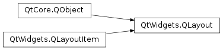
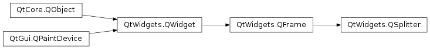

# 笔记

<!-- TOC -->

- [笔记](#笔记)
    - [补充](#补充)
        - [QLayout](#qlayout)
        - [注意](#注意)
    - [PyQt5中的布局管理](#pyqt5中的布局管理)
        - [绝对布局](#绝对布局)
        - [QBoxLayout 框布局](#qboxlayout-框布局)
        - [QGridLayout 网格布局](#qgridlayout-网格布局)
        - [QFormLayout 表单布局](#qformlayout-表单布局)
    - [QSplitter](#qsplitter)
        - [QSplitter常用方法](#qsplitter常用方法)

<!-- /TOC -->

## 补充

### QLayout

所有布局的基类`PyQt5.QtWidgets.QLayout`

可以用于设置的方法

setAlignment (l, alignment)  
setAlignment (w, alignment)  
setContentsMargins (left, top, right, bottom)  
setContentsMargins (margins)  
setEnabled (arg__1)  
setMargin (arg__1)  
setMenuBar (w)  
setSizeConstraint (arg__1)  
setSpacing (arg__1)  

### 注意

对于布局, 仅可向基础控件QWidget上添加布局对象, 如主窗口控件QMainWindow上添加布局对象, 将不会显示.

## PyQt5中的布局管理

PyQt5的界面进行布局管理主要有两种方法, 1. 绝对位置, 2. 布局类.

PyQt5中有四种布局方式: 水平布局, 垂直布局, 网格布局, 表单布局; 以及两种布局方法, addLayout()和addWidget(). 其中addLayout()用于在布局中插入子布局, addWidget()用于在布局中插入控件.

水平布局类, `PyQt5.QtWidgets.QHBoxLayout`, 将添加的控件在水平方向上依次排序  
垂直布局类, `PyQt5.QtWidgets.QVBoxLayout`, 将添加的控件在垂直方向上依次排序  
网格布局类, `PyQt5.QtWidgets.QGridLayout`, 将添加的控件以网格的形式填入  
表单布局类, `PyQt5.QtWidgets.QFormLayout`, 将添加的控件以两列的形式排列  

布局类派生关系

### 绝对布局

绝对位置布局(Absolute Positioning Layout)主要通过在窗口程序中指定每一个控件的显示坐标和大小来实现的. 最开始的坐标在左上角(0, 0)的位置, 以(0, 0)为原点定位窗口某一点的具体位置. 显示坐标的表示方法是(x, y), x是横坐标, 从左到右变化; y是纵坐标, 从上到下变化. 在绝对位置布局中, 窗口中的控件采用绝对位置进行布局.

通过控件的move(x:int, y:int)或使用控件的setGeometry(const QRect &), setGeometry(int x, int y, int w, int h)方法设置其坐标

优点  
- 可以直接定位每个控件的位置

缺点  
- 如果改变一个窗口的大小, 窗口中控件的大小和位置不会随之改变
- 所生成的窗口在不同的操作系统下看起来可能不一样
- 在程序中改变字体时可能会破坏布局
- 如果修改布局, 比如新增一个控件, 就必须全部重新布局

### QBoxLayout 框布局

采用QBoxLayout类可以在水平和垂直方向上排列控件

#### QHBoxLayout 水平布局

QHBoxLayout类, 按照从左到右的顺序来添加控件.

**QHBoxLayout常用方法**

addLayout(QLayout, stretch=0) : 在窗口的右边添加布局, 使用stretch(伸缩量)进行伸缩, 伸缩量默认为0  
addWidget(QWidget, stretch, Qt.Alignment alignment) : 在布局中添加控件
  + stretch(伸缩量), 只适用于QBoxLayout, 控件和窗口会随着伸缩量的变大而增加
  + alignment, 指定对齐的方式

addSpacing(int) : 设置各控件的上下间距, 通过该方法可以增加额外的空间

在创建QHBoxLayout布局时用到的对齐方式

PyQt5.QtCore.Qt.AlignLeft : 水平方向居左对齐  
PyQt5.QtCore.Qt.AlignRight : 水平方向居右对齐  
PyQt5.QtCore.Qt.AlignCenter : 水平方向居中对齐  
PyQt5.QtCore.Qt.AlignJustify : 水平方向两端对齐  
PyQt5.QtCore.Qt.AlignTop : 垂直方向靠上对齐  
PyQt5.QtCore.Qt.AlignBottom : 垂直方向靠下对齐  
PyQt5.QtCore.Qt.AlignVCenter : 垂直方向居中对齐  

    h_layout = QHBoxLayout()
    h_layout.addWidget(QPushButton("#1"), 0, Qt.AlignTop)
    h_layout.addWidget(QPushButton("#2"), 0, QtAlignLeft | QtAlignTop)
    h_layout.addWidget(QPushButton("#3"))

#### QVBoxLayout 垂直布局

QVBoxLayout类, 按照从上到下的顺序添加控件.

**QVBoxLayout常用方法**

addLayout(QLayout) : 在窗口的右边添加布局  
addWidget(QWidget) : 在布局中添加控件  
addStretch(int stretch=0) : 在布局管理器中增加一个可伸缩的控件(QSpaceItem), 0为最小值, 并且将stretch作为伸缩添加到布局末尾. stretch参数表示均分的比例, 默认值为0  

    v_layout = QVBoxLayout()
    v_layout.addWidget(QPushButton("#1"))
    v_layout.addStretch(1)

### QGridLayout 网格布局

QGridLayout类，　是将窗口分隔成行和列的网格来进行排列. 通常可以使用函数addWidget()将被管理的控件widget添加到窗口中, 或者使用addLayout()函数将布局layout添加到窗口中. 也可以通过addWidget()函数对所添加的控件设置行数和列数的跨越, 最后实现网格占据多个窗格.

**QGridLayout常用方法**

addWidget(widget: QWidget, row: int, col: int, alignment=0) : 给网格布局添加控件, 设置指定的行和列. 起始位置(top-left position)的默认值是(0, 0)
  + widget: 所添加的控件
  + row: 控件的行数, 默认从0开始
  + column: 控件的列数, 默认从0开始
  + alignment: 对齐方式

addWidget(widget: QWidget, formRow: int, fromColumn: int, rowSpan: int, columnSpan: int, Qt.Alignment alignment=0) : 添加的控件跨越很多行或者列时, 使用这个函数
  + widget: 所添加的控件
  + fromRow: 控件的起始行数
  + fromColumn: 控件的起始列数
  + rowSpan: 控件跨越的行数
  + columnSpan: 控件跨越的列数
  + alignment: 对齐方式

addSpacint(spacing: int) : 设置控件在水平和垂直方向的间隔

### QFormLayout 表单布局

QFormLayout是label-field式的表单布局. 第1列用于显示信息, 用于提示, 一般叫做label域; 第2列一般用于操作, 叫field域.

**QFormLayout常用方法**

按行添加  
addRow (widget)
addRow (layout)  
addRow (labelText, field)  
addRow (label, field)

按指定的行数插入  
insertRow (row, label, field)
insertRow (row, labelText, field)
insertRow (row, layout)

按指定的行, 布局管理器, 控件移除  
removeRow (row)
removeRow (layout)
removeRow (widget)

setLabelAlignment (alignment) : 设置label域的对齐方式  
setFormAlignment (alignment) : 设置field域的对齐方式  
setHorizontalSpacing (spacing) : 设置控件在水平方向的间隔  
setVerticalSpacing (spacing) : 设置控件在垂直方向的间隔  

## QSplitter

`PyQt5.QtWidgets.QSplitter`

除了Layout布局管理, PyQt还提供了一个特殊的布局管理器QSplitter, 其可以动态地拖动子控件之间的边界, 算是一个动态的布局管理器. QSplitter允许通过拖动子控件的边界来控制子控件的大小, 并提供了一个处理拖曳子控件的控制器.

在QSplitter对象中, 各子控件默认是横向布局的, 可以使用Qt.Vertical进行垂直布局.

### QSplitter常用方法

addWidget() : 将小控件添加到QSplitter管理器的布局中  
indexOf() : 返回小控件在QSplitter管理器中的索引  
insertWidget() : 根据指定的索引讲一个控件插入到QSplitter管理器中  
setOrientation() : 设置布局方向  
  + PyQt5.QtCore.Qt.Horizontal, 水平方向(默认)
  + PyQt5.QtCore.Qt.Vertical, 垂直方向

setSizes() : 设置控件的初始化大小  
count() : 返回小控件在QSplitter管理器中的数量  

    topleft = QFrame()
    topleft.setFrameShape(QFrame.StyledPanel)
    bottom = QFrame()
    bottom.setFrameShape(QFrame.StyledPanel)

    # 水平的
    splitter_1 = QSplitter(Qt.Horizontal)
    splitter_1.addWidget(topleft)   # 第一个添加
    splitter_1.addWidget(QTextEdit())   # 第二个添加
    splitter_1.setSizes([100, 200])

    # 垂直的
    splitter_2 = QSplitter(Qt.Vertical)
    splitter_2.addWidget(splitter_1)   # 将水平的也添加到里面
    splitter_2.addWidget(bottom)

    h_layout = QHBoxLayout()
    h_layout.addWidget(splitter_2)
    self.setLayout(h_layout)