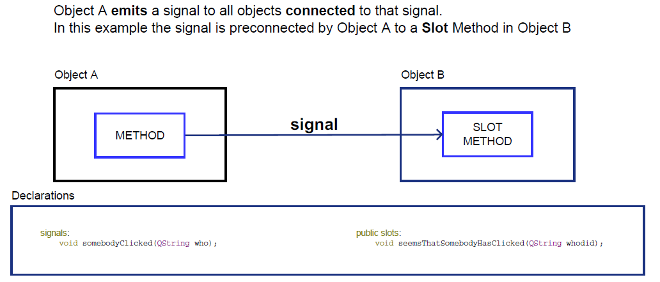

# 笔记

<!-- TOC -->

- [笔记](#笔记)
    - [信号与槽](#信号与槽)
        - [定义信号](#定义信号)
        - [操作信号](#操作信号)
    - [信号与槽入门级应用](#信号与槽入门级应用)
        - [内置信号与槽的使用](#内置信号与槽的使用)
        - [自定义信号与槽的使用](#自定义信号与槽的使用)
    - [信号与槽进阶](#信号与槽进阶)
        - [自定义信号与槽](#自定义信号与槽)
        - [使用自定义参数](#使用自定义参数)
        - [装饰器信号与槽](#装饰器信号与槽)
        - [信号与槽的断开和连接](#信号与槽的断开和连接)
        - [多线程中信号与槽的使用](#多线程中信号与槽的使用)

<!-- /TOC -->

[官方文档](https://www.riverbankcomputing.com/static/Docs/PyQt5/signals_slots.html)

## 信号与槽

信号(signal)和槽(slot)是Qt中的核心机制, 也是在PyQt编程中对象之间进行通信的机制. 在Qt中, 每一个QObject对象和PyQt中所有继承自QWidget的控件(这些都是QObject的子对象)都支持信号与槽机制. 当信号发出时, 连接的槽函数将会自动执行. 在PyQt5中信号与槽通过object.signal.connect()方法连接. 

PyQt的窗口控件类中有很多内置信号, 开发者也可以添加自定义信号. 信号与槽具有如下特点:
+ 一个信号可以连接多个槽
+ 一个信号可以连接另一个信号
+ 信号参数可以是任何Python类型
+ 一个槽可以监听多个信号
+ 信号与槽的连接方式可以是同步连接, 也可以是异步连接
+ 信号与槽的连接可以跨线程
+ 信号可能会断开

在GUI编程中, 当改变一个控件的状态时(如单击了按钮), 通常需要通知另一个控件, 也就是实现了对象之间的通信. 在早期的GUI编程中使用的是回调机制, 在Qt中则使用一种新机制--信号与槽. 在编写一个类时, 要线定义该类的信号与槽, 在类中信号与槽进行连接, 实现对象之间的数据传输.

当事件或者状态发生改变时, 就会发出信号. 同时, 信号会触发所有与这个事件(信号)相关的函数(槽). 信号与槽可以是多对多的关系. 一个信号可以连接多个槽, 一个槽也可以坚挺多个信号.

### 定义信号

`PyQt5.QtCore.pyqtSignal`

PyQt5.QtCore.pyqtSignal(types[, name[, revision=0[, arguments=[]]]]) : 用于创建一个或多个重载的为绑定的信号作为类的参数
+ types – 定义信号的C++签名. 每一个类型可能是一个Python类型对象或一个用字符串表示的C++类型. 或者每一个可能是一系列类型参数. 在这种情况下每一个序列对应一个不同重载信号的签名. 第一个重载的将会是默认的.

+ name – 信号的名字. 如果省略, 类的名字将会被使用. 该参数只能通过关键字参数给予.

+ revision – 导出到QML的信号的修订. 该参数只能通过关键字参数给予.

+ arguments – 导出到QML的信号的参数的名字序列. 该参数只能通过关键字参数给予. 

返回  
一个未绑定的信号

PyQt的内置信号是自动定义的. 使用PyQt5.QtCore.pyqtSignal()函数可以为QObject创建一个信号, 使用pyqtSignal()函数可以把信号定义为类的属性.

**1.为QObject对象创建信号**

使用pyqtSignal()函数创建一个或多个重载的未绑定的信号作为类的属性, 信号只能在QObject的子类中定义.

信号必须在类创建时定义, 不能在类创建后作为类的属性动态添加进来. types参数表示定义信号时参数的类型, name参数表示信号名字, 该项缺省时使用类的属性名字.

使用pyqtSignal()函数创建信号时, 信号可以传递多个参数, 并指定信号传递参数的类型, 参数类型是标准的Python类型(字符串, 日期, 布尔类型, 数字, 列表, 元祖, 字典).

    from PyQt5.QtCore import pyqtSignal
    from PyQt5.QtWidgets import QMainWindow

    class  MainWin(QMainWindow):
        my_signal = pyqtSignal(dict)   # 可以使用发送emit()时, 可以给一个dict

### 操作信号

使用`connect()`函数可以把信号绑定到槽函数上. 

connect(slot[, type=PyQt5.QtCore.Qt.AutoConnection[, no_receiver_check=False]]) -> PyQt5.QtCore.QMetaObject.Connection : 连接信号到槽. 连接失败会造成异常.
+ slot – 连接到的槽函数, 可以是一个可调用的Python对象, 也可以是其他绑定信号.

+ type – 进行连接的类型

+ no_receiver_check – 禁止检查基础C++接收器实例是否仍然存在, 并始终传递信号.

返回  
一个可以被传递给disconnect()的连接对象. 这是唯一用于断开一个连接和lambda函数的方式.

使用`disconnect()`函数可以解除信号与槽函数的绑定. 

disconnect([slot]) : 从一个信号断开其与一个或多个槽的连接. 如果该信号没有连接到该槽, 或者该信号已经没有连接的对象了, 就会触发一个异常.
+ slot – 可选的槽参数用于断开连接, 要么connect()返回的一个连接对象, 或一个Python可调用对象, 或其他的绑定信号. 如果不给定指定的槽, 那么所有与该信号连接的槽都会断开.

使用`emit()`函数可以发射信号.

emit(*args) : 发射一个信号

+ args – 可选的参数序列用于传递给任何连接到的槽

## 信号与槽入门级应用

信号与槽有三种使用方式
1. 内置信号与槽的使用
2. 自定义信号与槽的使用
3. 装饰器的信号与槽的使用

### 内置信号与槽的使用

所谓内置信号与槽的使用, 是指在发射信号时, 使用窗口控件的函数, 而不是自定义的函数. 在信号与槽中, 可以通过QObject.signal.connect将一个QObject的信号连接到另一个QObject的槽函数.

    import sys
    from PyQt5.QtWidgets import QApplication, QWidget, QPushButton, QMessageBox

    def show_msg(widget):
        QMessageBox.information(widget, "消息提示框", "弹出测试信息.")

    app = QApplication(sys.argv)
    widget = QWidget()
    btn = QPushButton("点击测试按钮", widget)
    btn.clicked.connect(lambda : show_msg(widget))   # 连接clicked到槽函数
    widget.show()
    sys.exit(app.exec())

### 自定义信号与槽的使用

所谓自定义信号与槽的使用, 是指在发射信号时, 不使用窗口控件的函数, 而是使用自定以的函数(简单的说, 就是使用pyqtSignal类实例发射信号). 之所以要使用自定义的信号与槽, 是因为通过内置函数发射信号可能不能满足需要. 首先内置函数只包含一些常用的信号, 有些信号的发射找不到对应的内置函数; 其次, 只有在特定情况下(如按钮的点击事件)才能发射这种信号; 最后, 内置函数传递的参数是特定的, 不可以自定义. 

在PyQt5编程中, 自定义信号与槽的使用范围很灵活, 比如因为业务需求, 在程序中的某个地方需要发射一个信号, 传递多种数据类型(实际上就是传递参数), 然后在槽函数中接收传递过来的数据, 这样就可以非常灵活地实现一些业务逻辑.

一般自定义信号是作为类的一个属性存在的

    from PyQt5.QtCore import QObject, pyqtSignal

    # 信号对象
    class QTypeSignal(QObject):
        # 定义一个信号
        send_object = pyqtSignal(object)   # send_object = pyqtSignal(object1, object2) 可以设置多个

        def __init__(self):
            super(QTypeSignal, self).__init__()

        def run(self):
            # 发射信号
            self.send_msg.emit(object)
        
    # 槽对象
    class QTypeSlot(QObject):
        def __init__(self):
            super(QTypeSlot, self).__init__()

        # 槽对象中的槽函数
        def get(self, object):
            pass

    signal_send = QTypeSignal()
    slot_recive = QTypeSlot()

    # 1. 自定义的信号绑定槽
    signal_send.send_object.connect(slot_recive.get)

    # 2. 信号与槽断开
    signal_send.send_object.disconnect(slot_recive.get)   # 指定断开的槽, 不指定断开所有

## 信号与槽进阶

以自己喜欢的方式定义信号与槽函数, 并传递参数.
1. 定义信号
2. 定义槽函数
3. 连接信号与槽函数
4. 发射信号

### 自定义信号与槽

**1.定义信号**

通过类成员变量定义信号对象

    class SignalForm(QWidget):
        # 无参数的信号
        signal_NoParameters = pyqtSignal()
        # 带一个参数(这里是int)的信号
        signal_OneParameter = pyqtSignal(int)
        # 带一个参数(这里可以是int或str)的重载版本的信号
        signal_OneParameter_Overload = pyqtSignal([int], [str])
        # 带两个参数(这里是int, str)的信号
        signal_TwoParameters = pyqtSignal(int, str)
        # 带两个参数(这里可以是[int, int]或[int, str])的重载版本的信号
        signal_TwoParameters_Overload = pyqtSignal([int, int], [int, str])

**2.定义槽函数**

定义一个槽函数, 它有多个不同的输入参数

    class SlotForm(QWidget):
        def setValue_NoParameters(self):
            """无参数的槽函数"""
            pass

        def setValue_OneParameter(self, intVal):
            """带一个参数(这里是int)的槽函数"""
            pass

        def setValue_TwoParameters(self, intVal1, intVal2):
            """带两个参数(这里是int, int)的槽函数"""
            pass

        def setValue_TwoParameters_String(self, intVal, strVal):
            """带两个参数(这里是int, str)的槽函数"""
            pass

**3.连接信号与槽函数**

通过connect方法连接信号与槽函数或者可调用对象.

    app = QApplication(sys.argv)
    signal_widget = SignalForm()
    slot_widget = SlotForm()
    
    # 连接无参数的信号
    signal_widget.signal_NoParameters.connect(slot_widget.setValue_NoParameters)

    # 连接带一个int参数的信号
    signal_widget.signal_OneParameter.connect(slot_widget.setValue_OneParameter)

    # 连接带一个int参数, 经过重载的信号
    signal_widget.signal_OneParameter_Overload[int].connect(slot_widget.setValue_OneParameter)

    # 连接带一个str参数, 经过重载的信号
    signal_widget.signal_OneParameter_Overload[str].connect(slot_widget.setValue_OneParameter)

    # 连接一个信号, 他有两个int, int参数
    signal_widget.signal_TwoParameters.connect(slot_widget.setValue_TwoParameters)

    # 连接两个(int, int)参数, 经过重载的信号
    signal_widget.signal_TwoParameters_Overload[int, int].connect(slot_widget.setValue_TwoParameters)

    # 连接两个(int, str)参数, 经过重载的信号
    signal_widget.signal_TwoParameters_Overload[int, str].connect(slot_widget.setValue_TwoParameters)

**4.发射信号**

通过emit方法发射信号

    class SignalForm(QWidget):

        def mousePressEvent(self, event):
            """重载鼠标单击事件"""
            event.accept()

            # 发射无参数的信号
            self.signal_NoParameters.emit()
            # 发射带一个参数(这里是int)的信号
            self.signal_OneParameter.emit(1)
            # 发射带一个参数(这里是int)的重载版本的信号
            self.signal_OneParameter_Overload.emit(1)
            # 发射带一个参数(这里是str)的重载版本的信号
            self.signal_OneParameter_Overload.emit("abc")
            # 发射带两个参数(这里是int, str)的信号
            self.signal_TwoParameters.emit(1, "abc")
            # 发射带两个参数(这里是int, int)的重载版本信号
            self.signal_TwoParameters_Overload.emit(1, 2)
            # 发射带两个参数(这里是int, str)的重载版本的信号
            self.signal_TwoParameters_Overload.emit(1, "abc")

### 使用自定义参数

如果要向一个槽中传递自定义的参数, 可以使用lambda表达式用以定义向槽中传递什么对象, 这样条理清晰且灵活

    btn.clicked.connect( lambda: do_thing(arg1, arg2) )

也可以使用functools.partial函数, 将要调用的槽函数与参数打包

    btn.clicked.connect( functools.partial(do_thing(arg1, arg2)) )

### 装饰器信号与槽

通过装饰器的方法来定义信号和槽函数

    @PyQt5.QtCore.pyqtSlot(参数)
    def on_发送者对象名称_发射信号名称(self, 参数):
        pass

这种方法有效的前提是下面的函数已经执行

    QMetaObject.connectSlotByName(QObject)

在上面代码中, "发送这名称对象"就是使用setObjectName函数设置的名称, 因此自定义槽函数的命名规则也可以看成: on + 使用setObjectName设置的名称 + 信号名称.

    import sys

    from PyQt5.QtCore import QMetaObject, pyqtSlot
    from PyQt5.QtWidgets import QApplication, QWidget, QHBoxLayout, QPushButton

    class WinForm(QWidget):
        """主窗口"""
        def __init__(self, parent=None):
            super().__init__(parent)

            self.btnOK = QPushButton("OK", self)

            self.btnOK.setObjectName("btnOK") # 使用setObjectName设置对象名称

            QMetaObject.connectSlotsByName(self)   # 更具信号名称自动连接到槽函数

            h_layout = QHBoxLayout()
            h_layout.addWidget(self.btnOK)
            self.setLayout(h_layout)

        @pyqtSlot()
        def on_btnOK_clicked(self):
            print("单击了OK按钮")

QMetaObject.connectSlotsByName(QObject), 事实上, 它是根据信号名称自动连接到槽函数的核心代码. 使用pyuic5命令生成的代码中会有这么一行代码. 这行代码用来将QObject中的子对象的某些信号按照其objectName连接到相应的槽函数.

其实, 在QMetaObject.connectSlotsByName(self)运行后

    @PyQt5.QtCore.pyqtSlot()
    def on_btnOK_clicked(self):
        pass

会被识别为如下的代码

    def __init__(self, parent=None):
        self.btnOK.clicked.connect(self.btnOK_clicked)

    def btnOK_clicked(self):
        pass

### 信号与槽的断开和连接

使用connect()连接, disconnect()断开连接

    btn.clicked.connect(do_thing)

    # 指定特定的方法从绑定的信号上断开
    btn.clicked.disconnect(do_thing)
    # 全部断开
    btn.clicked.disconnect()

### 多线程中信号与槽的使用

最简单的多线程使用方法是利用QThread函数. 一般是在QThread的子类中自定义一个信号作为该子类的类属性, 这个信号可能会带着返回值, 该值就可用于传递给槽函数. 当达成目的后, 就发出这个信号.

    class SignalThread(QThread):
        """线程子类"""
        signal_back = pyqtsignal(dict)

        def __init__(self, parent=None):
            super(SignalThread, self).__init__(parent=parent)

        def run(self):
            """重载run"""
            self.signal_back.emit({"OK": True})

    class WinForm(QWidget):
        """主窗口"""
        def __init__(self, parent=None):
            super(WinForm, self).__init__(parent=parent)

            btn = QPushButton("OK", self)
            btn.clicked.connect(self.create_th)

            h_layout = QHBoxLayout()
            h_layout.addWidget(btn)
            self.setLayout(h_layout)
        
        def create_th(self):
            th = SignalThread()
            th.signnal_back.connect(self.handle_th)
            th.start()

        def handle_th(self, dit):
            pass

有时在开发程序时, 经常会执行一些耗时的操作, 这样就会导致界面卡顿, 这也是多线程的应用范围之一, 为了解决这个问题, 可能需要创建多线程, 使用主线程更新界面, 使用子线程实时处理数据, 最后将结果显示到界面上.