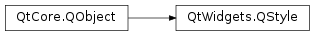

# 笔记

<!-- TOC -->

- [笔记](#笔记)
    - [补充](#补充)
        - [QStyle](#qstyle)
        - [QStyleOption](#qstyleoption)
        - [QStyleFactory](#qstylefactory)
    - [窗口风格](#窗口风格)
        - [设置窗口风格](#设置窗口风格)
        - [设置窗口样式](#设置窗口样式)
        - [使用自定义的无边框窗口](#使用自定义的无边框窗口)

<!-- /TOC -->

使用PyQt实现的窗口样式, 默认使用的就是当前操作系统的原生窗口样式. 在不同操作系统下原生窗口的显示效果是不一样的.

## 补充

### QStyle

`PyQt5.QtCore.QStyle`

Qt包含了一系列QStyle的子类, 模拟了不同操作平台的样式(比如QWindowsStyle, QMacStyle). 默认的这些在Qt GUI模块中建立. 样式也可以通过插件的形式提供.

Qt的内置控件使用QStyle到操作平台进行几乎所有的绘制, 保证了他们看起来像系统本地的样式一样.

**设置一个样式**

整个应用的样式可以使用setStyle()方法进行设置. 也可以通过应用的用户使用-style命令行选项.

    python myapplication.py -style windows

如果没有指定样式, Qt将会选择最接近用户操作平台桌面环境的样式.

独立的控件也可以单独的设置样式, 通过使用setStyle()方法.

**定义自己的样式**

如果要定义自己的风格, 可以使用QStyle方法来完善控件绘制的部分, 比如  drawItemText() , drawItemPixmap() , drawPrimitive() , drawControl() , and drawComplexControl() 

大多数QStyle绘画方法接收4个参数

+ 一个枚举值指定在那个图形元素上回话啊
+ QStyleOption指定如何和在哪去给予那个元素
+ QPainter用于绘画的对象
+ QWidget被绘画的对象, 可选

如下, 绘画一个矩形在一个控件上

    def paintEvent(self, event):
        painter = QPainter(self)

        option = QStyleOptionFocusRect()
        option.initFrom(self)
        option.backgroundColor = palette().color(QPalette.Background)

        style().drawPrimitive(QStyle.PE_FrameFocusRect, option, painter, self)

QStyle从QStyleOption中获得所有产生图形元素的信息. 控件作为最后一个参数传入, 如果样式需要它完成指定的效果(比如在macOS上的动态默认按钮), 但是这是非强制性的. 事实上, 可以使用QStyle在任何可绘画的设备上绘画, 不仅仅是控件, 通过正确的设置QPainter.

QStyleOption对绘画不同的图形元素类型有不同的子类. 比如, PE_FrameFocusRect需要一个QStyleOptionFocusRect参数.

为了确保绘画操作运行够快, QStyleOption和其子类有共用的数据成员.

为了方便, Qt提供了QStylePainter类, 用以组合一个QStyle, QPainter和QWidget.

    painter = QStylePainter(self)
    ...
    painter.drawPrimitive(QStyle.PE_FrameFocusRect, option)

等价于

    painter = QPainter(self)
    ...
    style().drawPrimitive(QStyle.PE_FrameFocusRect, option, painter, self)

**创建一个自定义的样式**

一般有两种方法来创建一个自定义的样式. 在静态方法中, 可以选择已经存在的QStyle, 继承它, 并重新实现它的虚函数以提供自定义的行为; 或者可以槽从头创建一个完整的QStyle类. 在动态的方法中, 可以在运行时动态的改变应用的样式. 下面主要介绍的是静态的方法, 动态的方法和QProxyStyle相关.

静态方法的第一步获取Qt中提供的一个样式用以创建自己的样式. 如何选择QStyle类取决于和自己想要样式的相识度, 选像的, 这样改的少. 通常会使用的是QCommonStyle(不是QStyle). 这是因为Qt需要其样式是属于QCommonStyle.

取决与哪一个基础部分的样式你想改变, 必须重新实现那些用于绘画的接口部分. 为了显示这个, 下面的例子将会通过QWindowsStyle改变spinbox箭头绘画. 箭头是通过drawPrimitive()绘制的原始元素, 所以需要重新实现这个方法. 需要在类声明之后.

    class CustomStyle(QProxyStyle):
        ...

        def drawPrimitive(PrimitiveElement element, const QStyleOption *option, QPainter *painter, const QWidget *widget) const;
            # element : PrimitiveElement
            # option  : QStyleOption
            # painter : QPainter
            # widget  : QWidget
            ...

为了画出上和下的箭头, QSpinBox使用PE_IndicatorSpinUp和PE_IndicatorSpinDown原始元素. 这里是如何重写drawPrimitive()方法来不同地绘制它们.

    void CustomStyle::drawPrimitive(PrimitiveElement element, const QStyleOption *option, QPainter *painter, const QWidget *widget) const
    {
        if (element == PE_IndicatorSpinUp || element == PE_IndicatorSpinDown) {
            QPolygon points(3);
            int x = option->rect.x();
            int y = option->rect.y();
            int w = option->rect.width() / 2;
            int h = option->rect.height() / 2;
            x += (option->rect.width() - w) / 2;
            y += (option->rect.height() - h) / 2;

            if (element == PE_IndicatorSpinUp) {
                points[0] = QPoint(x, y + h);
                points[1] = QPoint(x + w, y + h);
                points[2] = QPoint(x + w / 2, y);
            } else { // PE_SpinBoxDown
                points[0] = QPoint(x, y);
                points[1] = QPoint(x + w, y);
                points[2] = QPoint(x + w / 2, y + h);
            }

            if (option->state & State_Enabled) {
                painter->setPen(option->palette.mid().color());
                painter->setBrush(option->palette.buttonText());
            } else {
                painter->setPen(option->palette.buttonText().color());
                painter->setBrush(option->palette.mid());
            }
            painter->drawPolygon(points);
        } else {
        QProxyStyle::drawPrimitive(element, option, painter, widget);
        }
    }

知道了不使用widget参数, 除非在QWindowStyle::drawPrimitive()上传递它. 顺带的, 关于绘画什么和怎样去画, 是通过QStyleOption对象来指定的. 所以这里不需要在去询问控件.

如果需要使用widget参数来获得其他信息, 确保其不为0并且在使用前它的类型正确.

    const QSpinBox *spinBox = qobject_cast<const QSpinBox *>(widget);
    if (spinBox) {
    ...
    }

当实现一个自定义的样式, 不能假定控件是一个QSpinBox, 因为枚举值是被PE_IndicatorSpinUp或PE_IndicatorSpinDown调用的.

警告, 现在版本的Qt style sheet 是不被自定义的QStyle子类支持的. 

**使用一个自定义样式**

在Qt应用中, 有几种使用自定义样式的方式. 最简单的方式是在创建QApplication对象之前传递自定义的样式到setStyle()静态方法.

    #include <QtWidgets>

    #include "customstyle.h"

    int main(int argc, char *argv[])
    {
        QApplication::setStyle(new CustomStyle);
        QApplication app(argc, argv);
        QSpinBox spinBox;
        spinBox.show();
        return app.exec();
    }

能在任何时候调用setStyle(), 但是通过在构建函数之前调用它, 要确保用户的优先级, 设置使用-style命令行选项, 是更加优先的.

如果想要将自己定义的样式应用于别的应用. 可以使用Qt Plugin(Qt 插件)系统来创建样式插件. 创建的样式通过Qt自身被以共享对象的形式在运行时载入. 

编译自己的插件, 并将其放入Qt的plugins/styles目录. 现在就有了一个可插拔的样式可以被Qt自动载入. 在存在的应用上使用新的样式, 可以简单地用下面的命令行运行

    python myapplication.py -style custom

**从右到左的桌面环境**

从右到左写的语言(如阿拉伯语, 西伯利亚语)通常也镜像整个控件的布局, 并需要从屏幕右上角为起点进行设计.

如果创造了一个自定义的样式, 需要特别注意当进行绘画非对称的元素的时候, 要保证它们以镜像看起来也是对的. 一个简单的测试方式定义的演示就是运行应用带上-reverse命令行选项或者在自己的主方法中调用setLayoutDirection().

在从右到左的桌面环境上的样式注意事项

+ subControlRect()和subElemnetRect()返回屏幕坐标中的矩形
+ QStyleOption::direction标明在那个目标对象上应该被画入
+ visualRect(), visualPos()和visualAlignment()对从逻辑的屏幕表现有用
+ alignedRect()将会返回逻辑矩形对齐当前的目标

**在项目视图中的的样式**

视图中的项目的绘制被一个代理完成. Qt的默认代理, QStyleditemDelegate, 也被用作计算绑定的项目的矩形, 它们的子元素, 用于QStyledItemDelegate支持的多种多样的data roles.

当QStyledItemDelegate绘制它的项目, 其绘制CE_ItemViewItem, 并通过CT_ItemViewItem计算它们的尺寸. 注意同样其使用SE_ItemViewItemText来这是编辑器的尺寸. 当实现一个样式来自定义项目视图的绘制, 需要检查QCommonStyle的实现(和任何其他来自样式继承的子类). 这样, 可以找出哪一个和怎样其他的样式元素被绘制, 可以在这之后重新实现不同元素的绘制.

    switch (element) {
        case (PE_PanelItemViewItem): {
            painter->save();

            QPoint topLeft = option->rect.topLeft();
            QPoint bottomRight = option->rect.topRight();
            QLinearGradient backgroundGradient(topLeft, bottomRight);
            backgroundGradient.setColorAt(0.0, QColor(Qt::yellow).lighter(190));
            backgroundGradient.setColorAt(1.0, Qt::white);
            painter->fillRect(option->rect, QBrush(backgroundGradient));

            painter->restore();
        break;
        }
        default:
            QProxyStyle::drawPrimitive(element, option, painter, widget);
    }

原始的元素PE_Pane1ItemViewItem负责为项目的背景进行绘制, 其由QCommonStyle的CE_ItemViewItem的实现调用.

为了添加对新的类型和新的项目data role, 创建一个自定义的代理是有必要的. 但是如果仅仅需要支持数据类型由默认代理的实现, 一个自定义的样式是不需要一个随同的代理的. 

项目视图头的绘制也是有样式完成的, 项目头的尺寸的控制和行与列的大小.

### QStyleOption

`PyQt5.QtWidgets.QStyleOption`

### QStyleFactory

`PyQt5.QtWidgets.QStyleFactory`

**静态方法**

create (arg__1)  
keys ()  

QStyle类是一个抽象基类, 封装了一个GUI的样式. QStyleFactory.create()方法创建一个QStyle对象, 一个可用键识别的风格. 样式类型可以来自内置的也可以来自动态的从样式插件中载入(来自 QStylePlugin)

可用的键可用keys()方法获得. 典型的, 他们包含"windows"和"fusion". 根据依赖, 可能会有"windowsvista", "macintosh"可用. 注意, 键不区分大小写.

## 窗口风格

### 设置窗口风格

为每个Widget都设置风格

    setStyle(QStyle style)

获得当前平台支持的原有的QStyle样式

    QStyleFactory.keys()

对QApplication设置QStyle样式

    QApplication.setStyle(QStyleFactory.create("WindowsXP"))

如果其他Widget没有设置QStyle, 则默认使用QApplication设置的QStyle

使用

    class WinForm(QWidget):
        def __init__(self, parent=None):
        ......
            self.label_style = QLabel("设置 Style:")
            self.combobox_style = QComboBox()

            # 从QStyleFactory中增加多个显示样式
            self.combobox_style.addItems(QStyleFactory.keys())

            # 选择当前窗口风格
            index = self.combobox_style.findText(QApplication.style().objectName(), Qt.MatchFixedString)

            # 设置当前窗口风格
            self.combobox_style.setCurrentIndex(index)
            
            # 通过combobox控件选择窗口风格
            self.combobox_style.activated[str].connect(self.handle_style_change)

            ......
        
    def handle_style_change(self, style):
        """让整个应用都应用这个风格, 参数style是可用的风格名"""
        # QApplication.setStyle(style) QApplication的setStyle可以接受str表明的风格名, 也可以接受QStyle
        qstyle = QStyleFactory.create(style)
        QApplication.setStyle(qstyle)

### 设置窗口样式

PyQt使用setWindowFlags(self, Union[Qt.WindowFlags, Qt.WindowType])函数设置窗口样式, 具体参数如下

**顶层窗口外观标志**

+ PyQt5.QtCore.Qt.MSWindowsFixedSizeDialogHint, 窗口无法调整大小
+ PyQt5.QtCore.Qt.FramelessWindowHint, 窗口无边框
+ PyQt5.QtCore.Qt.CustomizeWindowHint, 有边框但无标题栏和按钮, 不能移动和拖动
+ PyQt5.QtCore.Qt.WindowTitleHint, 添加标题栏和一个关闭按钮
+ PyQt5.QtCore.Qt.WindowSystemMenuHint, 添加系统目录和一个关闭按钮
+ PyQt5.QtCore.Qt.WindowMaximizeButtonHint, 激活最大化和关闭按钮, 禁用最小化按钮
+ PyQt5.QtCore.Qt.WindowMinimizeButtonHint, 激活最小化和关闭按钮, 禁用最大化按钮
+ PyQt5.QtCore.Qt.WindowMinMaxButtonHint, 激活最小化, 最大化和关闭按钮
+ PyQt5.QtCore.Qt.WindowCloseButtonHint, 添加一个关闭按钮
+ PyQt5.QtCore.Qt.WindowContextHelpButtonHint, 添加问号和关闭按钮, 像对话框一样
+ PyQt5.QtCore.Qt.WindowStaysOnTopHint, 窗口始终处于顶层位置
+ PyQt5.QtCore.Qt.WindowStaysOnBottomHint, 窗口始终处于底层位置

**基本窗口类型**

+ PyQ5.QtCore.Qt.Widget, 默认窗口, 有最小化, 最大化, 关闭按钮
+ PyQ5.QtCore.Qt.Window, 普通窗口, 有最小化, 最大化, 关闭按钮
+ PyQ5.QtCore.Qt.Dialog, 对话窗口, 有问好和关闭按钮
+ PyQ5.QtCore.Qt.Popup, 弹出窗口, 窗口无边框
+ PyQ5.QtCore.Qt.ToolTip, 提示窗口, 窗口无边框, 无任务栏
+ PyQ5.QtCore.Qt.SplashScreen, 闪屏, 窗口无边框, 无任务栏
+ PyQ5.QtCore.Qt.SubWindow, 子窗口, 窗口无按钮, 但有标题

使用

    class MainWin(QMainWindow):
        """主窗口"""
        def __init__(self, parent=None):
            super().__init__(parent=parent)
            self.setWindowTitle("设置窗口样式")
            self.resize(200, 100)

            # 设置无边框窗口样式
            self.setWindowFlags(Qt.WindowSystemMenuHint | Qt.WindowCloseButtonHint)

### 使用自定义的无边框窗口

下面将自定义一个无边框窗口, 占用100%用户屏幕

**1.设置窗口标志, 实现无边框效果**

    # 设置窗口标志(无边框)
    self.setWindowFlags(QtCore.Qt.FramelessWindowHint)

**2.覆盖实现最大化函数**

首先应该得到屏幕可显示尺寸, 需要用到QDesktopWidget类的availableGeometry()函数

    # 得到桌面控件, QDesktopWidget
    desktop = QApplication.desktop()
    # 得到屏幕可显示的尺寸, QRect
    qrect = desktop.availableGeometry()

然后, 设置窗口尺寸为屏幕可显示尺寸并显示

    # 设置窗口尺寸
    self.setGeometry(qrect)
    # 显示窗口
    self.show()
