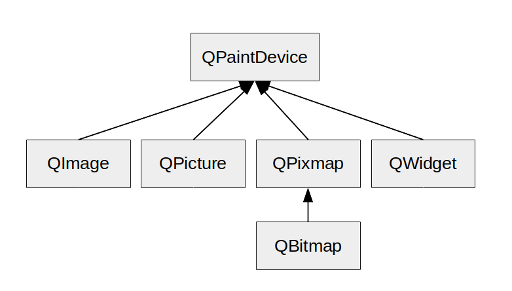

# 笔记

<!-- TOC -->

- [笔记](#笔记)
    - [补充](#补充)
        - [QPaintDevice](#qpaintdevice)
    - [绘图](#绘图)
        - [图像类](#图像类)

<!-- /TOC -->

## 补充

### QPaintDevice

`PyQt5.QtGui.QPaintDevice` 类, 是一个可被QPainter绘制的对象的基类.

一个可绘制的设备是一个二维控件的抽象, 可以使用QPainter向其进行绘制. 其默认的坐标系统有其自己的原点, 在左上角. X轴向右边延伸, Y轴向下延伸. 单位是1像素

QPaintDevice的绘制能力当前被被QWidget, QImage, QPixmap, QGLPixelBuffer, QPicture和QPrinter子类实现.

为了实施对新后端的支持, 必须从QPaintDevice派生并重新实现paintEngine()虚函数以告诉QPainter在当前设备上哪一个绘制引擎应该被用作绘制. 注意, 其也必须也要创建一个相应的绘制引擎可以在设备上绘制. 比如从QPaintEngine派生和重新实现它的虚拟函数.

警告, Qt要求在创建任何绘制设备之前存在QGuiApplication对象. 绘制设备接触窗口系统资源, 这些资源不会在应用创建前初始化.

QPaintDevice类提供一些方法返回不同额设备指标: depth()方法返回它自己的位深(位平面数). height()方法返回它自己在默认坐标系统的单位的高(比如以像素为单位的QPixmap和QWidget), 然而heightMM()返回以毫米为单位的高. 同样的, with()和withMM()方法返回在默认坐标系统的单位像素和毫米. 另外的, 受保护的metric()方法可以通过指定的想要的PaintDeviceMetric作为参数被用来找回指标信息.

logicalDpiX()和logicalDpiY()方法返回每英寸的点数的水平和垂直的设备的解析度. physicalDpiX()和physicalDpiY()函数同样也返回设备的每英寸的点数, 但是, 注意如果逻辑和物理的解析度有差别, 相关的QPaintEngine必须被用作处理这个映射. 最后, coilorCount()方法返回不同颜色的数提供给绘制设备.

## 绘图

### 图像类

PyQt中常用的图像类有4个, QPixmap, QImage, QPicture, QBitmap

+ QPixmap是专门为绘图而设计的, 在绘制图片时使用
+ QImage提供了一个与硬件无关的图像表示函数, 可以用于图片的像素级访问
+ QPicture是绘图设备类, 它继承自QPainter类. 可以使用QPainter的begin()函数在QPicture上绘图, 使用end()函数结束绘图, 使用QPicture的save()函数将QPainter所使用过的绘图指令保存到文件中
+ QBitmap是一个继承自QPixmap的简单类, 它提供了1bit深度的二值图像的类. QBitmap提供的单色图象, 可以用来制作游标(QCursor)或者笔刷(QBrush) 

图像类的继承关系

