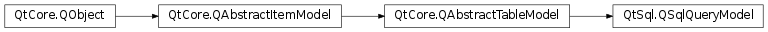

# 笔记

<!-- TOC -->

- [笔记](#笔记)
    - [SQLite](#sqlite)
    - [PyQt对数据库的支持](#pyqt对数据库的支持)
        - [QSqlDatabase 常用方法](#qsqldatabase-常用方法)
    - [执行SQL语句](#执行sql语句)
        - [QSqlQuery常用方法](#qsqlquery常用方法)
    - [数据库模型视图](#数据库模型视图)
        - [QSqlTableModel常用方法](#qsqltablemodel常用方法)
    - [数据库查询视图](#数据库查询视图)
        - [QSqlQueryModel常用方法](#qsqlquerymodel常用方法)
    - [封装分页查询控件](#封装分页查询控件)

<!-- /TOC -->

## SQLite

[主页](https://www.sqlite.org/index.html)

遵守ACID的关系数据库管理系统, 它包含在一个相对小的C程式库中. 与许多其它数据库管理系统不同, SQLite不是一个客户端/服务器结构的数据库引擎, 而是被集成在用户程序中.

SQLite遵守ACID, 实现了大多数SQL标准. 它使用动态的, 弱类型的SQL语法. 它作为嵌入式数据库, 是应用程序, 如网页浏览器, 在本地/客户端存储数据的常见选择. 它可能是最广泛部署的数据库引擎, 因为它正在被一些流行的浏览器, 操作系统, 嵌入式系统所使用. 同时，它有许多程序设计语言的语言绑定.

其常用的DBMS(数据库管理系统) [SQLiteStudio](https://sqlitestudio.pl/)

Python中有sqlite3标准库, 提供了对DB2.0-API的支持. 可用于处理sqlite数据库与其数据.

## PyQt对数据库的支持

`PyQt5.QtSql.QSqlDatabase`

PyQt API提供了很多基于SQL数据库通信类. 其中QSQLDatabase类用来连接数据库, 可以使用数据库驱动(Driver)与不同的数据库进行交互. 一个QSalDatabase实例代表了一次数据库连接.

当前可用的数据库驱动类型

| 数据库驱动类型 |      描述     |
|      -      |       -       |
|    QDB2     | IBM DB2驱动程序 |
|   QIBASE    | Borland InterBase驱动程序 |
|   QMYSQL    | MySQL驱动程序 |
|    QOCI     | Oracle调用接口驱动程序 |
|    QODBC    | ODBC驱动程序(包括Microsoft) |
|    QPSQL    | PostgreSQL驱动程序 |
|   QSQLITE   | SQLite3或更高版本的驱动程序 |
|   QSQLITE2  | SQLite2驱动程序 |

### QSqlDatabase 常用方法

**函数方法**

setDatavaseName() : 设置所连接的数据库名称  
setHosetName() : 设置安装数据库的主机名称  
setUserName() : 指定连接的用户名  
setPassword() : 设置连接对象的密码(如果有)  
setPort() : 设置端口  
commit() : 提交事务, 如果执行成功则返回True  
rollback() : 回滚数据库事物  
close() : 关闭数据库连接  
exec_([query=""]) : 执行sql语句, 返回一个QSqlQuery对象  
tables([type=QSql.Tables]) : 已指定的type返回包含数据表, 系统数据表, 和视图的列表  

**静态方法**

addDatabase() : 设置连接数据库的数据库驱动类型  
cloneDatabase() : 数据库克隆  

使用addDatabase()静态方法创建一个数据库连接(也就是QSQLDatabase实例), 指定数据库的驱动类型和连接的主机名称(host). 主机名称是安装数据库的主机的IP值或域名.

QSQLDatabase还支持默认连接, 没有数据库名称的连接就是默认连接. 要创建默认连接, 在调用addDatabase()方法时, 不传递所要连接的数据库名称参数即可.

下面演示如何创建并打开一个到MySQL数据库的连接

    from PyQt5.QtSql import QSqlDatabase

    db = QSqlDatabase.addDatabase("QMYSQL")
    db.setHostName("192.168.0.1")
    db.setUserName("root")
    db.setPassword("12456")
    db_conn = db.open()

下面演示如何创建一个SQLite数据库的默认连接

    from PyQt5.QtSql import QSqlDatabase

    db = QSqlbase.addDatabase("QSQLITE")
    db.setDatabaseName("./data.sqlite3")
    db_conn = db.open()

在定义一个使用数据库的应用的时候, 一般将关闭数据库添加到窗口控件的关闭事件中

    def closeEvent(self, event):
        self.db.close()
        event.accept()

## 执行SQL语句

`PyQt5.QtSql.QSqlQuery` 类具有执行和操作SQL语句的功能, 可以执行DDL(数据定义, 如CREATE TABLE)和DML类型(数据操作, 如 SELECT , INSERT , UPDATE, DELETE)的SQL查询. 该类中最重要的方法是exec(), 它将一个包含要执行的SQL语句的字符串作为参数.

    query = QSQLQuery()
    query.exec("create table people(id int primary key, name varchar(20), address varchar(30))")

### QSqlQuery常用方法

isActive() : 查询是否活动  
previous() : 返回结果中的上一条记录  
next() : 返回结果中的下一条记录  
first() : 返回结果中的第一条记录  
last() : 返回结果中的最后一条记录  
seek(i[, relative=false]) : 返回指定索引的查询结果  
value() : 返回指定索引或字段名的的字段值  
result() : 返回查询结果  
record() : 返回一个QSqlRecord对象, 该对象包含当前查询的字段  
size() : 返回结果条数  

查看下一条查询记录, 如果是一直查询下一条, 可以设置setForwardOnly(), 这样会优化速度

    query = QSqlQuery("SELECT country FROM artist")
    while query.next():
        country = query.value(0)
        doSomething(country)

索引以0开始, 要转换一个字段名为索引值, 可以如下使用record().indexOf()

    fieldNo = query.record().indexOf("country")

QSqlQuery可以先构建查询, 然后在进行查询. 这完全是由QSqlQuery来实现的.

绑定值来构建查询

    query = QSqlQuery()
    query.prepare("INSERT INTO person (id, forename, surname) "
                "VALUES (:id, :forename, :surname)")
    query.bindValue(":id", 1001)
    query.bindValue(":forename", "Bart")
    query.bindValue(":surname", "Simpson")
    query.exec_()

通过名字位置对应来绑定值构建查询

    query = QSqlQuery()
    query.prepare("INSERT INTO person (id, forename, surname) "
                "VALUES (:id, :forename, :surname)")
    query.bindValue(0, 1001)
    query.bindValue(1, "Bart")
    query.bindValue(2, "Simpson")
    query.exec_()

通过位置对应来绑定值构建查询, 同样要指定位置索引的

    query = QSqlQuery()
    query.prepare("INSERT INTO person (id, forename, surname) "
                "VALUES (?, ?, ?)")
    query.bindValue(0, 1001)
    query.bindValue(1, "Bart")
    query.bindValue(2, "Simpson")
    query.exec_()

通过位置对应来绑定值构建查询, 不指定位置索引, 而通过执行的顺序

    query = QSqlQuery()
    query.prepare("INSERT INTO person (id, forename, surname) "
                "VALUES (?, ?, ?)")
    query.addBindValue(1001)
    query.addBindValue("Bart")
    query.addBindValue("Simpson")
    query.exec_()

通过绑定值到一个存储的程序

下面的代码调用一个存储的函数AsciiToInt(), 通过参数传递给它一个字符, 将其结果作为参数

    query = QSqlQuery()
    query.prepare("CALL AsciiToInt(?, ?)")
    query.bindValue(0, "A")
    query.bindValue(1, 0, QSql.Out)
    query.exec_()
    i = query.boundValue(1) # i is 65

## 数据库模型视图

`PyQt5.QtSql.QSqlTableModel` 类是一个高级接口, 提供了可读的数据库模型, 用于在单个表中读取和保存数据. 此模型用于填充QTableView对象, 它向用户呈现了可以放在任何顶层窗口中的可滚动和可编辑的视图.

可以用下面方式声明QSqlTableModel对象, 然后查询people表中的数据, 最后保存到QSqlTableModel对象的只读数据模型中.

    from PyQt5.QtSql import QSqlTableModel()

    model = QSqlTableModel()
    model.setTable("people")
    model.setEditStrategy(QSqlTableModle.OnManualSubmit)   # 设置策略
    model.setFilter("id > 1")   # 设置过滤器
    model.select()   # 执行查询

    model.setHeaderData(0, Qt.Horizontal, "id")   # 对应索引位置设置表头名
    model.setHeaderData(1, Qt.Horizontal, "name")
    model.setHeaderData(2, Qt.Horizontal, "address)

    # 用表格视图显示
    view = QTableView(parent=self)
    view.setModel(model)
    view.show()

如果不想显示某个字段, 可以使用model.removeColumn(i)来移除对应索引的字段.

可以使用setFilter()进行过滤, 可以使用setSort()进行排序. 但最后都要使用select()执行查询.

QSqlTableModel类是一个可以读和写的表格模型, 当连接到数据库后, 使用setTable()函数设置要查询的表, 使用setFilter()函数设置过滤条件, 这个过滤其条件与SQL查询语句中的where条件一样, 然后使用select()函数执行查询, 最后使用setEditStrategy()函数设置"编辑策略". 可设置的编辑策略如下:

QSqlTableModel.OnFieldChange : 所有变更实时更新到数据库中  
QSqlTableModel.OnRowChange : 当用户选择不同的行时, 在当前行进行变更  
QSqlTableModel.OnManualSubmit : 手动提交, 不自动提交  

也可以直接编程式的使用数据库

    model = QSqlQueryModel()
    model.setQuery("SELECT * FROM employee")
    salary = model.record(4).value("salary")

上面代码演示了, 从select查询记录4中找出字段salary的值.

**与QTableView表格视图类的连用**

设置数据库模型视图

    model = QSqlTableModel()
    
    model.setTable("people")
    model.setEditStrategy(QSqlTableModel.OnFieldChange)   # 当在表格视图中发生改变时, 实时跟进
    model.select()

    model.removeColumn(0)   # 移除第0索引的字段, 即id段
    model.setHeaderData(0, "name")   # 这时的第0索引就是name段了
    model.setHeaderData(1, "address")

将数据库模型视图设置到表格视图上

    view = QTableView()
    view.setModel(model)

### QSqlTableModel常用方法

insertRow()  
removeRow()  
insertRows() : 在指定索引插入数据行  
removeRows() : 删除指定的行  
insertRowIntoTable(values) : 向当前活动的数据库中插入数据  
updateRowInTable(row, values) : 更新指定行数据  
deleteRowFromTable(row) : 底层方法, 直接在数据库上删除指定的行数据, 不会应用策略  
fieldIndex (fieldName) : 通过字段名获得字段的索引  
setTable(tablename) : 将模型在其上操作的数据库表设置为tablename  
setFilter() : 设置当前过滤, 相当于sql中的where  
setSort(column, order) : 排序  
setPrimaryKey (key) : 保护方法, 用来让子类设置主键为指定的key
setRecord (row, record) : 在模型中应用values到row. 源和目标字段通过字段名映射, 而不是位置.  
setEditStrategy(strategy) : 设置策略  
submitAll() : 提交所有暂存操作  
isDirty(index) : 对应索引的是否为脏数据, 即更改而没有提交的数据  
revertAll() : 还原所有  
revertRow() : 还原指定行  

## 数据库查询视图

`PyQt5.QtSql.QSqlQueryModel`, 提供了只读的sql查询结果的数据模型

    model = QSqlQueryModel()
    model.setQuery("SELECT name, salary FROM employee")
    model.setHeaderData(0, Qt.Horizontal, "Name")
    model.setHeaderData(1, Qt.Horizontal, "Salary")

    view =  QTableView()
    view.setModel(model)
    view.show()

也可以编程式的使用

    model = QSqlQueryModel()
    model.setQuery("SELECT * FROM employee")
    salary = model.record(4).value("salary")

如果知道要找的字段的索引, 可以使用如下的代码替换上面的最后一行

    salary = model.data(model.index(4, 2))

### QSqlQueryModel常用方法

setLastError (error) : 设置最后一次错误  
setQuery (query) : 返回模型, 并设置数据提供为符合给定的查询的数据  
setQuery (query[, db=QSqlDatabase()])  
clear () : 清除模型并释放所有资源  
indexInQuery (item) : 返回item在模型中数据库结果集的值的索引  

## 封装分页查询控件

让表格控件可以通过翻页查看大量的数据. 一般实现翻页, 需要实现如下的属性

    class DataGrid(QWidget):
        """用于分页的类"""
        def __init__(self):
            # 查询模型
            self.queryModel = None
            # 数据表
            self.tableView = None
            # 总页数文本
            self.totalPageLabel = None
            # 当前页文本
            self.currentPageLabel = None
            # 转到页输入框
            self.switchPageLinedit = None
            # 前一页按钮
            self.prevButton = None
            # 后一页按钮
            self.nextButton = None
            # 转到页面页按钮
            self.switchPageButton = None
            # 当前页
            self.currentPage = 0
            # 总页数
            self.totalPage = 0
            # 总记录数
            self.totalRecordCount = 0
            # 每页显示记录数
            self.pageREcordCount = 5

第一部分, 初始化上一页, 下一页和跳转按钮控件, 以及相关的标签控件.

    self.prevButton = QPushButton("上一页")
    self.nextButton = QPushButton("下一页")
    self.switchPageButton = QPushButton("跳转")
    self.switchPageLinedit = QLineEdit()
    self.switchPageLinedit.setfixedWidth(40)

    switchLabel_1 = QLable("跳转到第"); switchLabel_2 = QLabel("页")
    h_layout = QHBoxLayout()
    h_layout.addWidget(self.prevButton)
    h_layout.addWidget(self.nextButton)
    h_layout.addWidget(switchLabel_1)
    h_layout.addWidget(self.switchPageLinedit)
    h_layout.addWidget(switchLabel_2)
    h_layout.addWidget(self.switchPageButton)
    h_layout.addWidget(QSplitter())

第二部分, 初始化显示信息的数据控件, 设置表格中单元格的宽度自动适应所要显示的数据.

    self.tableView = QTableView()
    self.tableView.horizontalHeader().setStretchLastSection(True)
    self.tableView.horizontalHeader().setSectionResizeMode(QHeaderView.Stretch)

第三部分, 创建分页控件的主窗口. 在主窗口中添加第一部分的布局和第二部分的表格控件.

    v_layout = QVBoxLayout(self)
    v_layout.addLayout(h_layout)
    v_layout.addWidget(self.tableView)
    self.setLayout(v_layout)

第四部分, 获取表格控件用到的数据

声明查询模型类QSqlQueryModel, 然后读取数据库中的对应的数据表, 放到QSqlQueryModel

    def setTableView(self):
        self.db = QSqlDatabase.addDatabase("QSQLITE")
        # 设置数据库名称
        self.db.setDatabaseName("./data.sqlite3")
        # 打开数据库
        self.db.open()
        # 声明查询模型
        self.queryModel = QSqlQueryModel(self)
        # 记录查询
        self.recordQuery(0)
        # 设置模型
        self.tableView.setModel(self.queryModel)
        # 设置表头
        self.queryModel.setHeaderData(0, Qt.Horizontal, "编号")
        self.queryModel.setHeaderData(1, Qt.Horizontal, "姓名")
        self.queryModel.setHeaderData(2, Qt.Horizontal, "性别")
        self.queryModel.setHeaderData(3, Qt.Horizontal, "年龄")

    # 记录查询
    def recordQuery(self, limitIndex):
        search_query = "select * from people limit {}, {}".format(limitIndex, self.pageRecordCount)
        self.queryModel.setQuery(search_query)

第五部分, 为上一页, 下一页和跳转按钮添加信号槽, 当单击按钮时触发

    self.prevButton.clicked.connect(self.onPrevButtonClick)
    self.nextButton.clicked.connect(self.onNextButtonClick)
    self.switcPageButton.clicked.connect(self.onSwitchPageButtonclick)

    # 上一页按钮被按下
    def onPrevButtonClick(self):
        limitIndex = (self.currentPage - 2) * self.pageRecordCount
        self.recordQuery(limitIndex)
        self.currentPabe -= 1
        self.updateStatus()

    # 下一页按钮被按下
    def onNextButtonclick(self):
        limitIndex = self.currentPage * self.pageRecordCount)
        self.recordQuery(limitIndex)
        self.currentPage += 1
        self.updteStatus()

    # 跳转按钮被按下
    def onSwitchPageButtonClick(self):
        # 得到输入字符串
        search_text = self.switchPageLinedit.text()
        # 数字正则表达式
        pattern = re.compile(r"^[-+]?[0-9]+\.[0-9]+$])
        match = pattern.match(search_text)

        # 判断是否为数字
        if not match:
            QMessageBox.information(...)
            return
        
        # 是否为空
        if search_text == "":
            QMessageBox.information(...)
            return

        # 得到页数
        pageIndex = int(search_text)
        # 判断是否有指定页
        if pageIndex > self.totalPage or pageIndex < 1:
            QMessageBox.information(...)
            return
        
        # 得到查询起始行号
        limitIndex = (pageIndex-1) * self.pageReecordCount

        # 记录查询
        self.recordQuery(limitIndex)
