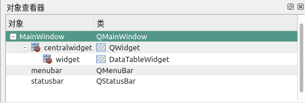

# 笔记

<!-- TOC -->

- [笔记](#笔记)
    - [pandas](#pandas)
        - [官方使用例子](#官方使用例子)
    - [设置提升的窗口控件](#设置提升的窗口控件)
        - [如何实现提升的窗口控件](#如何实现提升的窗口控件)

<!-- /TOC -->

## pandas

[pandas主页](https://pandas.pydata.org/)

pandas是Python的一个数据分析包, 目前由专注于Python数据包开发的PyData开发组维护, 属于PyData项目的一部分. 最初是被作为金融数据分析工具而开发的, 并为时间序列分析提供了很好的支持. pandas名字由面板数据(panel data)和数据分析(data analysis)结合.

要让PyQt与pandas结合, 使用qtpandas即可. 安装

    pip install pandas qtpandas

### 官方使用例子

[示例源](https://github.com/draperjames/qtpandas/tree/master/examples)

<raw>BaseExample.py</raw>

    from __future__ import unicode_literals
    from __future__ import print_function
    from __future__ import division
    from __future__ import absolute_import
    from future import standard_library
    standard_library.install_aliases()
    import pandas
    import numpy
    import sys
    from qtpandas.excepthook import excepthook

    # 使用compat模块中的QtGui表类, 需要确保安装了必须的sip库
    from qtpandas.compat import QtGui
    from qtpandas.models.DataFrameModel import DataFrameModel
    from qtpandas.views.DataTableView import DataTableWidget
    # from qtpandas.views._ui import icons_rc

    sys.excepthook = excepthook

    # 创建一个空的模型, 该模型用于存储与处理数据
    model = DataFrameModel()

    # 创建一个应用用于显示表格
    app = QtGui.QApplication([])
    widget = DataTableWidget()
    widget.resize(800, 600)
    widget.show()
    # Asign the created model"""
    widget.setViewModel(model)

    # 测试数据
    data = {
        'A': [10, 11, 12],
        'B': [20, 21, 22],
        'C': ['Peter Pan', 'Cpt. Hook', 'Tinkerbell']
    }
    df = pandas.DataFrame(data)
    
    # 下面两列用来测试委托是否成立
    df['A'] = df['A'].astype(numpy.int8)   # A列数据格式变成整型
    df['B'] = df['B'].astype(numpy.float16)   # B列数据格式变成浮点型

    # 在模型中填入数据df
    model.setDataFrame(df)

    # 运行应用
    app.exec_()

qtpandas基本上做完了pandas与PyQt结合的所有事情, 剩下的就是调用了. 那么, 如何把qtpandas嵌入PyQt的主窗口中, 而不是像现在这样成为一个独立的窗口呢?

核心的代码是下面几行

    # 创建一个空的模型, 该模型用于存储与数据处理
    model = DataFrameModel()

    widget = DataTablewidget()   # 创建一个空的表格, 主要用来呈现数据
    widget.resize(500, 300)
    widget.show()

    # 让表格绑定模型, 也就是让表格呈现模型的内容
    widget.setViewModel(model)

    # 在模型中填入数据df
    model.setDataFrame(df)

## 设置提升的窗口控件

如果想要使用Qt Designer来实现将pandas与PyQt相结合, 但在Qt Designer中并没有DataTableWidget和DataFrameModel这两个类对应的窗口控件, 这里就需要提升的窗口控件.

所谓提升的窗口控件, 就是指有些窗口控件是用户自己基于PyQt定义的衍生窗口控件, 这些窗口控件在Qt Designer中没有直接提供, 但是可以通过提升的窗口控件这个功能来实现. 

### 如何实现提升的窗口控件

从导航栏Containers中找到QWidget并拖入主窗口中, 然后对其单击鼠标右键, 从弹出的快捷菜单里选择"提升为", 打开"提升的窗口控件"对话框.

单击"添加"按钮, 会发现在"提升的类"中多了一项.

选中它, 然后单击"提升"按钮

对widget重命名为pandastablewidget, 这样就基本完成了对提升的窗口控件的操作, 对应的主要代码如下

    from qtpandas.views.DtaTableView import DataTableWidget

    ......

    self.pandastablewidget = DataTableWidget(self.centralWidget)
    self.pandastablewidget.setGeometry(100, 100, 500, 500)
    self.pandastablewidget.setStyleSheet("")
    self.pandastablewidget.setObjectName("pandastablewidget")
