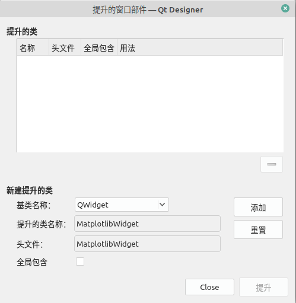

# 笔记

<!-- TOC -->

- [笔记](#笔记)
    - [matplitlib](#matplitlib)
        - [对MatplotlibWidget的解读](#对matplotlibwidget的解读)
        - [1. 设置绘图类](#1-设置绘图类)
        - [2. 封装绘图类](#2-封装绘图类)
        - [设置提升的窗口控件](#设置提升的窗口控件)
        - [MatplotlibWidget的使用](#matplotlibwidget的使用)
    - [PyQtGraph](#pyqtgraph)
        - [使用例子](#使用例子)
        - [设置提升的窗口控件](#设置提升的窗口控件-1)
    - [Plotly](#plotly)
        - [结合方法例子](#结合方法例子)
        - [使用例子](#使用例子-1)

<!-- /TOC -->

## matplitlib

[主页](https://matplotlib.org/)

### 对MatplotlibWidget的解读

### 1. 设置绘图类

首先创建FigureCanvas类, 在其初始化工程中建立一个空白的图像. 注意下面代码的开头两行是用来解决中文和负号显示问题的, 也可以把它应用到使用matplitlib进行的日常绘图中.

    class MyMplCanvas(FigureCanvas):
        """FigureCanvas的最终父类起始是QWidget"""
        def __init__(self, parent=None, width=5, height=4, dpi=100):
            # 设置中文显示
            plt.rcParams["font.family"] = ["SimHei", "FangSong"]   # 用来正常显示中文标签
            plt.rcParams["axes.unicode_minus"] = False   # 用来正常显示负号

            # 新建一个绘图对象
            self.fig = Figure(figsize=(width, height), dpi=dpi)
            # 建立一个子图. 如果要建立复合图, 可以在这里修改
            self.axes = self.fig.add_subplit(111)

            self.axes.hold(False)   # 每次绘图时都不保留上一次绘图的结果

            FigureCanvas.__init__(self ,self.fig)
            self.setParent(parent)

            """定义FigureCanvas的尺寸策略, 意思是设置FigureCanvas, 使之尽可能向外填充控件"""
            FigureCanvas.setSizePlicy(self, QSizePolicy.Expanding, QSizePolicy.Expanding)
            FigureCanvas.updateGeometry(self)

定义绘制静态图函数, 调用这个函数可以在上一步所创建爱你的空白的图像中绘图. 注意, 这部分内容可以随意定义, 可以在[matplitlib examples](https://matplotlib.org/gallery/index.html)找到自己需要的图像, 获取其源码, 然后对静态函数(start_static_plot)中的相关代码进行替换即可.

    """绘制静态图, 可以在这里定义绘图逻辑"""
    def start_static_plot(self):
        self.fig.suptitle("测试静态图")
        t = range(0.0, 3.0, 0.01)
        s = math.sin(2 * pi * t)
        self.axes.plot(t, s)
        self.axes.set_ylable("静态图: Y轴")
        self.axes.set_xlabel("静态图: X轴")
        self.axes.grid(True)

定义绘制动态图函数, 设置每隔1秒就会重新绘制一次图像. 注意, 对于update_figure()函数也可以随意定义.

    """启动绘制动态图"""
    def start_dynamic_plot(self, *args, **kwargs):
        timer = QtCore.QTimer(self)
        tiemr.timeout.connect(self.update_figure)   # 每隔一段时间就会触发一次update_figure()函数
        timer.start(1000)   # 触发时间间隔为1秒

    """可以在这里修改动态图的绘图逻辑"""
    def update_figure(self):
        self.fig.suptitle("测试动态图")
        l = [random.randint(0, 10) for i in range(4)]
        self.axes.plot([0, 1, 2, 3], l, 'r')
        self.axes.set_ylabel("动态图: Y轴")
        self.axes.set_xlabel("动态图: X轴")
        self.axes.grid(True)
        self.draw()

### 2. 封装绘图类

这部分主要是使用QWidget把上面的绘图类和工具栏封装到MatplotlibWidget中, 只需要调用MatplotlibWidget这个类就可以实现绘图功能了.

这个示例保留了初始化时就载入图像的接口, 把下面注释掉的代码取消注释, 那么在载入MatplotlibWidget时就会实现绘图功能. 其主要适用于那些不需要使用按钮来触发绘图功能的场景.

    class MatplotlibWidget(QWidget):
        def __init__(self, parent=None):
            super().__init__(parent=parent)
            self.initUi()

        def initUi(self):
            self.layout = QVBoxLayout(self)
            self.mpl = MyMplCavas(self, width=5, height=4, dpi=100, title="Title 1")
            # self.mp1.start_static_plot()   # 如果想要在初始化时就呈现静态图, 取消这行注释
            # self.mp1.start_dynamit_plot()   # 如果想要在初始化时就呈现动态图, 取消这行注释
            self.mp1_ntb = NavigationToolbar(self.mp1, self)   # 添加完整的工具栏

            self.layout.addWidget(self.mp1)
            self.layout.addWidget(self.mp1_ntb)

运行

    app = QApplication(sys.argv)
    ui = MatplotlibWidget()   # 测试静态图
    # ui.mp1.start_dynamit_plot()  # 测试动态图
    ui.show()
    sys.exit(sys.exec())

### 设置提升的窗口控件

可以使用Qt Designer的提升控件功能, 实现Matplotlib与PyQt的结合.

照常, 新建一个QWidget类, 对其进行提升

注意, 在生成对话框代码时, 可能会提示错误: 模型对象没有MatplotlibWidget. 原因是没有找到MatplotlibWidget类所在的文件, 解决办法是把对应的文件所在的目录添加到环境变量中, 然后重启即可.

### MatplotlibWidget的使用

首先是初始化模型. 注意, 在初始化中隐藏了两个图像, 如果想让它们在初始化时呈现的话, 把下面代码中的最后两行注释掉即可.

    class MainWin(QMainWindow, Ui_MainWindow):
        def __init__(self, parent=None):
            super().__init__(parent=parent)
            self.setupUi(self)
            self.matplotlibwidget_dynamic.setVisible(False)
            self.matplotlibwidget_static.setVisible(False)

然后设置按钮的操作--使得隐藏的图像课件, 并触发对应的绘图函数

    @pyqtSlot()
    def on_pushButton_clicked(self):
        """槽"""
        self.matplotlibwidget_static.setVisible(True)
        self.matplotlibwidget_static.mp1.start_static_plot()

    @pyqtSlot()
    def on_pushbutton_2_clicked(self):
        """槽"""
        self.matplotlibwidget_dynamic.setVisible(True)
        self.matplotlibwidget_dynamic.mp1.start_dynamic_plot()

运行

    app = QApplication(sys.argv)
    win = MainWin()
    win.show()
    sys.exit(app.exec())

## PyQtGraph

[主页](http://www.pyqtgraph.org/)

PyQtGraph是纯Python图形GUI库, 它充分利用PyQt和PySide的高质量的图像表现水平和Numpy的高速科学计算与处理能力, 在数学, 科学和工程领域都有广泛的应用. PyQtGraph基于MIT开源许可.

PyQtGraph可以为数据, 绘图, 视频等提供快速, 可交互的图形显示. 提供快速开发应用的工具.

PyQtGraph比Matplotlib要快一些, 尤其是在显示基于时间序列的数据. PyQtGraph有自己的特殊应用, 如图形交互, 参数树, 流程图等. 由于PyQtGraph是基于PyQt开发的集成绘图模块, 所以使用PyQtGraph绘图与通过底层方式来实现PyQt的绘图功能在速度上没有太大区别.

### 使用例子

一般使用方式如下

    import pyqtgraph as pg
    import numpy as np
    win = pg.GraphicsWindow(title="Basic plotting examples")
    p1 = win.addPlot(title="Basic array plotting", y=np.random.normal(size=100))

更详细的, 首先对程序进行出事化设置

    import pyqtgraph as pg

    class MainWin(QMainWindow, ui_MainWindow):
        """主窗口"""
        def __init__(self, parent=None):
            super().__init__(parent=parent)
            pg.setConfigOption("background", "#f0f0f0")   # 设置背景为灰色
            pg.setconfigOption("foreground", "d")   # 设置前景部分(包括坐标轴, 线条, 文本)为黑色
            pg.setconfigOptions(antialias=True)   # 使曲线看起来更光滑, 而不是锯齿状
            # pg.setConfigOption("antialias", True)   # 和上一条语句作用相同, 但是在setConfigOptions可以传递多个参数进行多项设置, 而setConfigOption一次只能接收一个参数进行一项设置
            self.setupUi(self)

这里需要详细说明如下两点

1. 对pg的设置要放在主程序初始化设置self.setupUi(self)之前, 否则效果呈现不出来, 因为在setupUi()函数中已经按照默认方式设置好了绘图的背景色, 文本颜色, 线条颜色等.
2. 关于获取主窗口背景色, 有一个简单的方法: 在Qt Designer的样式编辑器中随意进入一个颜色设置界面, 找到去涩琪, 单击"Pick Screen Color"按钮, 对主窗口取色, 然后不啊这个结果设置为PyQtGraph的背景色即可.

接下解析对绘图部分

    @pyqtSlot()
    def on_pushButton_clicked(self):
        self.pyqtgraph1.clear()   # 清空里面的内容, 否则会发生重复绘图的结果

        """第一种绘图方式"""
        self.pyqtgraph1.addPlot(title="绘制单条线", y=np.random.normal(size=100), pen=pg.mkPen(color='b', width=2))

        """第二种绘图方式"""
        plt2=self.pyqtgraph.addPlot(title="绘制多条线")
        plt2.plot(np.random.normal(size=150), pen=pg.mkPen(color='r', width=2), name"red curve")   # pg.mkPen的使用方法, 设置线条颜色为红色, 宽度为2
        plt2.plot(np.random.normal(size=110) + 5, pen=(0, 255, 0), name="Green curve")
        plt2.plot(np.random.normal(size=120) + 10, pen(0, 0, 255), name="Blue curve")

pyqtgraph的绘图方法非常容易理解, 通过addPlot函数在水平方向上添加一个图.

值得说明的是, pyqtgraph.mkPen函数是对Qt的QPen类的简化封装, 调用时只需要传递几个字典参数就可以了.

    @pyqtSlot()
    def on_pushButton_2_clicked(self):
        """如果没有进行第一次绘图, 就开始绘图, 然后做绘图标记, 否则什么都不做"""
        try:
            self.first_plot_flag   # 检测是否进行过绘图
        except:
            plt = self.pyqtgraph2.addPlot(title="绘制条状图")
            x = np.arange(10)
            y1 = np.sin(x)
            y2 = 1.1*np.sin(x+1)
            y3 = 1.2*np.sin(x+2)

            bg1 = pg.BarGraphItem(x=x, height=y1, width=0.3, brush='r')
            bg2 = pg.BarGraphItem(x=x+0.33, height=y2, width=0.3, brush='g')
            bg2 = pg.BarGraphItem(x=x+0.66, height=y3, width=0.3, brush='b')

            plt.addItem(bg1)
            plt.addItem(bg2)
            plt.addItem(bg3)

            self.pyqtgraph.nexRow()

            p4 = self.pyqtgraph2.addPlot(title="参数图 + 显示网格")
            x = np.cos(np.linspace(0, 2*np.pi, 1000))
            y = np.sin(np.linspace(0, 4*np.pi, 1000))
            p4.plot(x, y, pen=pg.mkPen(color='d', width=2))
            p4.showGrid(x=True, y=True)   # 显示网格

            self.first_plot_flg = True   # 第一次绘图后进行标记

这里没有使用self.pyqtgraph2.clear()函数, 而是使用try语句, 是因为在垂直方向上进行绘图, 使用这个函数会出现问题, 这可能是官方原因, 没有把这个函数处理完善, 现在就这样处理吧.

同时, 可以看到PyQtGraph绘图所使用的数据绝大部分是用Numpy生成的, 也从侧面说明了PyQtGraph的确是局域PyQt和Numpy开发的.

### 设置提升的窗口控件

和前面一样, 将一个QWidget窗口拖动到主窗口中, 然后右键为其提升

## Plotly

[主页](https://plotly.com/python/)

Plotly本质上是基于JavaScript的图表库, 支持不同类型的图表, 如地图, 箱形图, 密度图, 以及比较常见的条形图, 线形图等. 

Plotly的帮助文档中似乎并没有与PyQt结合使用的具体方法, 但是可以通过PyQt的QWebEngineView类封装Plotly所生成的绘图结果, 从而实现Plotly与PyQt的交互.

### 结合方法例子

    import sys

    from PyQt5.QtCore import *
    from PyQt5.QtGui import *
    from PyQt5.QtWidgets import *
    from PyQt5.QtWebEngineWidgets import QWebEngineView

    class WinForm(QWidget):
        def __init__(self, parent=None):
            super().__init__(parent=parent)
            
            self.qweb_engine = QWebEngineView(self)
            self.qweb_engine.setGeometry(QRect(50, 20, 1200, 600))
            self.qweb_engine.load(QUrl.fromLocalFile("html/index.html"))

    app = QApplicaiton(sys.argv)
    win = WinForm()
    win.show()
    sys.exit(app.exec())

其核心如下

    self.qweb_engine = QWebEngineView(self)
    self.qweb_engine.load(QUrl.fromLocalFile("html/index.html"))

表示新建一个QWebEngineView, 以及在QWebEngineView中载入文件

注意, index.html是利用Plotly生成的HTML本地文件.

### 使用例子

    import os

    import pandas as pd
    import numpy as np
    import matplotlib.pyplot as plt
    import plotly.offline as pyof
    import plotly.graph_objesa as go

    class Plotly_PyQt5():
        def __init__(self):
            """初始化时设置存储HTML文件的文件夹的名称, 默认为plotly_html"""
            plotly_dir = "plotly_html"
            if not os.path.isdir(plotly_dir):
                os.mkdirs(plotly_dir)

            self.path_dir_plotly_html = os.getcwd() + os.sep _ plotly_dir

        def get_plotly_path_if_hs300_bais(self, file_name="if_hs300_bais.html"):
            path_plotly = self.path_dir_plotly_heml + os.sep + file_name
            df = pd.read_excel(r"if_index_bais.xlsx")

            """绘制散点图"""
            line_main_price = go.Scatter(
                x=df.index,
                y=df["main_price"],
                name="main_price",
                connectgaps=True,   # 这个参数表示允许连接数据之间的缺失值
            )

            line_hs300_close = go.Scatter(
                x=df.index,
                y=df["hs300_close"],
                name="hs300_close",
                connectgaps=True,
            )

            data = [line_hs300_close, line_main_price]

            layout = dict(
                title="if_hs300_bais",
                xaxis=dict(title="Date"),
                yaxid=dict(title="Price")
            )

            fig = go.Figure(data=data, layout=layout)

            pyof.plot(fig, filename=path_plotly, auto_open=False)
            return path_plotly

对于这个示例, 需要注意的是

1. 文件绘图使用的是离线绘图模式, 而不是在线绘图模式. 因为离线绘图模式的速度非常快, 而在线绘图模式由于对方服务器的原因会比较卡.

    import plotly.offline as pyof

2. 禁止自动在浏览器中打开. 设置auto_open参数为False

    pyof.plot(fig, filename=path_pltly, auto_open=False)

3. 绘图完成后将绘图结果保存在本地, 通过函数返回保存的路径, 然后让QWebEngineView调用这个路径就实现了PyQt与plotly的交互

    return path_plotly

对于PyQt的主程序

    import sys

    from PyQt5.QtCore import pyqtSlot, QRect, QUrl
    from PyQt5.QtWidgets import QMainWindow, QApplication

    from Ui_plotly_pyqt import Ui_MainWindow
    from Plotly_PyQt5 import Plotly_PyQt5

    class MainWin(QMainWindow, Ui_MainWindow):
        def __init__(self, parent=None):
            super().__init__(parent=parent)
            self.setupUi(self)
            self.plotly_pyqt5 = Plotly_PyQt5()
            self.qweb_engine.setGeometry(QRect(50, 20, 1200, 600))
            self.qweb_engine.load(QUrl.fromLocalFile(self.plotly_pyqt5.get_plotly_path_if_hs300_bais()))

    app = QApplicaiton(sys.argv)
    win = MainWin()
    win.show()
    sys.exit(app.exec())

首先从Plotly中绘图, 把结果保存到本地, 然后通过QWebEngineView加载这个本地文件. 这样就产生了以硬盘写入与读取的问题, 显然会拖慢程序的运行速度.
