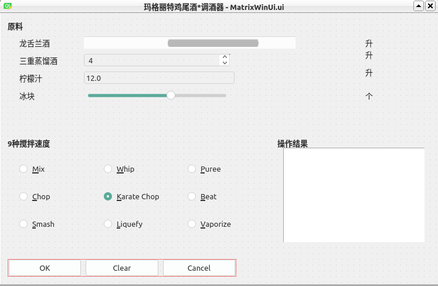

# 笔记

<!-- TOC -->

- [笔记](#笔记)
    - [手工与自动化测试](#手工与自动化测试)
    - [模拟鸡尾酒的调酒器窗口](#模拟鸡尾酒的调酒器窗口)
    - [单元测试文件](#单元测试文件)
        - [1. 编写单元测试类](#1-编写单元测试类)
        - [2. 定时关闭窗口](#2-定时关闭窗口)
        - [3. 测试调酒器窗口的默认值](#3-测试调酒器窗口的默认值)
        - [4. 测试PyQt的QScrollBar](#4-测试pyqt的qscrollbar)
        - [5. 测试PyQt的QSpinBox](#5-测试pyqt的qspinbox)
        - [6. 测试PyQt的QLineEdit](#6-测试pyqt的qlineedit)
        - [7. 测试PyQt的QSlider](#7-测试pyqt的qslider)
        - [8. 测试PyQt的QRadioButton](#8-测试pyqt的qradiobutton)
    - [运行测试用例](#运行测试用例)
    - [生成测试报告](#生成测试报告)

<!-- /TOC -->

## 手工与自动化测试

对于单元测试, Python可以使用它内部自带的单元测试模块unittest. 对于模拟手工操作, PyQt可以使用它内部的测试模块QTest.

注意, 虽然Qt C++ API包含了完整的单元测试框架, 但是PyQt的QtTest模块仅包含QTest类, 它使用静态方法来模拟按键, 鼠标单击和鼠标移动.

手工测试是传统, 常规的软件测试方法, 由测试人员依据设计文档手工编写测试用例, 然后执行并记录测试结果.

自动化测试是指利用软件测试工具自动实现全部或者部分测试工作(测试管理, 测试用例设计, 测试执行和生成测试报告). 自动化测试可以节省测试资源, 并能够完成一些手工测试无法实现的测试, 比如单元测试, 统计测试覆盖率等. 随着技术进步, 有发展除UI层的自动化测试.

Ui层的自动化测试, 是自动化测试的一类, 是指编写代码, 脚本, 通过测试框架的驱动, 让脚本自动运行, 通过UI层面的键盘输入和鼠标操作, 发现被测系统的缺陷, 用来代替部分手工测试. 其核心思想是, 通过测试框架抓取被测元素对象, 保存至对象库, 通过脚本的编写以及配置必要的测试数据, 在被测系统上进行回放, 驱动被测系统完成期望的操作, 获得最终结果, 并将最终结果与预测的期望值进行比对, 将比对结果进行报告输出.

[测试用例资料](http://johnnado.com/pyqt-qtest-example/)

## 模拟鸡尾酒的调酒器窗口

玛格丽特鸡尾酒(Margarita Midori)  
原料: 冰块8粒, Ei Charro Anejo龙舌兰酒20ml, Midori 10ml, 新鲜柠檬汁20ml, Triple Sec 20ml, 盐少许  
制作: 将龙舌兰酒, 鲜柠檬汁, Midori和Triple Sec倒入摇酒壶中, 加入一些冰块, 摇匀后滤入挂有盐霜的酒杯中, 并在泡沫上撒少许盐

testCase中的, PyQt QTest自动化测试例子

[MargaritaMixer.ui](./示例内容/testCase/MatrixWinUi.ui), Qt Designer的XML输出, 用于描述GUI对话框设计.  
[MargaritaMixer.py](./示例内容/testCase/MatrixWinUi.py), 用于描述GUI对话框设计的Python源码文件, 可以使用pyuic5 转换ui文件.  
[CallMatrixWinUi.py](./示例内容/testCase/CallMatrixWinUi.py), 包含了实例化GUI对话框并处理结果的类.  
[MatricWinTest.py](./示例内容/testCase/MatrixWinTest.py), 自动化单元测试.  
[RunTextCase.py](./示例内容/testCase/RunTestCase.py), 进行自动化测试, 生成测试报告  

## 单元测试文件

测试类<raw>MatrixWinTest.py</raw>

### 1. 编写单元测试类

编写单元测试类MatrixWinTest使用的标准Python中的unittest模块, 它是Python内部自带的一个单元测试模块.

1)首先导入unittest模块

    import unittest

2)定义一个继承自unittest.TestCase的测试用例类MatrixWinTest

3)定义setUp()和tearDown(), 在每个测试用例的前后做一些辅助工作. 使用setUP()方法调用测试类之前的初始化工作; 使用tearDown()方法调用测试类之后的清理工作.

4)定义测试用例, 名字以test开头, 比如testmoveScrollBar()和test_tripleSecSpinBox()

5)一个测试用例应该只测试一个方面, 测试目的和测试内容很明确, 主要是调用assertEqual, assertRaises等断言方法判断程序执行结果和预期值是否相符. 如果测试未通过, 则会输出相应的错误提示.

6)调用unittest.main()启动测试

常用的断言方法如下

assertEqual(a, b) : 检测 a==b  
assertNotEqual(a, b) : 检测 a!=b  
assertTrue(x) : 检测bool(x) is True  
assertFalse(x) : 检测bool(x) is False  
assertIsNot(a, b) : 检测a is not b  

所编写的单元测试类MatrixWinTest需要继承自unittest.TestCase类, 通过unittest模块编写测试业务

    class MatrixWinTest(unittest.TestCase):
        # 初始化工作
        def setUp(self):
            print("*** setUp ***")
            self.app = QApplication(sys.argv)
            self.form = CallMatrixWinUi.CAllMatrixWinUi()
            self.form.show()

        # 退出清理工作
        def tearDown(self):
            print("*** tearDown ***")
            self.app.exec()

### 2. 定时关闭窗口

运行完PyQt的测试用例后, 所生成的测试用例窗口是不会自动消失的, 因为PyQt使用的是事件主循环机制, 当应用启动后, 主循环接受事件消息并将其分发给程序的各个控件. 如果调用exit()或主控件被销毁, 主循环就会结束. 使用sys.exit()方法退出可以确保程序完整地结束. 所以如果用户不主动关闭窗口, 窗口是不会消失的. 为了方便测试, 可以编写一个线程类, 定时关闭所生成的测试用例窗口.

    # 继承自QThread类
    class BackWorkThread(QThread):
        # 声明一个信号, 同时返回一个str
        finish_signal = pyqtSignal(str)
        # 在构造函数中增加形参
        def __init__(self, sleep_time, parent=None):
            super().__init__(parent=parent)
            # 储存参数
            self.sleep_time = sleep_time

        # 重写run(), 在里面定时执行任务
        def run(self):
            # 休眠一段时间
            time.sleep(self.sleep_time)
            # 休眠结束, 发送一个信号告诉主线程窗口
            self.finish_signal.emit("OK, begin to close Window")

现在对单元测试类MatrixWinTest进行优化, 在单元测试类的初始化函数setUp()中, 新建BackWorkThread线程对象传入时间参数, 每5秒就关闭一个测试用例.

    class MatrixWinTest(unittest.TestCase):
        # 初始化工作
        def setUp(self):
            print("*** setUp ***")
            self.app = QApplication(sys.argv)
            self.form = CallMatrixWinUi.CallMatrixWinUi()
            self.form.show()

            # 新建线程对象, 传入参数, 每5s关闭一个测试用例
            self.bkThread = BackWorkthread(int(5))
            # 连接子进程的信号和槽函数
            self.bkThread.finish_signal.connect(self.closeWindow)
            # self.bkThread.finish_signal.connect(self.app.exec_)

            # 启动线程, 开始执行run函数内容
            self.bkThread.start()

        # 退出时清理工作
        def tearDown(self):
            print("*** tearDown ***")
            self.app.exec_()

### 3. 测试调酒器窗口的默认值

测试设置"原料"部分每一个控件的默认值, 以及"9种搅拌速度"部分的单选按钮(QRadioButton), 当全部控件默认是指完毕后单击"OK"按钮, 把结果显示在"操作结果"部分.

    # 测试用例--在默认状态下测试GUI
    def test_defaults(self):
        """测试GUI处于默认状态"""
        print("*** testCase test_defaults begin ***")
        self.form.setwindowTitle("开始测试用例 test_defaults")

        self.assertEqual(self.form.ui.tequilaScrollBar.value(), 8)
        self.assertEqual(self.form.ui.tripleSecSpinBox.value(), 4)
        self.assertEqual(self.form.ui.limejuiceLineEdit.text(), "12.0")
        self.assertEqual(self.form.ui.iceHorizontalSlider.value(), 12)
        self.assertEqual(self.form.ui.speedButtonGroup.checkedButton().text(), "&Karate Chop")
        print("*** speedName='{}' ***".format(self.form.getSpeedName()))

        # 用鼠标左键单击"OK"按钮
        okWidget = self.form.ui.okBtn
        QTest.mouseClick(okWidget, Qt.LeftButton)

        # 测试窗口在默认状态下, 各个控件的默认值时候与预期值一样
        self.assertEqual(self.formgetJiggers(), 36.0)
        self.assertEqual(self.form.getSpeedName(), "&Karate Chop")
        print("*** testCase test defaults end ***")

### 4. 测试PyQt的QScrollBar

在运行测试用例前, 将窗口中原料对应的所有控件中的所有成分数值设置为0, 将待测试控件的成分设置为非零值. 比如将龙舌兰酒对应的滑动条控件的值超过它的合法范围, 设置为12, 而在UI]文件中实际他的最大值为11, 最小值为0, 查看窗口是否能正常运行.

为方便起见, setFormToZero()将所有控件的值都设置为0

    # 设置窗口中所有控件的值为0, 状态设置为出事状态.
    def setFormToZero(self):
        print("* setFormToZero *")
        self.form.ui.tequilascrollBar.setValue(0)
        self.form.ui.tripleSecSpinbox.setValue(0)
        self.form.ui.limeJuiceLineEdit.setText("0.0")
        self.form.ui.iceHorizontalSlider.setValue(0)

        self.form.ui.selScrollBarLb1.setText("0")
        self.form.ui.selIceSliderLb1.setText("0")

接下来测试使用滑动条控件来模拟往调酒器里倒入多少升龙舌兰酒. 测试设置滑动条的最小值和最大值, 然后尝试合法值, 观察滑动条能否正常使用.

    # 测试用例, 测试滑动条
    def test_moveScrollBar(self):
        """测试用例 test_moveScrollBar"""
        print("*** testCase test_moveScrollBar begin ***")
        self.form.setWindowTitle("开始测试用例 test_moveScrollBar")
        self.setFormToZero()

        # 测试将龙舌兰酒的滑动条的值设置为12, 在UI中实际它的最大值为11
        self.form.ui.tequilaScrollBar.setValue(12)
        print("* 当执行self.form.ui.tequilaScrollBar.setValue(12)后, ui.tequilaScrollBar.value() => {} *".format(self.form.ui.tequilaScrollBar.value()))
        self.assertEqual(self.form.ui.tequilaScrollBar.value(), 11)

        # 测试将龙舌兰酒的滑动条的值设置为-1, 在UI中实际它的最小值为0
        self.form.ui.tequilaScrollBar.setValue(-1)
        print("* 当执行self.form.ui.tequilaScrollBar.setValue(-1)后, ui.tequilaScrollBar.value() => {} *".format(self.form.ui.tequilaScrollBar.value()))
        self.assertEqual(self.form.ui.tequilaScrollBar.value(), 0)

        # 重新将龙舌兰酒的滑动条的值设定为5
        self.form.ui.tequilaScrollBar.setValue(5)

        # 用鼠标左键单击OK按钮
        okWidget.self.form.ui.okBtn
        QTest.mouseClick(okwidget, Qt.LefrButton)
        self.assertEqual(self.form.getJiggers(), 5)
        print("*** testCase test_moveScrollBar end ***")

### 5. 测试PyQt的QSpinBox

将三重蒸馏酒对应的计数器控件(QSpinBox)的数值设置为非零值, 在UI文件中计数器控件的最大值为11, 最小值为0, 通过测试用例设置控件的最大值和最小值, 然后尝试设置合法值, 最后验证结果.

    # 测试用例, 测试计数器控件(QSpinBox)
    def test_tripleSecSpinBox(self):
        """测试用例 test_tripleSecSpinBox"""
        print("*** testCase test_tripleSecSpinBox begin ***")
        self.form.setWindowtitle("开始测试用例 test_tripleSecSpinBox")
        """ 测试修改计数器控件(QSpinBox)的最大值, 最小值 """
        self.setFormToZero()
        
        # tripleSecSpinBox在界面中的取值范围为0~11, 将它的最大值设置为12, 看是否显示正常
        self.form.ui.tripleSecSpinbox.setValue(12)
        print("* 当执行self.form.ui.tripleSecSpinBox.setValue(12)后, ui.tripleSecSpinBox.value() => {} *".format(self.form.ui.tripleSecSpinBox.value()))

        # tripleSecSpinBox在界面中的取值范围0~11, 将它的最小值设置为-1, 看是否正常
        self.form.ui.tripleSecSpinbox.setValue(-1)
        print("* 当执行self.form.ui.tripleSecSpinBox.setValue(-1)后, ui.tripleSecSpinBox.value() => {} *".format(self.form.ui.tripleSecSpinBox.value()))

        self.form.ui.tripleSecspinBox.setValue(2)

        # 用鼠标左键单击OK按钮
        okWidget = self.form.ui.okBtn
        QTest.mouseClick(okWidget, Qt.LeftButton)
        self.assertEqual(self.form.getJiggers(), 2)
        print("*** testCase test_tripleSecSpinBox end ***")

### 6. 测试PyQt的QLineEdit

使用QTest.keyClicks()实际输入一个字符串到limeJuiceLineEdit文本框中, 这里要强调是使用交互的手段向其中输入值, 所以没有用QLineEdit.setText()直接设置.

    # 测试用例, 测试柠檬汁单行文本框
    def test_limeJuiceLineEdit(self):
        """测试用例 test_limejuiceLineEdit"""
        print("*** testCase test_limeJuiceLineEdit begin ***")
        self.form.setWindowTitle("开始测试用例 test_limeJuiceLineEdit")

        """测试修改lineEdit文本框控件的最大值, 最小值"""
        self.setFormToZero()
        # 清除lineEdit文本框控件值, 让后在lineEdit文本框控件中输入"3.5"
        self.form.ui.limeJuiceLineEdit.clear()
        QTest.keyClicks(self.form.ui.limeJuiceLineEdit, "3.5")

        # 用鼠标左键单击OK按钮
        okWidget = self.form.ui.okBtn
        QTest.mouseClick(okWidget, Qt.LeftButton)
        self.assertEqual(self.form.getJiggers(), 3.5)
        print("*** testCase test_limeJuiceLineEdit end ***")

### 7. 测试PyQt的QSlider

测试冰块互动控件

    # 测试用例, 测试iceHorizontalSlider
    def test_iceHorizontalSlider(self):
        """测试用例 test_iceHorizontalSlider"""
        print("*** testCase test_icehorizontalSlider begin ***")
        self.form.setWindowTitle("开始测试用例 test_iceHorizontalslider")

        """测试冰块滑动条控件"""
        self.setFormToZero()
        self.form.ui.iceHorizontalSlider.setValue(4)

        # 用鼠标左键单击OK按钮
        okWidget = self.form.ui.okBtn
        QTest.mouseClick(okWidget, QtLeftButton)
        self.assertEqul(self.form.getJiggers(), 4)
        print("*** testCase test_iceHorizontalSlider end ***")

### 8. 测试PyQt的QRadioButton

在"9种减半速度"部分包含了9个单选按钮, 测试选中每个单选按钮, 取得的值是否和单选按钮的文本一致. 比如搅拌速度的文本显示的是"&Mix", 则意味着按住"Alt+M"快捷键, 可以快速定位到"Mix"单选按钮.

    # 测试用例, 测试搅拌速度单选按钮
    def test_blenderSpeedButtons(self):
        print("*** testCase test_blenderSpeedButtons begin ***")
        self.form.ui.speedButton1.click()
        self.assertEqual(self.form.getSpeedName(), "&Mix")
        self.form.ui.speedButton2.click()
        self.assertEqual(self.form.getSpeedName(), "&Whip")
        self.form.ui.speedButton3.click()
        self.assertEqual(self.form.getSpeedName(), "&Puree")
        self.form.ui.speedButton4.click()
        self.assertEqual(self.form.getSpeedName(), "&Chop")
        self.form.ui.speedButton5.click()
        self.assertEqual(self.form.getSpeedName(), "&Karate Chop")
        self.form.ui.speedButton6.click()
        self.assertEqual(self.form.getSpeedName(), "&Beat")
        self.form.ui.speedButton7.click()
        self.assertEqual(self.form.getSpeedName(), "&Smash")
        self.form.ui.speedButton8.click()
        self.assertEqual(self.form.getSpeedName(), "&Linquefy")
        self.form.ui.speedButton9.click()
        self.assertEqual(self.form.getSpeedName(), "&Vaporize")
        print("*** testCase test_blenderSpeedButtons end ***")

## 运行测试用例

运行单元测试类MatrixWinTest. 运行单元测试类有两种方法: 一种是默认执行所有的测试用例; 另一种是按照指定顺序执行测试用例.

首先需要导入unittest模块

    import unittest

默认指定所有的测试用例

    unittest.main()

使用以下命令, 可以将测试结果报告保存到指定文件中

    python MatrixWinTest.py >> ./reportLog.txt 2>&1

按照指定顺序执行测试用例

    suite = unittest.TestSuite()
    suite.addTest(MatrixWinTest("test_default"))
    suite.addTEst(MatrixWintest("test_moveScrollBar"))
    suite.addTEst(MatrixWintest("test_tripleSecSpinBox"))
    suite.addTEst(MatrixWintest("test_limeJuiceLineEdit"))
    suite.addTEst(MatrixWintest("test_iceHorizontalSlider"))
    suite.addTEst(MatrixWintest("test_liters"))
    suite.addTEst(MatrixWintest("test_blenderSpeedButtons"))
    runner = unittest.TextTExtRunner()
    runner.run(suite)

## 生成测试报告

虽然可以通过unittest生成测试日志, 但是把测试结果汇总到测试报告里, 需要手工完成. 可以使用HTMLTestRunner来生成测试报告, 以将所有结果自动生成到一个页面中.

HTMLTestRunner是Python标准库unittest模块的一个扩展库, 使用它可以生成易于使用的HMTL测试报告.

[HTMLTestRunner下载](http://tungwaiyip.info/software/HTMLTestRunner.html)

    import unittest
    import HTMLTestRunner
    import time   
    from MatrixWinTest import MatrixWinTest
        
    if __name__ == "__main__":  
        
        now = time.strftime("%Y-%m-%d-%H_%M_%S", time.localtime(time.time()))	
        print( now )
        testunit = unittest.TestSuite()
        testunit.addTest(unittest.makeSuite(MatrixWinTest ))
            
        htmlFile = ".\\"+now+"HTMLtemplate.html"
        print( 'htmlFile='+ htmlFile)
        fp = open(htmlFile,'wb')
        runner = HTMLTestRunner.HTMLTestRunner(
            stream=fp, 
            title=u"PyQt5测试报告", 
            description=u"用例测试情况")
        runner.run(testunit)
        fp.close()